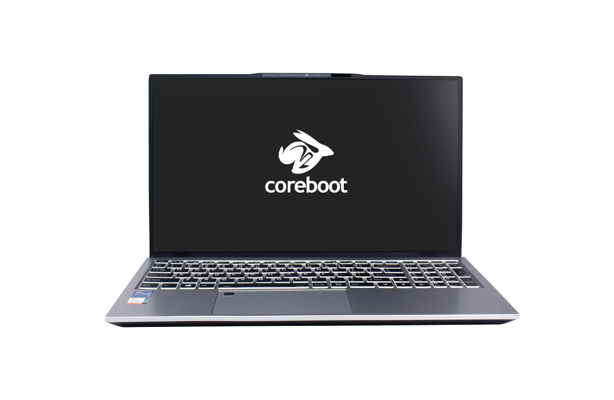

# Overview

## Hardware

The `NovaCustom NS5x/7x` section is related to the two physical NovaCustom
laptops based on the 11th generation Intel Core processor:

- [NS51 series](https://configurelaptop.eu/ns51-series/)
- [NS70 series](https://configurelaptop.eu/ns70-series/)

For more information on the hardware, please refer to the references in above
links.

## Firmware

Each firmware release contains of two parts:

- [BIOS](https://en.wikipedia.org/wiki/BIOS) firmware,
- [EC (Embedded Controller)](https://en.wikipedia.org/wiki/Embedded_controller)
  firmware.

They both interact with each other tightly, so keeping their compatible versions
in in sync is important. Information on compatiblity should be always explained
in the [release page](releases.md).
