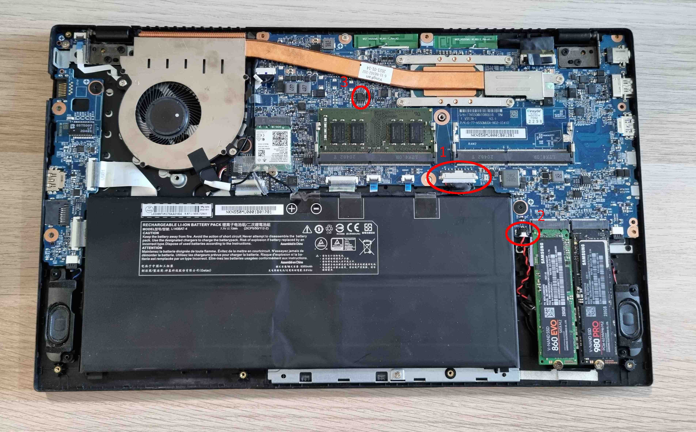

# Initial Deployment

## Intro

Flashing coreboot can be done from Linux using flashrom with the internal
programmer. This document describes the process of building, installing and
running flashrom on Ubuntu 20.04.

## Build flashrom

Currently, the latest flashrom release lacks support for Tiger Lake-U internal
flashing. Because of this, we need to build flashrom from the source.

1. Install build dependencies:

    ```bash
    apt install git build-essential debhelper pkg-config libpci-dev libusb-1.0-0-dev libftdi1-dev meson
    ```

1. Obtain source code:

    ```bash
    git clone https://review.coreboot.org/flashrom.git
    cd flashrom
    ```

1. Build flashrom:

    ```bash
    make
    sudo make install
    ```

## Reading flash contents

To read from the flash and save them to a file (`dump.rom`), execute the
following command:

```bash
flashrom -p internal -r dump.rom
```

## Installing Dasharo

### Initial Installation

During the initial installation of Dasharo, you should deploy the supported
Intel ME version (and configuration) on the device.

> Publicly released binaries do not contain ME binary. If you need an Intel ME
> update for your device, contact us via already established commercial support
> channel.

When flashing binaries with ME binary included, flashing of the whole chip is
required. Additionally, the firmware has to be flashed externally using an
external programmer like a `ch341a_spi`.



Steps for initial Dasharo installation:

1. Open the laptop.
1. Disconnect the primary battery. (1)
1. Disconnect the CMOS battery. (2)
1. Attach an external programmer with a SOIC-8 clip to the SPI flash chip. (3)
1. Execute the following command, replacing [path] with the path to the firmware
    image you want to flash, e.g. `novacustom_ns5xpu_ns7xpu_full_v1.0.0.rom`

    ```bash
    flashrom -p ch341a_spi -w [path]
    ```

1. Detach the SOIC-8 clip.
1. Connect the primary battery (1) - do **not** connect the CMOS battery yet.
    (2)
1. Power on the laptop. The laptop may shut down once after training the memory.
1. Once Dasharo is booted, shut down the laptop and reconnect the CMOS battery.

### Transition to open EC

If you have deployed the Dasharo using external programmer, time to switch to
Open EC. This step is required to support all Dasharo features. To install Open
EC Firmware on NS5xPU/NS7xPU, follow this instruction:
[Dasharo EC Transition](../../../common-coreboot-docs/dasharo_tools_suite/#dasharo-ec-transition).

If this is your first experience with DTS, first read its
[documentation](https://docs.dasharo.com/common-coreboot-docs/dasharo_tools_suite/).
We recommend using DTS with the
[Bootable over network](https://docs.dasharo.com/common-coreboot-docs/dasharo_tools_suite/#bootable-over-network)
method which is less time-consuming and just easier than DTS on the USB Stick.

Successful transition to Open EC finishes the initial deployment process.
