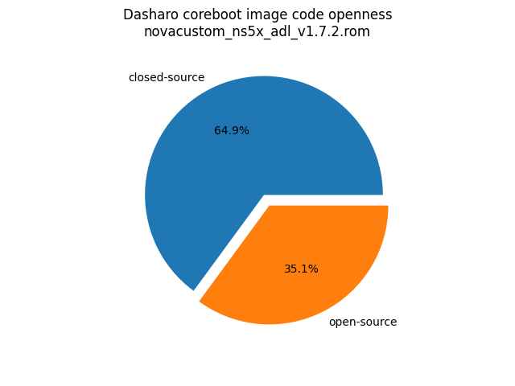
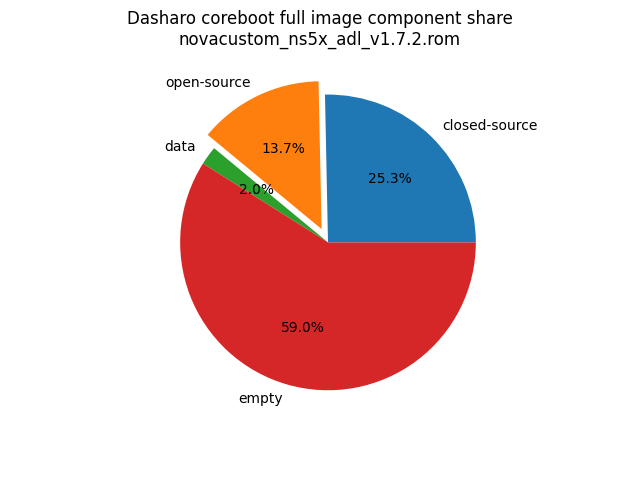

# Dasharo Openness Score

This page contains the [Dasharo Openness
Score](../../glossary.md#dasharo-openness-score) for NovaCustom NS5XPU/NS7XPU
Dasharo releases. The content of the page is generated with [Dasharo Openness
Score utility](https://github.com/Dasharo/Openness-Score).

## v1.7.2

Report has been generated with Openness Score utility version v0.2

Openness Score for novacustom_ns5x_adl_v1.7.2.rom

Open-source code percentage: **35.1%**
Closed-source code percentage: **64.9%**

* Image size: 33554432 (0x2000000)
* Number of regions: 27
* Number of CBFSes: 3
* Total open-source code size: 4588518 (0x4603e6)
* Total closed-source code size: 8497434 (0x81a91a)
* Total data size: 686310 (0xa78e6)
* Total empty size: 19782170 (0x12dda1a)

> Numbers given above already include the calculations from CBFS regions
> presented below

### FMAP regions

| FMAP region | Offset | Size | Category |
| ----------- | ------ | ---- | -------- |
| SI_ME | 0x1000 | 0x4ff000 | closed-source |
| SI_DESC | 0x0 | 0x1000 | data |
| RECOVERY_MRC_CACHE | 0x1000000 | 0x10000 | data |
| RW_MRC_CACHE | 0x1010000 | 0x10000 | data |
| SMMSTORE | 0x1020000 | 0x40000 | data |
| SHARED_DATA | 0x1060000 | 0x2000 | data |
| VBLOCK_DEV | 0x1062000 | 0x2000 | data |
| RW_NVRAM | 0x1064000 | 0x6000 | data |
| CONSOLE | 0x106a000 | 0x20000 | data |
| VBLOCK_A | 0x118a000 | 0x10000 | data |
| RW_FWID_A | 0x1bfffc0 | 0x40 | data |
| RO_VPD | 0x1c00000 | 0x4000 | data |
| FMAP | 0x1c04000 | 0x800 | data |
| RO_FRID | 0x1c04800 | 0x40 | data |
| RO_FRID_PAD | 0x1c04840 | 0x7c0 | data |
| GBB | 0x1c05000 | 0x3000 | data |
| UNUSED | 0x500000 | 0xb00000 | empty |

### CBFS BOOTSPLASH

* CBFS size: 1048576
* Number of files: 1
* Open-source files size: 0 (0x0)
* Closed-source files size: 0 (0x0)
* Data size: 28 (0x1c)
* Empty size: 1048548 (0xfffe4)

> Numbers given above are already normalized (i.e. they already include size
> of metadata and possible closed-source LAN drivers included in the payload
> which are not visible in the table below)

| CBFS filename | CBFS filetype | Size | Compression | Category |
| ------------- | ------------- | ---- | ----------- | -------- |
| (empty) | null | 1048548 | none | empty |

### CBFS FW_MAIN_A

* CBFS size: 10903488
* Number of files: 13
* Open-source files size: 2244371 (0x223f13)
* Closed-source files size: 1629325 (0x18dc8d)
* Data size: 8626 (0x21b2)
* Empty size: 7021166 (0x6b226e)

> Numbers given above are already normalized (i.e. they already include size
> of metadata and possible closed-source LAN drivers included in the payload
> which are not visible in the table below)

| CBFS filename | CBFS filetype | Size | Compression | Category |
| ------------- | ------------- | ---- | ----------- | -------- |
| fallback/romstage | stage | 95808 | none | open-source |
| fallback/ramstage | stage | 152932 | LZMA | open-source |
| fallback/dsdt.aml | raw | 22545 | none | open-source |
| fallback/postcar | stage | 42408 | none | open-source |
| fallback/payload | simple elf | 1930678 | none | open-source |
| cpu_microcode_blob.bin | microcode | 546816 | none | closed-source |
| fspm.bin | fsp | 786432 | none | closed-source |
| fsps.bin | fsp | 296077 | LZ4 | closed-source |
| config | raw | 5482 | LZMA | data |
| revision | raw | 856 | none | data |
| build_info | raw | 98 | none | data |
| vbt.bin | raw | 1290 | LZMA | data |
| (empty) | null | 868 | none | empty |

### CBFS COREBOOT

* CBFS size: 4161536
* Number of files: 18
* Open-source files size: 2344147 (0x23c4d3)
* Closed-source files size: 1629325 (0x18dc8d)
* Data size: 9944 (0x26d8)
* Empty size: 178120 (0x2b7c8)

> Numbers given above are already normalized (i.e. they already include size
> of metadata and possible closed-source LAN drivers included in the payload
> which are not visible in the table below)

| CBFS filename | CBFS filetype | Size | Compression | Category |
| ------------- | ------------- | ---- | ----------- | -------- |
| fallback/romstage | stage | 95808 | none | open-source |
| fallback/ramstage | stage | 152932 | LZMA | open-source |
| fallback/dsdt.aml | raw | 22545 | none | open-source |
| fallback/postcar | stage | 42408 | none | open-source |
| fallback/payload | simple elf | 1930678 | none | open-source |
| bootblock | bootblock | 99776 | none | open-source |
| cpu_microcode_blob.bin | microcode | 546816 | none | closed-source |
| fspm.bin | fsp | 786432 | none | closed-source |
| fsps.bin | fsp | 296077 | LZ4 | closed-source |
| cbfs_master_header | cbfs header | 28 | none | data |
| intel_fit | intel_fit | 80 | none | data |
| config | raw | 5482 | LZMA | data |
| revision | raw | 856 | none | data |
| build_info | raw | 98 | none | data |
| vbt.bin | raw | 1290 | LZMA | data |
| cmos_layout.bin | cmos_layout | 800 | none | data |
| (empty) | null | 612 | none | empty |
| (empty) | null | 177508 | none | empty |
