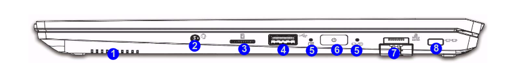
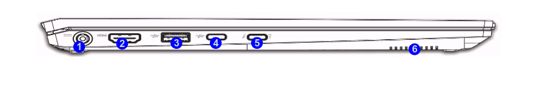

# Hardware configuration matrix

## Introduction

This document describes the hardware configurations used for validation of the
coreboot port on the NovaCustom NS51/NS70 laptops.

## Ports specification

### Right side view

| No.  | Description                                      |
|------|--------------------------------------------------|
| 1.   | Speaker                                          |
| 2.   | 2-In-1 Audio Jack (Headphone / Microphone)       |
| 3.   | MicroSD Card Reader                              |
| 4.   | USB 2.0 Port                                     |
| 5.   | LED Indicator                                    |
| 6.   | Power Button                                     |
| 7.   | RJ-45 LAN Jack                                   |
| 8.   | Security Lock Slot                               |

### Left side view

| No. |                     Description                     |
| --- | --------------------------------------------------- |
| 1.  | DC-In Jack                                          |
| 2.  | HDMI-Out Port                                       |
| 3.  | USB 3.2 Gen 2 Type-A Port                           |
| 4.  | USB 3.2 Gen 2 Type-A Port with [Always On USB][aou] |
| 5.  | Thunderbolt 4 Port with Power Delivery (DC-IN)      |
| 6.  | Speaker                                             |

[aou]: ../../dasharo-menu-docs/dasharo-system-features.md#power-management-options

The graphics used are from pages 17-18 of the
[official service manual](https://novacustom.stackstorage.com/s/s2zVcQyd004hRQJ/en_US?dir=%2FNS51%2FService%20Manual&node-id=233996)
for the NS51/70 platforms.

## NS51MU

| Component                      | Description                                      |
|--------------------------------|--------------------------------------------------|
| **CPU**                        | Intel(R) Core(TM) i5-1135G7                      |
|                                | Internal Cooling                                 |
| **RAM**                        | Slot 1: KVR32S22D8/16                            |
|                                | Slot 2: KVR32S22D8/16                            |
| **SSD**                        | 1. Samsung SSD 980 PRO 250 GB                    |
|                                | 2. Samsung SSD 980 PRO 500 GB                    |
| **Flash memory**               | Winbond 25Q128JVSQ 2118 16 MB                    |
| **USB pendrives**              | SanDisk Ultra USB 3.0 32 GB                      |
| **USB Keyboard**               | Logitech, Inc. Keyboard K120                     |
| **Wireless card**              | Intel Wi-Fi 6 AX201                              |
| **Display**                    | Display 1: HDMI 1920x1080p                       |
| **Network**                    | Local network wired connection                   |
| **Internal devices**           | 1. 1920x1080 15.6 inch screen                    |
|                                | 2. Internal keyboard with LED backlight          |
|                                | 3. Touchpad                                      |
|                                | 4. Camera                                        |
|                                | 5. Audio subsystem                               |
| **Attached devices**           | The platform is tested with every docking station/hub listed [in HCL][HCL] |
| **Power Supply**               | Chicony 19V, 3.42A, 65 W                         |

## NS70MU

| Component                      | Description                                      |
|--------------------------------|--------------------------------------------------|
| **CPU**                        | Intel(R) Core(TM) i5-1135G7                      |
|                                | Internal Cooling                                 |
| **RAM**                        | Slot 1: KVR32S22S8/8                             |
|                                | Slot 2: KVR32S22S8/8                             |
| **SSD**                        | Samsung SSD 980 1 TB                             |
| **Flash memory**               | GigaDevice 25B127DSIG 16 MB                      |
| **USB pendrives**              | SanDisk Ultra USB 3.0 32 GB                      |
| **USB Keyboard**               | Logitech, Inc. Keyboard K120                     |
| **Wireless card**              | Intel Wi-Fi 6 AX201                              |
| **Display**                    | Display 1: HDMI 1920x1080p                       |
| **Network**                    | Local network wired connection                   |
| **Internal devices**           | 1. 1920x1080 17 inch screen                      |
|                                | 2. Internal keyboard with LED backlight          |
|                                | 3. Touchpad                                      |
|                                | 4. Camera                                        |
|                                | 5. Audio subsystem                               |
| **Attached devices**           | The platform is tested with every docking station/hub listed [in HCL][HCL] |
| **Power Supply**               | Chicony 19V, 3.42A, 65 W                         |

[HCL]: https://docs.dasharo.com/unified/novacustom/hcl/#ns5x7x-11th-gen
