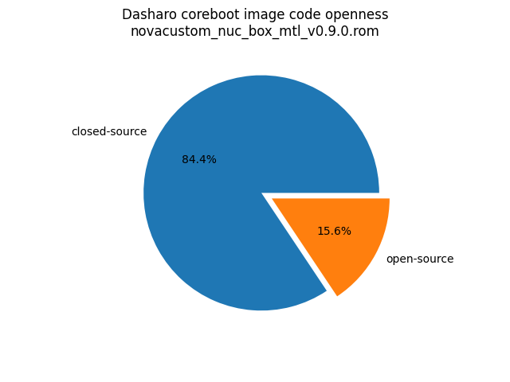
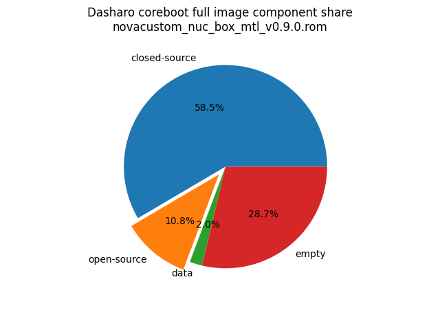

# Dasharo Openness Score

This page contains the [Dasharo Openness
Score](../../glossary.md#dasharo-openness-score) for NovaCustom NUC BOX
Dasharo releases. The content of the page is generated with [Dasharo Openness
Score utility](https://github.com/Dasharo/Openness-Score).

## v0.9.0

Openness Score for novacustom_nuc_box_mtl_v0.9.0.rom

Open-source code percentage: **15.6%**
Closed-source code percentage: **84.4%**

* Image size: 33554432 (0x2000000)
* Number of regions: 28
* Number of CBFSes: 3
* Total open-source code size: 3636140 (0x377bac)
* Total closed-source code size: 19616546 (0x12b5322)
* Total data size: 668790 (0xa3476)
* Total empty size: 9632956 (0x92fcbc)

> Numbers given above already include the calculations from CBFS regions
> presented below

### FMAP regions

| FMAP region | Offset | Size | Category |
| ----------- | ------ | ---- | -------- |
| SI_ME | 0x4000 | 0x9ec000 | closed-source |
| SI_DESC | 0x0 | 0x4000 | data |
| RECOVERY_MRC_CACHE | 0x1000000 | 0x10000 | data |
| RW_MRC_CACHE | 0x1010000 | 0x10000 | data |
| SMMSTORE | 0x1020000 | 0x40000 | data |
| RW_ELOG | 0x1060000 | 0x4000 | data |
| SHARED_DATA | 0x1064000 | 0x2000 | data |
| VBLOCK_DEV | 0x1066000 | 0x2000 | data |
| RW_NVRAM | 0x1068000 | 0x6000 | data |
| CONSOLE | 0x106e000 | 0x20000 | data |
| VBLOCK_A | 0x1200000 | 0x2000 | data |
| RW_FWID_A | 0x18fffc0 | 0x40 | data |
| RO_VPD | 0x1900000 | 0x4000 | data |
| FMAP | 0x1906000 | 0x800 | data |
| RO_FRID | 0x1906800 | 0x40 | data |
| GBB | 0x1907000 | 0x3000 | data |

### CBFS BOOTSPLASH

* CBFS size: 1048576
* Number of files: 2
* Open-source files size: 0 (0x0)
* Closed-source files size: 0 (0x0)
* Data size: 11680 (0x2da0)
* Empty size: 1036896 (0xfd260)

> Numbers given above are already normalized (i.e. they already include size
> of metadata and possible closed-source LAN drivers included in the payload
> which are not visible in the table below)

| CBFS filename | CBFS filetype | Size | Compression | Category |
| ------------- | ------------- | ---- | ----------- | -------- |
| logo.bmp | raw | 11585 | LZMA | data |
| (empty) | null | 1036896 | none | empty |

### CBFS FW_MAIN_A

* CBFS size: 7331776
* Number of files: 13
* Open-source files size: 1775062 (0x1b15d6)
* Closed-source files size: 1189297 (0x1225b1)
* Data size: 9317 (0x2465)
* Empty size: 4358100 (0x427fd4)

> Numbers given above are already normalized (i.e. they already include size
> of metadata and possible closed-source LAN drivers included in the payload
> which are not visible in the table below)

| CBFS filename | CBFS filetype | Size | Compression | Category |
| ------------- | ------------- | ---- | ----------- | -------- |
| fallback/payload | simple elf | 1466553 | none | open-source |
| fallback/romstage | stage | 81368 | none | open-source |
| fallback/ramstage | stage | 149284 | LZMA | open-source |
| fallback/dsdt.aml | raw | 17169 | none | open-source |
| fallback/postcar | stage | 60688 | none | open-source |
| cpu_microcode_blob.bin | microcode | 140288 | none | closed-source |
| fspm.bin | fsp | 786432 | none | closed-source |
| fsps.bin | fsp | 262577 | LZ4 | closed-source |
| config | raw | 5804 | LZMA | data |
| revision | raw | 858 | none | data |
| build_info | raw | 104 | none | data |
| vbt.bin | raw | 1724 | LZ4 | data |
| (empty) | null | 1572 | none | empty |

### CBFS COREBOOT

* CBFS size: 7299072
* Number of files: 18
* Open-source files size: 1861078 (0x1c65d6)
* Closed-source files size: 1189297 (0x1225b1)
* Data size: 10737 (0x29f1)
* Empty size: 4237960 (0x40aa88)

> Numbers given above are already normalized (i.e. they already include size
> of metadata and possible closed-source LAN drivers included in the payload
> which are not visible in the table below)

| CBFS filename | CBFS filetype | Size | Compression | Category |
| ------------- | ------------- | ---- | ----------- | -------- |
| fallback/payload | simple elf | 1466553 | none | open-source |
| fallback/romstage | stage | 81368 | none | open-source |
| fallback/ramstage | stage | 149284 | LZMA | open-source |
| fallback/dsdt.aml | raw | 17169 | none | open-source |
| fallback/postcar | stage | 60688 | none | open-source |
| bootblock | bootblock | 86016 | none | open-source |
| cpu_microcode_blob.bin | microcode | 140288 | none | closed-source |
| fspm.bin | fsp | 786432 | none | closed-source |
| fsps.bin | fsp | 262577 | LZ4 | closed-source |
| cbfs_master_header | cbfs header | 32 | none | data |
| intel_fit | intel_fit | 80 | none | data |
| config | raw | 5804 | LZMA | data |
| revision | raw | 858 | none | data |
| build_info | raw | 104 | none | data |
| cmos_layout.bin | cmos_layout | 888 | none | data |
| vbt.bin | raw | 1724 | LZ4 | data |
| (empty) | null | 356 | none | empty |
| (empty) | null | 4237604 | none | empty |
