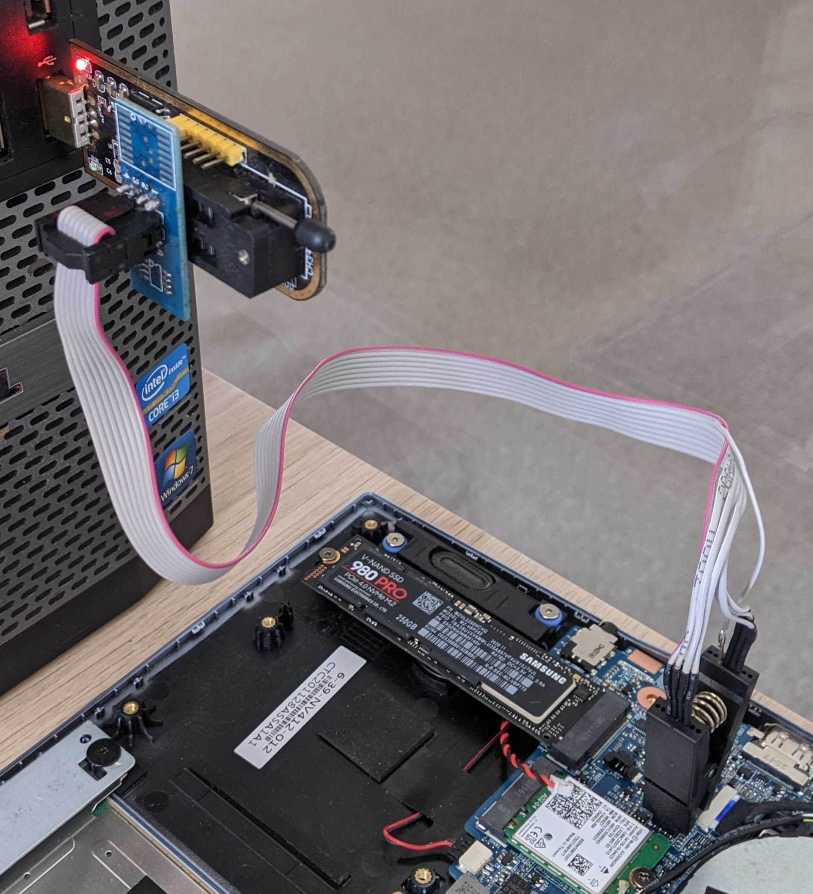

# coreboot external flashing

## Intro

Currently, the only supported method of external flashing is with a `ch341a`
programmer and a Pomona SOIC-8 clip. Other external programmers are currently
unsupported.

Requirements:

- ch341a SPI programmer
- Pomona SOIC-8 clip with ribbon connecting cable
- Computer running Linux with flashrom

## Preparation

Ensure that the EC is running updated firmware. Follow the steps outlined in
[EC firmware update](../ec_update)

Install Flashrom from your distribution's repositories.

For Ubuntu, Debian and derivatives:

```bash
sudo apt install flashrom
```

For Fedora:

```bash
sudo dnf install flashrom
```

For Arch Linux:

```bash
sudo pacman -S flashrom
```

Create a file `layout.txt` with the following contents:

```bash
00000000:00000fff fd
00500000:00ffffff bios
00001000:004fffff me
```

## Setup

Connect the Pomona clip to the programmmer. The red wire should be connected
towards the rear of the programmer (away from the USB port).

Remove the bottom cover from the laptop. Disconnect the internal battery and
CMOS battery. Locate the BIOS chip - the square chip located next to the Wi-Fi
card, with the text `AJ2001 25B127DSIG` written on top of it.

Attach the clip to the BIOS chip. The clip should be attached so that the red
wire is aligned with the identifying dot on the in one of the corners of the
chip.

Once the clip is connected, connect the programmer to a computer. To test
if the programmer is detected properly, run the following command:

```bash
flashrom -p ch341a_spi
```

The output should contain the following text:

```bash
Found GigaDevice flash chip "GD25Q128B" (16384 kB, SPI) on linux_spi.
Found GigaDevice flash chip "GD25Q128C" (16384 kB, SPI) on linux_spi.
Multiple flash chip definitions match the detected chip(s): "GD25Q128B", "GD25Q128C"
```

If it doesn't, disconnect the programmer from the PC, detach the clip and
re-attach everything again.

The final setup should look like in the picture below:



## Reading from the flash

Before writing anything to the flash, it's important to always make a backup.
Read the flash 3 times and ensure the backup is correct:

```bash
flashrom -p ch341a_spi -c GD25B128B/GD25Q128B -r backup1.rom
flashrom -p ch341a_spi -c GD25B128B/GD25Q128B -r backup2.rom
flashrom -p ch341a_spi -c GD25B128B/GD25Q128B -r backup3.rom
md5sum backup1.rom backup2.rom backup3.rom
```

The output of the last command should contain 3 identical hashes.

```bash
6e5599d95ad03eb9ead7390bd1be4146  backup1.rom
6e5599d95ad03eb9ead7390bd1be4146  backup2.rom
6e5599d95ad03eb9ead7390bd1be4146  backup3.rom
```

Your hashes may be different to these depending on the current flash
contents, but they must be identical to each other. If they're not identical,
reseat the Pomona clip and try again.

Once the backups are verified, save and store one of the backup*.rom files
securely.

## Writing to the flash

Once you have the backups saved, proceed to flashing the chip - replace
`[path]` with the path to the binary you want to write - e.g. `build/coreboot.rom`

```bash
flashrom -p ch341a_spi -c GD25B128B/GD25Q128B -w [path] -l layout.txt -i bios
```

flashrom will read the flash, erase it, write the new image and verify that
it's written correctly. If the flash was successful, the output will contain the
text `VERIFIED`.
