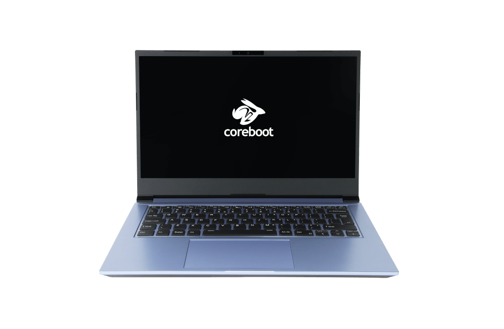

# Overview

## Hardware

The `NovaCustom NV4x` section is related to the one physical NovaCustom
laptops based on the 11th generation Intel Core processor:

- [NV41 series](https://configurelaptop.eu/nv41-series/)

For more information on the hardware, please refer to the references in above
link.

## Firmware

Each firmware release contains of two parts:

- [BIOS](https://en.wikipedia.org/wiki/BIOS) firmware,
- [EC (Embedded Controller)](https://en.wikipedia.org/wiki/Embedded_controller)
  firmware.

They both interact with each other tightly, so keeping their compatible versions
in in sync is important. Information on compatibility should be always explained
in the [release page](releases.md).

## Documentation sections

- [Releases](releases.md) - groups information about all releases.
- [Building manual](building-manual.md) - describes how to build Dasharo for
    NovaCustom NV4x.
- [Initial deployment](initial-deployment.md) - describes initial Dasharo
    deployment methods (i. e. flashing new firmware) for NovaCustom NV4x.
- [Firmware update](firmware-update.md) - explains supported Dasharo
    open-source firmware update methods.
- [Recovery](recovery.md) - gathers information on how to recover the platform
    from potential failure.
- [Hardware configuration matrix](hardware-matrix.md) - describes the
    platform's hardware configuration used during the Dasharo firmware
    validation procedure.
- [Test matrix](test-matrix.md) - describes validation scope used during
    Dasharo firmware validation procedure.
- [Post-installation setup](/common-coreboot-docs/clevo_post_install/) -
    describes the post installation steps which should be performed to unlock
    the full functionality of the product.
- [Updating firmware using fwupd](/common-coreboot-docs/fwupd_usage/) -
    describes the method of updating the Dasharo firmware by using fwupd daemon.
- [Logo customization](/common-coreboot-docs/custom_logo.md) - describes the
    method of customization the logo shown during system booting
- [Openness score](openness_analysis.md) - explains the method of counting
    firmware openness score and presents openness score for both Dasharo and
    Vendor firmware.
- [LVFS report](lvfs_report.md) - contains the report of the discovery of the
    most appropriate fwupd/LVFS firmware update method, including potential
    risks and roadblocks.
- [Checkbox results](compatibility-check-results-ubuntu.md) - contains the
    report of checkbox certification software results against both Dasharo and
    Vendor firmware.
