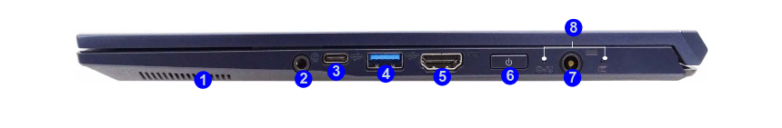
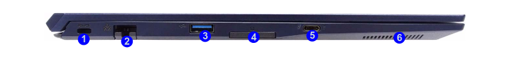

# Hardware configuration matrix

## Introduction

This document describes the hardware configurations used for validation of the
coreboot port on the NovaCustom NV4X laptop.

## Ports specification

### Right side view

| No. |                     Description                     |
| --- | --------------------------------------------------- |
| 1.  | Speaker                                             |
| 2.  | 2-In-1 Audio Jack (Headphone / Microphone)          |
| 3.  | USB 3.2 Gen 2 Type-C Port                           |
| 4.  | USB 3.2 Gen 2 Type-A Port with [Always On USB][aou] |
| 5.  | HDMI-Out Port                                       |
| 6.  | Power Button                                        |
| 7.  | DC-In Jack                                          |
| 8.  | Led Indicator                                       |

[aou]: ../../dasharo-menu-docs/dasharo-system-features.md#power-management-options

### Left side view

| No.  | Description                                      |
|------|--------------------------------------------------|
| 1.   | Security Lock Slot                               |
| 2.   | RJ-45 LAN Jack                                   |
| 3.   | USB 3.2 Gen 2 Type-A Port                        |
| 4.   | SD Card Reader                                   |
| 5.   | Thunderbolt 4 Port with Power Delivery (DC-IN)   |
| 6.   | Speaker                                          |

The graphics used are from pages 17-18 of the
[official service manual](https://novacustom.stackstorage.com/s/6mFpzU01I9UR94sI/en_US)
for the NV41 platforms.

## NV41PZ

| Component                      | Description                                      |
|--------------------------------|--------------------------------------------------|
| **CPU**                        | Intel(R) Core(TM) i5-1240P                       |
|                                | Internal Cooling                                 |
| **RAM**                        | Slot 1: KVR32S22S8/8                             |
|                                | Slot 2: KVR32S22S8/8                             |
| **SSD**                        | Samsung SSD 980 PRO 250 GB                       |
| **Flash memory**               | Macronix MX25L25673GZ4I-08G                      |
| **USB pendrives**              | SanDisk Ultra USB 3.0 32 GB                      |
| **USB Keyboard**               | Logitech, Inc. Keyboard K120                     |
| **Wireless card 1**            | Intel Wi-Fi 6 AX201                              |
| **Wireless card 2**            | Atheros QCNFA222                                 |
| **Display**                    | Display 1: HDMI 1920x1080p                       |
| **Network**                    | Local network wired connection                   |
| **Internal devices**           | 1. 1920x1080 14 inch screen                      |
|                                | 2. Internal keyboard with LED backlight          |
|                                | 3. Touchpad                                      |
|                                | 4. Camera                                        |
|                                | 5. Audio subsystem                               |
| **Attached devices**           | The platform is tested with every docking station/hub listed [in HCL][HCL] |
| **Power Supply**               | Chicony 19V, 4.74A, 90 W                         |

[HCL]: https://docs.dasharo.com/unified/novacustom/hcl/#nv4x-12th-gen

## coreboot + heads

Generally, the same hardware configuration as for the
UEFI variant applies.

A notable addition is usage of the
[Nitrokey 3A Mini](https://novacustom.com/product/nitrokey-3a-mini/)
USB device, which is required for Heads installation and usage.
