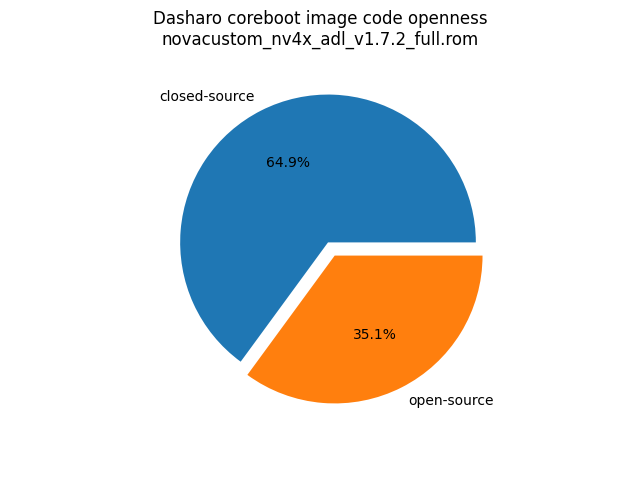
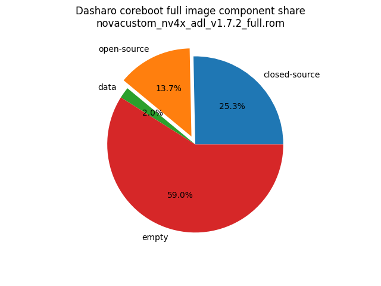

# Dasharo Openness Score

Openness Score for novacustom_nv4x_adl_v1.7.2_full.rom

Open-source code percentage: **35.1%**
Closed-source code percentage: **64.9%**

* Image size: 33554432 (0x2000000)
* Number of regions: 27
* Number of CBFSes: 3
* Total open-source code size: 4587012 (0x45fe04)
* Total closed-source code size: 8497434 (0x81a91a)
* Total data size: 686541 (0xa79cd)
* Total empty size: 19783445 (0x12ddf15)

> Numbers given above already include the calculations from CBFS regions
> presented below

## FMAP regions

| FMAP region | Offset | Size | Category |
| ----------- | ------ | ---- | -------- |
| SI_ME | 0x1000 | 0x4ff000 | closed-source |
| SI_DESC | 0x0 | 0x1000 | data |
| RECOVERY_MRC_CACHE | 0x1000000 | 0x10000 | data |
| RW_MRC_CACHE | 0x1010000 | 0x10000 | data |
| SMMSTORE | 0x1020000 | 0x40000 | data |
| SHARED_DATA | 0x1060000 | 0x2000 | data |
| VBLOCK_DEV | 0x1062000 | 0x2000 | data |
| RW_NVRAM | 0x1064000 | 0x6000 | data |
| CONSOLE | 0x106a000 | 0x20000 | data |
| VBLOCK_A | 0x118a000 | 0x10000 | data |
| RW_FWID_A | 0x1bfffc0 | 0x40 | data |
| RO_VPD | 0x1c00000 | 0x4000 | data |
| FMAP | 0x1c04000 | 0x800 | data |
| RO_FRID | 0x1c04800 | 0x40 | data |
| RO_FRID_PAD | 0x1c04840 | 0x7c0 | data |
| GBB | 0x1c05000 | 0x3000 | data |
| UNUSED | 0x500000 | 0xb00000 | empty |

## CBFS BOOTSPLASH

* CBFS size: 1048576
* Number of files: 1
* Open-source files size: 0 (0x0)
* Closed-source files size: 0 (0x0)
* Data size: 28 (0x1c)
* Empty size: 1048548 (0xfffe4)

> Numbers given above are already normalized (i.e. they already include size
> of metadata and possible closed-source LAN drivers included in the payload
 > which are not visible in the table below)

| CBFS filename | CBFS filetype | Size | Compression | Category |
| ------------- | ------------- | ---- | ----------- | -------- |
| (empty) | null | 1048548 | none | empty |

## CBFS FW_MAIN_A

* CBFS size: 10903488
* Number of files: 13
* Open-source files size: 2243746 (0x223ca2)
* Closed-source files size: 1629325 (0x18dc8d)
* Data size: 8744 (0x2228)
* Empty size: 7021673 (0x6b2469)

> Numbers given above are already normalized (i.e. they already include size
> of metadata and possible closed-source LAN drivers included in the payload
 > which are not visible in the table below)

| CBFS filename | CBFS filetype | Size | Compression | Category |
| ------------- | ------------- | ---- | ----------- | -------- |
| fallback/romstage | stage | 95456 | none | open-source |
| fallback/ramstage | stage | 152955 | LZMA | open-source |
| fallback/dsdt.aml | raw | 22564 | none | open-source |
| fallback/postcar | stage | 42408 | none | open-source |
| fallback/payload | simple elf | 1930363 | none | open-source |
| cpu_microcode_blob.bin | microcode | 546816 | none | closed-source |
| fspm.bin | fsp | 786432 | none | closed-source |
| fsps.bin | fsp | 296077 | LZ4 | closed-source |
| config | raw | 5485 | LZMA | data |
| revision | raw | 856 | none | data |
| build_info | raw | 98 | none | data |
| vbt.bin | raw | 1290 | LZMA | data |
| (empty) | null | 1060 | none | empty |

## CBFS COREBOOT

* CBFS size: 4161536
* Number of files: 18
* Open-source files size: 2343266 (0x23c162)
* Closed-source files size: 1629325 (0x18dc8d)
* Data size: 10057 (0x2749)
* Empty size: 178888 (0x2bac8)

> Numbers given above are already normalized (i.e. they already include size
> of metadata and possible closed-source LAN drivers included in the payload
 > which are not visible in the table below)

| CBFS filename | CBFS filetype | Size | Compression | Category |
| ------------- | ------------- | ---- | ----------- | -------- |
| fallback/romstage | stage | 95456 | none | open-source |
| fallback/ramstage | stage | 152955 | LZMA | open-source |
| fallback/dsdt.aml | raw | 22564 | none | open-source |
| fallback/postcar | stage | 42408 | none | open-source |
| fallback/payload | simple elf | 1930363 | none | open-source |
| bootblock | bootblock | 99520 | none | open-source |
| cpu_microcode_blob.bin | microcode | 546816 | none | closed-source |
| fspm.bin | fsp | 786432 | none | closed-source |
| fsps.bin | fsp | 296077 | LZ4 | closed-source |
| cbfs_master_header | cbfs header | 28 | none | data |
| intel_fit | intel_fit | 80 | none | data |
| config | raw | 5485 | LZMA | data |
| revision | raw | 856 | none | data |
| build_info | raw | 98 | none | data |
| vbt.bin | raw | 1290 | LZMA | data |
| cmos_layout.bin | cmos_layout | 800 | none | data |
| (empty) | null | 804 | none | empty |
| (empty) | null | 178084 | none | empty |
