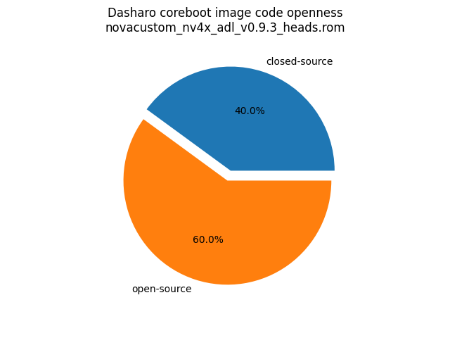
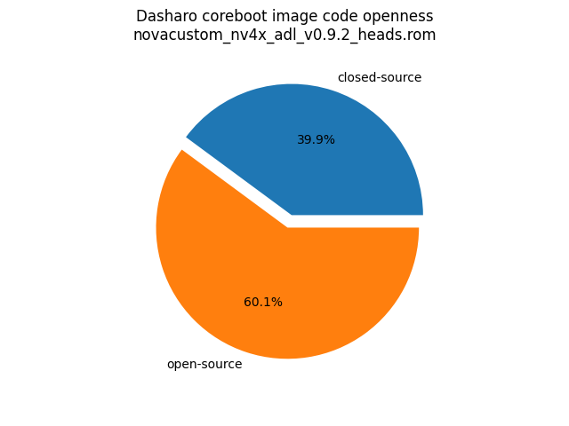
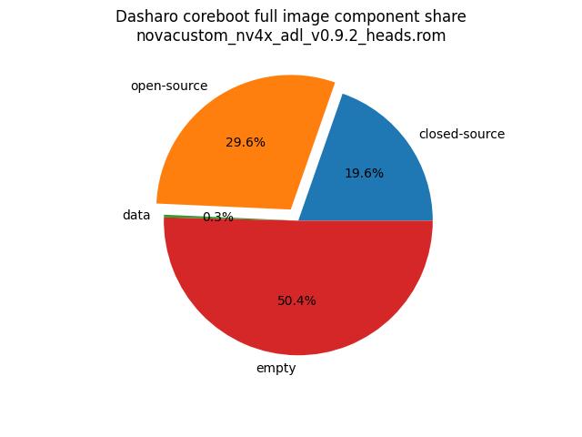
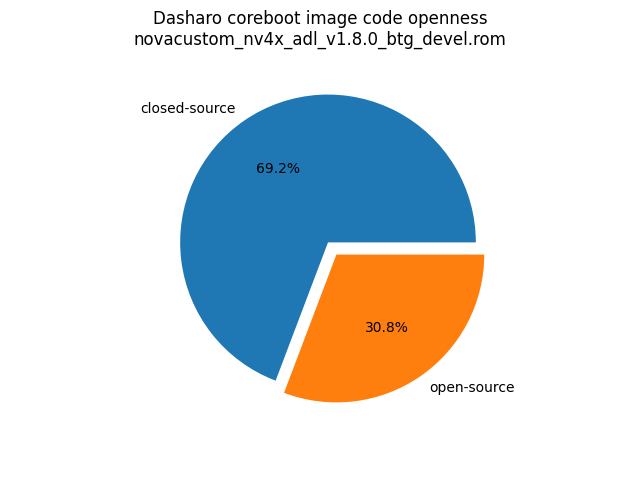
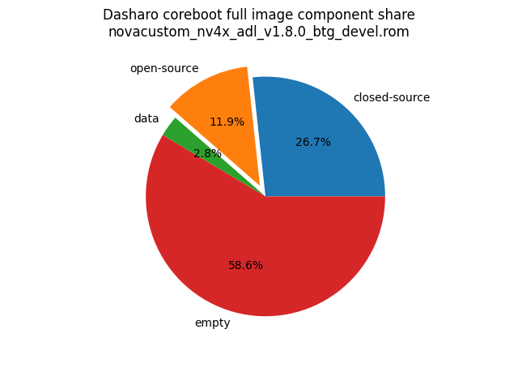
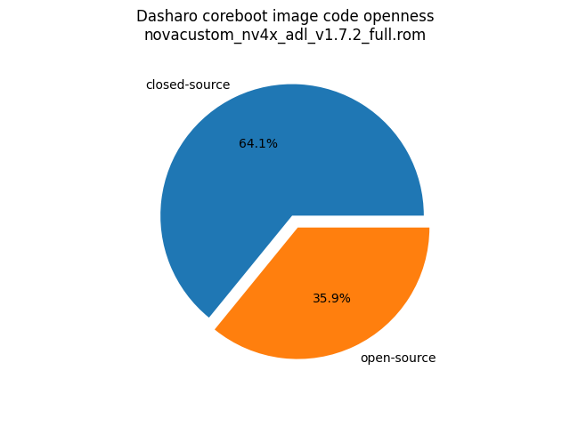
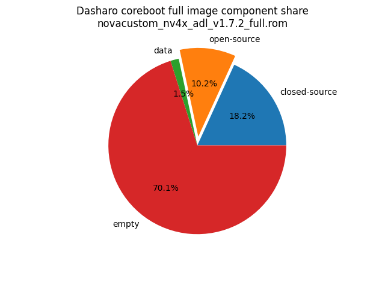

# Dasharo Openness Score

This page contains the [Dasharo Openness
Score](../../glossary.md#dasharo-openness-score) for NovaCustom NV4XPZ Dasharo
releases. The content of the page is generated with [Dasharo Openness Score
utility](https://github.com/Dasharo/Openness-Score).

## v0.9.3 Heads

Openness Score for novacustom_nv4x_adl_v0.9.3_heads.rom

Open-source code percentage: **60.0%**
Closed-source code percentage: **40.0%**

* Image size: 33554432 (0x2000000)
* Number of regions: 7
* Number of CBFSes: 1
* Total open-source code size: 9985278 (0x985cfe)
* Total closed-source code size: 6645457 (0x6566d1)
* Total data size: 106473 (0x19fe9)
* Total empty size: 16817224 (0x1009c48)

> Numbers given above already include the calculations from CBFS regions
> presented below

### FMAP regions

| FMAP region | Offset | Size | Category |
| ----------- | ------ | ---- | -------- |
| SI_ME | 0x1000 | 0x4b6000 | closed-source |
| SI_DESC | 0x0 | 0x1000 | data |
| RW_MRC_CACHE | 0x1000000 | 0x10000 | data |
| FMAP | 0x1010000 | 0x200 | data |
| SI_DEVICEEXT2 | 0x4b7000 | 0xb49000 | empty |

### CBFS COREBOOT

* CBFS size: 16711168
* Number of files: 20
* Open-source files size: 9985278 (0x985cfe)
* Closed-source files size: 1705681 (0x1a06d1)
* Data size: 36329 (0x8de9)
* Empty size: 4983880 (0x4c0c48)

> Numbers given above are already normalized (i.e. they already include size
> of metadata and possible closed-source LAN drivers included in the payload
> which are not visible in the table below)

| CBFS filename | CBFS filetype | Size | Compression | Category |
| ------------- | ------------- | ---- | ----------- | -------- |
| fallback/payload | simple elf | 9616058 | none | open-source |
| fallback/romstage | stage | 94168 | none | open-source |
| fallback/ramstage | stage | 171972 | LZMA | open-source |
| fallback/dsdt.aml | raw | 23248 | none | open-source |
| fallback/postcar | stage | 42968 | none | open-source |
| bootblock | bootblock | 36864 | none | open-source |
| cpu_microcode_blob.bin | microcode | 569344 | none | closed-source |
| fspm.bin | fsp | 786432 | none | closed-source |
| fsps.bin | fsp | 333763 | LZ4 | closed-source |
| cbfs_master_header | cbfs header | 32 | none | data |
| intel_fit | intel_fit | 80 | none | data |
| config | raw | 4932 | LZMA | data |
| revision | raw | 867 | none | data |
| build_info | raw | 96 | none | data |
| bootsplash.jpg | bootsplash | 26784 | none | data |
| vbt.bin | raw | 1290 | LZMA | data |
| cmos_layout.bin | cmos_layout | 800 | none | data |
| (empty) | null | 100 | none | empty |
| (empty) | null | 4983780 | none | empty |

## v0.9.2 Heads

Openness Score for novacustom_nv4x_adl_v0.9.2_heads.rom

Open-source code percentage: **60.1%**
Closed-source code percentage: **39.9%**

* Image size: 33554432 (0x2000000)
* Number of regions: 7
* Number of CBFSes: 1
* Total open-source code size: 9944607 (0x97be1f)
* Total closed-source code size: 6593380 (0x649b64)
* Total data size: 106613 (0x1a075)
* Total empty size: 16909832 (0x1020608)

> Numbers given above already include the calculations from CBFS regions
> presented below

### FMAP regions

| FMAP region | Offset | Size | Category |
| ----------- | ------ | ---- | -------- |
| SI_ME | 0x1000 | 0x4b6000 | closed-source |
| SI_DESC | 0x0 | 0x1000 | data |
| RW_MRC_CACHE | 0x1000000 | 0x10000 | data |
| FMAP | 0x1010000 | 0x200 | data |
| SI_DEVICEEXT2 | 0x4b7000 | 0xb49000 | empty |

### CBFS COREBOOT

* CBFS size: 16711168
* Number of files: 20
* Open-source files size: 9944607 (0x97be1f)
* Closed-source files size: 1653604 (0x193b64)
* Data size: 36469 (0x8e75)
* Empty size: 5076488 (0x4d7608)

> Numbers given above are already normalized (i.e. they already include size
> of metadata and possible closed-source LAN drivers included in the payload
> which are not visible in the table below)

| CBFS filename | CBFS filetype | Size | Compression | Category |
| ------------- | ------------- | ---- | ----------- | -------- |
| fallback/payload | simple elf | 9597114 | none | open-source |
| fallback/romstage | stage | 84704 | none | open-source |
| fallback/ramstage | stage | 169034 | LZMA | open-source |
| fallback/dsdt.aml | raw | 22719 | none | open-source |
| fallback/postcar | stage | 35068 | none | open-source |
| bootblock | bootblock | 35968 | none | open-source |
| cpu_microcode_blob.bin | microcode | 562176 | none | closed-source |
| fspm.bin | fsp | 786432 | none | closed-source |
| fsps.bin | fsp | 304996 | LZ4 | closed-source |
| cbfs_master_header | cbfs header | 32 | none | data |
| intel_fit | intel_fit | 80 | none | data |
| config | raw | 4689 | LZMA | data |
| revision | raw | 867 | none | data |
| build_info | raw | 96 | none | data |
| bootsplash.jpg | bootsplash | 26784 | none | data |
| vbt.bin | raw | 1290 | LZMA | data |
| cmos.default | cmos_default | 256 | none | data |
| cmos_layout.bin | cmos_layout | 800 | none | data |
| (empty) | null | 996 | none | empty |
| (empty) | null | 5075492 | none | empty |

## v1.8.0

Openness Score for novacustom_nv4x_adl_v1.8.0_btg_prod.rom

Open-source code percentage: **30.8%**
Closed-source code percentage: **69.2%**

* Image size: 33554432 (0x2000000)
* Number of regions: 27
* Number of CBFSes: 3
* Total open-source code size: 3982612 (0x3cc514)
* Total closed-source code size: 8963820 (0x88c6ec)
* Total data size: 954756 (0xe9184)
* Total empty size: 19653244 (0x12be27c)

> Numbers given above already include the calculations from CBFS regions
> presented below

### FMAP regions

| FMAP region | Offset | Size | Category |
| ----------- | ------ | ---- | -------- |
| SI_ME | 0x1000 | 0x4ff000 | closed-source |
| SI_DESC | 0x0 | 0x1000 | data |
| RECOVERY_MRC_CACHE | 0x1000000 | 0x10000 | data |
| RW_MRC_CACHE | 0x1010000 | 0x10000 | data |
| SMMSTORE | 0x1020000 | 0x80000 | data |
| SHARED_DATA | 0x10a0000 | 0x2000 | data |
| VBLOCK_DEV | 0x10a2000 | 0x2000 | data |
| RW_NVRAM | 0x10a4000 | 0x6000 | data |
| CONSOLE | 0x10aa000 | 0x20000 | data |
| VBLOCK_A | 0x11ca000 | 0x10000 | data |
| RW_FWID_A | 0x1bfffc0 | 0x40 | data |
| RO_VPD | 0x1c00000 | 0x4000 | data |
| FMAP | 0x1c04000 | 0x800 | data |
| RO_FRID | 0x1c04800 | 0x40 | data |
| RO_FRID_PAD | 0x1c04840 | 0x7c0 | data |
| GBB | 0x1c05000 | 0x3000 | data |
| UNUSED | 0x500000 | 0xb00000 | empty |

### CBFS BOOTSPLASH

* CBFS size: 1048576
* Number of files: 1
* Open-source files size: 0 (0x0)
* Closed-source files size: 0 (0x0)
* Data size: 28 (0x1c)
* Empty size: 1048548 (0xfffe4)

> Numbers given above are already normalized (i.e. they already include size
> of metadata and possible closed-source LAN drivers included in the payload
> which are not visible in the table below)

| CBFS filename | CBFS filetype | Size | Compression | Category |
| ------------- | ------------- | ---- | ----------- | -------- |
| (empty) | null | 1048548 | none | empty |

### CBFS FW_MAIN_A

* CBFS size: 10641344
* Number of files: 16
* Open-source files size: 1933962 (0x1d828a)
* Closed-source files size: 1705589 (0x1a0675)
* Data size: 10197 (0x27d5)
* Empty size: 6991596 (0x6aaeec)

> Numbers given above are already normalized (i.e. they already include size
> of metadata and possible closed-source LAN drivers included in the payload
> which are not visible in the table below)

| CBFS filename | CBFS filetype | Size | Compression | Category |
| ------------- | ------------- | ---- | ----------- | -------- |
| fallback/payload | simple elf | 1549959 | none | open-source |
| fallback/romstage | stage | 113480 | none | open-source |
| fallback/ramstage | stage | 164903 | LZMA | open-source |
| fallback/dsdt.aml | raw | 23248 | none | open-source |
| fallback/postcar | stage | 82372 | none | open-source |
| cpu_microcode_blob.bin | microcode | 569344 | none | closed-source |
| fspm.bin | fsp | 786432 | none | closed-source |
| fsps.bin | fsp | 333763 | LZ4 | closed-source |
| config | raw | 6218 | LZMA | data |
| revision | raw | 859 | none | data |
| build_info | raw | 102 | none | data |
| vbt.bin | raw | 1290 | LZMA | data |
| (empty) | null | 266660 | none | empty |
| (empty) | null | 2084 | none | empty |
| (empty) | null | 6722852 | none | empty |

### CBFS COREBOOT

* CBFS size: 4161536
* Number of files: 24
* Open-source files size: 2048650 (0x1f428a)
* Closed-source files size: 2019447 (0x1ed077)
* Data size: 14675 (0x3953)
* Empty size: 78764 (0x133ac)

> Numbers given above are already normalized (i.e. they already include size
> of metadata and possible closed-source LAN drivers included in the payload
> which are not visible in the table below)

| CBFS filename | CBFS filetype | Size | Compression | Category |
| ------------- | ------------- | ---- | ----------- | -------- |
| fallback/payload | simple elf | 1549959 | none | open-source |
| fallback/romstage | stage | 113480 | none | open-source |
| fallback/dsdt.aml | raw | 23248 | none | open-source |
| fallback/ramstage | stage | 164903 | LZMA | open-source |
| fallback/postcar | stage | 82372 | none | open-source |
| bootblock | bootblock | 114688 | none | open-source |
| cpu_microcode_blob.bin | microcode | 569344 | none | closed-source |
| txt_bios_acm.bin | raw | 256000 | none | closed-source |
| fspm.bin | fsp | 786432 | none | closed-source |
| fsps.bin | fsp | 333763 | LZ4 | closed-source |
| txt_sinit_acm.bin | raw | 57858 | LZMA | closed-source |
| cbfs_master_header | cbfs header | 32 | none | data |
| intel_fit | intel_fit | 272 | none | data |
| boot_policy_manifest.bin | raw | 1536 | none | data |
| key_manifest.bin | raw | 1024 | none | data |
| config | raw | 6218 | LZMA | data |
| revision | raw | 859 | none | data |
| build_info | raw | 102 | none | data |
| vbt.bin | raw | 1290 | LZMA | data |
| cmos_layout.bin | cmos_layout | 800 | none | data |
| (empty) | null | 40548 | none | empty |
| (empty) | null | 676 | none | empty |
| (empty) | null | 37540 | none | empty |

## v1.7.2

Report has been generated with Openness Score utility version v0.2

Openness Score for novacustom_nv4x_adl_v1.7.2_full.rom

Open-source code percentage: **35.9%**
Closed-source code percentage: **64.1%**

* Image size: 33554432 (0x2000000)
* Number of regions: 27
* Number of CBFSes: 3
* Total open-source code size: 4587012 (0x45fe04)
* Total closed-source code size: 8198426 (0x7d191a)
* Total data size: 686385 (0xa7931)
* Total empty size: 31616945 (0x1e26fb1)

> Numbers given above already include the calculations from CBFS regions
> presented below

### FMAP regions

| FMAP region | Offset | Size | Category |
| ----------- | ------ | ---- | -------- |
| RECOVERY_MRC_CACHE | 0x1000000 | 0x10000 | data |
| RW_MRC_CACHE | 0x1010000 | 0x10000 | data |
| SMMSTORE | 0x1020000 | 0x40000 | data |
| SHARED_DATA | 0x1060000 | 0x2000 | data |
| VBLOCK_DEV | 0x1062000 | 0x2000 | data |
| RW_NVRAM | 0x1064000 | 0x6000 | data |
| CONSOLE | 0x106a000 | 0x20000 | data |
| VBLOCK_A | 0x118a000 | 0x10000 | data |
| RW_FWID_A | 0x1bfffc0 | 0x40 | data |
| RO_VPD | 0x1c00000 | 0x4000 | data |
| FMAP | 0x1c04000 | 0x800 | data |
| RO_FRID | 0x1c04800 | 0x40 | data |
| RO_FRID_PAD | 0x1c04840 | 0x7c0 | data |
| GBB | 0x1c05000 | 0x3000 | data |
| UNUSED | 0x500000 | 0xb00000 | empty |

### IFD regions

| IFD region | Start | End | Size | Category |
| -------------- | ----- | --- | ---- | -------- |
| Intel ME | 0x00001000 | 0x004b6fff | 0x4b6000 | closed-source |
| Flash Descriptor | 0x00000000 | 0x00000fff | 0x1000 | data |
| Device Exp2 | 0x004b7000 | 0x00ffffff | 0xb49000 | empty |

### CBFS BOOTSPLASH

* CBFS size: 1048576
* Number of files: 1
* Open-source files size: 0 (0x0)
* Closed-source files size: 0 (0x0)
* Data size: 28 (0x1c)
* Empty size: 1048548 (0xfffe4)

> Numbers given above are already normalized (i.e. they already include size
> of metadata and possible closed-source LAN drivers included in the payload
> which are not visible in the table below)

| CBFS filename | CBFS filetype | Size | Compression | Category |
| ------------- | ------------- | ---- | ----------- | -------- |
| (empty) | null | 1048548 | none | empty |

### CBFS FW_MAIN_A

* CBFS size: 10903488
* Number of files: 13
* Open-source files size: 2243746 (0x223ca2)
* Closed-source files size: 1629325 (0x18dc8d)
* Data size: 8680 (0x21e8)
* Empty size: 7021737 (0x6b24a9)

> Numbers given above are already normalized (i.e. they already include size
> of metadata and possible closed-source LAN drivers included in the payload
> which are not visible in the table below)

| CBFS filename | CBFS filetype | Size | Compression | Category |
| ------------- | ------------- | ---- | ----------- | -------- |
| fallback/romstage | stage | 95456 | none | open-source |
| fallback/ramstage | stage | 152955 | LZMA | open-source |
| fallback/dsdt.aml | raw | 22564 | none | open-source |
| fallback/postcar | stage | 42408 | none | open-source |
| fallback/payload | simple elf | 1930363 | none | open-source |
| cpu_microcode_blob.bin | microcode | 546816 | none | closed-source |
| fspm.bin | fsp | 786432 | none | closed-source |
| fsps.bin | fsp | 296077 | LZ4 | closed-source |
| config | raw | 5418 | LZMA | data |
| revision | raw | 856 | none | data |
| build_info | raw | 98 | none | data |
| vbt.bin | raw | 1290 | LZMA | data |
| (empty) | null | 1124 | none | empty |

### CBFS COREBOOT

* CBFS size: 4161536
* Number of files: 17
* Open-source files size: 2343266 (0x23c162)
* Closed-source files size: 1629325 (0x18dc8d)
* Data size: 9965 (0x26ed)
* Empty size: 178980 (0x2bb24)

> Numbers given above are already normalized (i.e. they already include size
> of metadata and possible closed-source LAN drivers included in the payload
> which are not visible in the table below)

| CBFS filename | CBFS filetype | Size | Compression | Category |
| ------------- | ------------- | ---- | ----------- | -------- |
| fallback/romstage | stage | 95456 | none | open-source |
| fallback/ramstage | stage | 152955 | LZMA | open-source |
| fallback/dsdt.aml | raw | 22564 | none | open-source |
| fallback/postcar | stage | 42408 | none | open-source |
| fallback/payload | simple elf | 1930363 | none | open-source |
| bootblock | bootblock | 99520 | none | open-source |
| cpu_microcode_blob.bin | microcode | 546816 | none | closed-source |
| fspm.bin | fsp | 786432 | none | closed-source |
| fsps.bin | fsp | 296077 | LZ4 | closed-source |
| cbfs_master_header | cbfs header | 28 | none | data |
| intel_fit | intel_fit | 80 | none | data |
| config | raw | 5418 | LZMA | data |
| revision | raw | 856 | none | data |
| build_info | raw | 98 | none | data |
| vbt.bin | raw | 1290 | LZMA | data |
| cmos_layout.bin | cmos_layout | 800 | none | data |
| (empty) | null | 178980 | none | empty |
