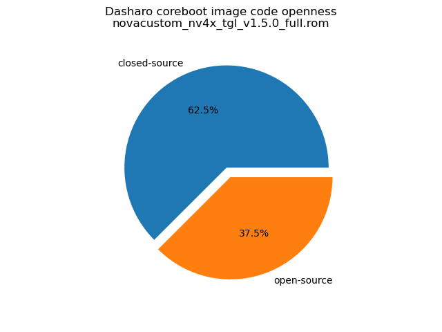
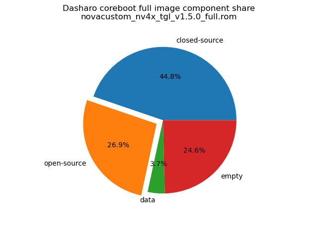

# Dasharo Openness Score

Openness Score for novacustom_nv4x_tgl_v1.5.0_full.rom

Open-source code percentage: **37.5%**
Closed-source code percentage: **62.5%**

* Image size: 16777216 (0x1000000)
* Number of regions: 26
* Number of CBFSes: 3
* Total open-source code size: 4510760 (0x44d428)
* Total closed-source code size: 7509228 (0x7294ec)
* Total data size: 628629 (0x99795)
* Total empty size: 4128599 (0x3eff57)

> Numbers given above already include the calculations from CBFS regions
> presented below

## FMAP regions

| FMAP region | Offset | Size | Category |
| ----------- | ------ | ---- | -------- |
| SI_ME | 0x1000 | 0x4ff000 | closed-source |
| SI_DESC | 0x0 | 0x1000 | data |
| RECOVERY_MRC_CACHE | 0x500000 | 0x10000 | data |
| RW_MRC_CACHE | 0x510000 | 0x10000 | data |
| SMMSTORE | 0x520000 | 0x40000 | data |
| SHARED_DATA | 0x560000 | 0x2000 | data |
| VBLOCK_DEV | 0x562000 | 0x2000 | data |
| RW_NVRAM | 0x564000 | 0x6000 | data |
| CONSOLE | 0x56a000 | 0x20000 | data |
| VBLOCK_A | 0x68a000 | 0x2000 | data |
| RW_FWID_A | 0xbfffc0 | 0x40 | data |
| RO_VPD | 0xc00000 | 0x4000 | data |
| FMAP | 0xc04000 | 0x800 | data |
| RO_FRID | 0xc04800 | 0x40 | data |
| RO_FRID_PAD | 0xc04840 | 0x7c0 | data |
| GBB | 0xc05000 | 0x3000 | data |

## CBFS BOOTSPLASH

* CBFS size: 1048576
* Number of files: 1
* Open-source files size: 0 (0x0)
* Closed-source files size: 0 (0x0)
* Data size: 28 (0x1c)
* Empty size: 1048548 (0xfffe4)

> Numbers given above are already normalized (i.e. they already include size
> of metadata and possible closed-source LAN drivers included in the payload
 > which are not visible in the table below)

| CBFS filename | CBFS filetype | Size | Compression | Category |
| ------------ | ------------- | ---- | ----------- | -------- |
| (empty) | null | 1048548 | none | empty |

## CBFS FW_MAIN_A

* CBFS size: 5717952
* Number of files: 13
* Open-source files size: 2209140 (0x21b574)
* Closed-source files size: 1135222 (0x115276)
* Data size: 8427 (0x20eb)
* Empty size: 2365163 (0x2416eb)

> Numbers given above are already normalized (i.e. they already include size
> of metadata and possible closed-source LAN drivers included in the payload
 > which are not visible in the table below)

| CBFS filename | CBFS filetype | Size | Compression | Category |
| ------------ | ------------- | ---- | ----------- | -------- |
| fallback/romstage | stage | 88136 | none | open-source |
| fallback/ramstage | stage | 141431 | LZMA | open-source |
| fallback/dsdt.aml | raw | 22608 | none | open-source |
| fallback/postcar | stage | 40492 | none | open-source |
| fallback/payload | simple elf | 1916473 | none | open-source |
| cpu_microcode_blob.bin | microcode | 207872 | none | closed-source |
| fspm.bin | fsp | 651264 | none | closed-source |
| fsps.bin | fsp | 276086 | LZ4 | closed-source |
| config | raw | 5156 | LZMA | data |
| revision | raw | 856 | none | data |
| build_info | raw | 98 | none | data |
| vbt.bin | raw | 1308 | LZMA | data |
| (empty) | null | 36 | none | empty |

## CBFS COREBOOT

* CBFS size: 4161536
* Number of files: 19
* Open-source files size: 2301620 (0x231eb4)
* Closed-source files size: 1135222 (0x115276)
* Data size: 9806 (0x264e)
* Empty size: 714888 (0xae888)

> Numbers given above are already normalized (i.e. they already include size
> of metadata and possible closed-source LAN drivers included in the payload
 > which are not visible in the table below)

| CBFS filename | CBFS filetype | Size | Compression | Category |
| ------------ | ------------- | ---- | ----------- | -------- |
| fallback/romstage | stage | 88136 | none | open-source |
| fallback/ramstage | stage | 141431 | LZMA | open-source |
| fallback/dsdt.aml | raw | 22608 | none | open-source |
| fallback/postcar | stage | 40492 | none | open-source |
| fallback/payload | simple elf | 1916473 | none | open-source |
| bootblock | bootblock | 92480 | none | open-source |
| cpu_microcode_blob.bin | microcode | 207872 | none | closed-source |
| fspm.bin | fsp | 651264 | none | closed-source |
| fsps.bin | fsp | 276086 | LZ4 | closed-source |
| cbfs_master_header | cbfs header | 28 | none | data |
| intel_fit | intel_fit | 80 | none | data |
| config | raw | 5156 | LZMA | data |
| revision | raw | 856 | none | data |
| build_info | raw | 98 | none | data |
| vbt.bin | raw | 1308 | LZMA | data |
| cmos_layout.bin | cmos_layout | 852 | none | data |
| etc/ps2-keyboard-spinup | raw | 8 | none | data |
| (empty) | null | 1508 | none | empty |
| (empty) | null | 713380 | none | empty |
