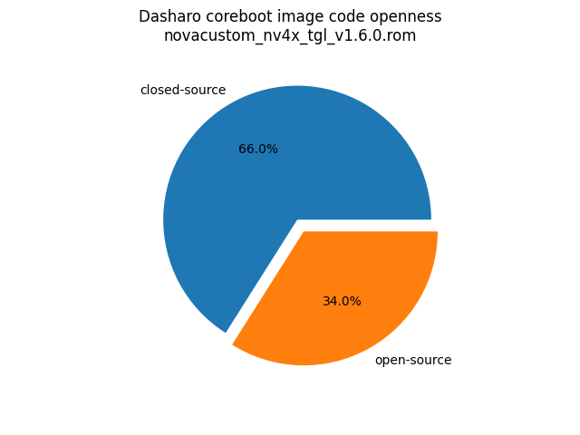
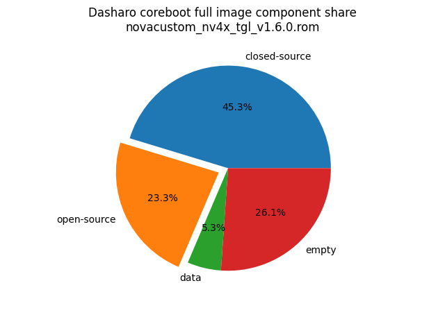
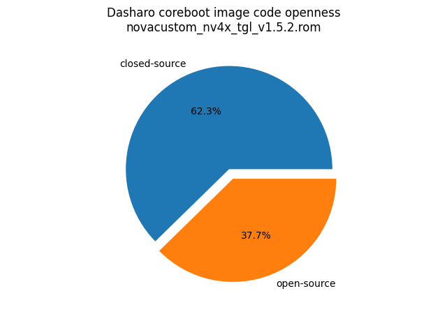
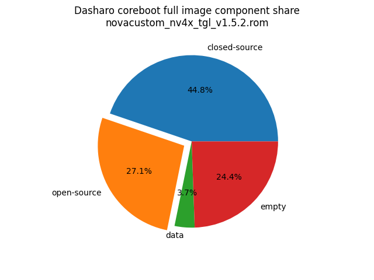

# Dasharo Openness Score

This page contains the [Dasharo Openness
Score](../../glossary.md#dasharo-openness-score) for NovaCustom NV4x 11th Gen
Dasharo releases. The content of the page is generated with [Dasharo Openness
Score utility](https://github.com/Dasharo/Openness-Score).

## v1.6.0

Openness Score for novacustom_nv4x_tgl_v1.6.0.rom

Open-source code percentage: **34.0%**
Closed-source code percentage: **66.0%**

* Image size: 16777216 (0x1000000)
* Number of regions: 23
* Number of CBFSes: 3
* Total open-source code size: 3909978 (0x3ba95a)
* Total closed-source code size: 7598688 (0x73f260)
* Total data size: 888854 (0xd9016)
* Total empty size: 4379696 (0x42d430)

> Numbers given above already include the calculations from CBFS regions
> presented below

### FMAP regions

| FMAP region | Offset | Size | Category |
| ----------- | ------ | ---- | -------- |
| SI_ME | 0x1000 | 0x4ff000 | closed-source |
| SI_DESC | 0x0 | 0x1000 | data |
| RECOVERY_MRC_CACHE | 0x500000 | 0x10000 | data |
| RW_MRC_CACHE | 0x510000 | 0x10000 | data |
| SMMSTORE | 0x520000 | 0x80000 | data |
| SHARED_DATA | 0x5a0000 | 0x2000 | data |
| VBLOCK_DEV | 0x5a2000 | 0x2000 | data |
| RW_NVRAM | 0x5a4000 | 0x6000 | data |
| CONSOLE | 0x5aa000 | 0x20000 | data |
| VBLOCK_A | 0x6ca000 | 0x2000 | data |
| RW_FWID_A | 0xafff00 | 0x100 | data |
| FMAP | 0xb00000 | 0x800 | data |
| RO_FRID | 0xb00800 | 0x100 | data |
| RO_FRID_PAD | 0xb00900 | 0x700 | data |
| GBB | 0xb01000 | 0x3000 | data |

### CBFS BOOTSPLASH

* CBFS size: 1048576
* Number of files: 1
* Open-source files size: 0 (0x0)
* Closed-source files size: 0 (0x0)
* Data size: 28 (0x1c)
* Empty size: 1048548 (0xfffe4)

> Numbers given above are already normalized (i.e. they already include size
> of metadata and possible closed-source LAN drivers included in the payload
> which are not visible in the table below)

| CBFS filename | CBFS filetype | Size | Compression | Category |
| ------------- | ------------- | ---- | ----------- | -------- |
| (empty) | null | 1048548 | none | empty |

### CBFS FW_MAIN_A

* CBFS size: 4407040
* Number of files: 16
* Open-source files size: 1903789 (0x1d0cad)
* Closed-source files size: 1179952 (0x120130)
* Data size: 14047 (0x36df)
* Empty size: 1309252 (0x13fa44)

> Numbers given above are already normalized (i.e. they already include size
> of metadata and possible closed-source LAN drivers included in the payload
> which are not visible in the table below)

| CBFS filename | CBFS filetype | Size | Compression | Category |
| ------------- | ------------- | ---- | ----------- | -------- |
| fallback/payload | simple elf | 1548893 | none | open-source |
| fallback/romstage | stage | 100816 | none | open-source |
| fallback/ramstage | stage | 154674 | LZMA | open-source |
| fallback/dsdt.aml | raw | 22090 | none | open-source |
| fallback/postcar | stage | 77316 | none | open-source |
| cpu_microcode_blob.bin | microcode | 211968 | none | closed-source |
| fspm.bin | fsp | 651264 | none | closed-source |
| fsps.bin | fsp | 300415 | LZ4 | closed-source |
| config | raw | 6064 | LZMA | data |
| revision | raw | 859 | none | data |
| build_info | raw | 102 | none | data |
| vbt.bin | raw | 1318 | LZMA | data |
| sbom | raw | 3873 | none | data |
| (empty) | null | 1316 | none | empty |
| (empty) | null | 1307936 | none | empty |

### CBFS COREBOOT

* CBFS size: 5226496
* Number of files: 23
* Open-source files size: 2006189 (0x1e9cad)
* Closed-source files size: 1179952 (0x120130)
* Data size: 18459 (0x481b)
* Empty size: 2021896 (0x1eda08)

> Numbers given above are already normalized (i.e. they already include size
> of metadata and possible closed-source LAN drivers included in the payload
> which are not visible in the table below)

| CBFS filename | CBFS filetype | Size | Compression | Category |
| ------------- | ------------- | ---- | ----------- | -------- |
| fallback/payload | simple elf | 1548893 | none | open-source |
| fallback/romstage | stage | 100816 | none | open-source |
| fallback/ramstage | stage | 154674 | LZMA | open-source |
| fallback/dsdt.aml | raw | 22090 | none | open-source |
| fallback/postcar | stage | 77316 | none | open-source |
| bootblock | bootblock | 102400 | none | open-source |
| cpu_microcode_blob.bin | microcode | 211968 | none | closed-source |
| fspm.bin | fsp | 651264 | none | closed-source |
| fsps.bin | fsp | 300415 | LZ4 | closed-source |
| cbfs_master_header | cbfs header | 32 | none | data |
| intel_fit | intel_fit | 272 | none | data |
| boot_policy_manifest.bin | raw | 1536 | none | data |
| key_manifest.bin | raw | 1024 | none | data |
| config | raw | 6064 | LZMA | data |
| revision | raw | 859 | none | data |
| build_info | raw | 102 | none | data |
| vbt.bin | raw | 1318 | LZMA | data |
| etc/ps2-keyboard-spinup | raw | 8 | none | data |
| cmos_layout.bin | cmos_layout | 852 | none | data |
| sbom | raw | 3873 | none | data |
| (empty) | null | 548 | none | empty |
| (empty) | null | 2021348 | none | empty |

## v1.5.2

Report has been generated with Openness Score utility version v0.2

Openness Score for novacustom_nv4x_tgl_v1.5.2.rom

Open-source code percentage: **37.7%**
Closed-source code percentage: **62.3%**

* Image size: 16777216 (0x1000000)
* Number of regions: 26
* Number of CBFSes: 3
* Total open-source code size: 4538722 (0x454162)
* Total closed-source code size: 7509228 (0x7294ec)
* Total data size: 628540 (0x9973c)
* Total empty size: 4100726 (0x3e9276)

> Numbers given above already include the calculations from CBFS regions
> presented below

### FMAP regions

| FMAP region | Offset | Size | Category |
| ----------- | ------ | ---- | -------- |
| SI_ME | 0x1000 | 0x4ff000 | closed-source |
| SI_DESC | 0x0 | 0x1000 | data |
| RECOVERY_MRC_CACHE | 0x500000 | 0x10000 | data |
| RW_MRC_CACHE | 0x510000 | 0x10000 | data |
| SMMSTORE | 0x520000 | 0x40000 | data |
| SHARED_DATA | 0x560000 | 0x2000 | data |
| VBLOCK_DEV | 0x562000 | 0x2000 | data |
| RW_NVRAM | 0x564000 | 0x6000 | data |
| CONSOLE | 0x56a000 | 0x20000 | data |
| VBLOCK_A | 0x68a000 | 0x2000 | data |
| RW_FWID_A | 0xbfffc0 | 0x40 | data |
| RO_VPD | 0xc00000 | 0x4000 | data |
| FMAP | 0xc04000 | 0x800 | data |
| RO_FRID | 0xc04800 | 0x40 | data |
| RO_FRID_PAD | 0xc04840 | 0x7c0 | data |
| GBB | 0xc05000 | 0x3000 | data |

### CBFS BOOTSPLASH

* CBFS size: 1048576
* Number of files: 1
* Open-source files size: 0 (0x0)
* Closed-source files size: 0 (0x0)
* Data size: 28 (0x1c)
* Empty size: 1048548 (0xfffe4)

> Numbers given above are already normalized (i.e. they already include size
> of metadata and possible closed-source LAN drivers included in the payload
> which are not visible in the table below)

| CBFS filename | CBFS filetype | Size | Compression | Category |
| ------------- | ------------- | ---- | ----------- | -------- |
| (empty) | null | 1048548 | none | empty |

### CBFS FW_MAIN_A

* CBFS size: 5717952
* Number of files: 13
* Open-source files size: 2223121 (0x21ec11)
* Closed-source files size: 1135222 (0x115276)
* Data size: 8395 (0x20cb)
* Empty size: 2351214 (0x23e06e)

> Numbers given above are already normalized (i.e. they already include size
> of metadata and possible closed-source LAN drivers included in the payload
> which are not visible in the table below)

| CBFS filename | CBFS filetype | Size | Compression | Category |
| ------------- | ------------- | ---- | ----------- | -------- |
| fallback/romstage | stage | 88200 | none | open-source |
| fallback/ramstage | stage | 141474 | LZMA | open-source |
| fallback/dsdt.aml | raw | 22277 | none | open-source |
| fallback/postcar | stage | 40492 | none | open-source |
| fallback/payload | simple elf | 1930678 | none | open-source |
| cpu_microcode_blob.bin | microcode | 207872 | none | closed-source |
| fspm.bin | fsp | 651264 | none | closed-source |
| fsps.bin | fsp | 276086 | LZ4 | closed-source |
| config | raw | 5155 | LZMA | data |
| revision | raw | 856 | none | data |
| build_info | raw | 98 | none | data |
| vbt.bin | raw | 1308 | LZMA | data |
| (empty) | null | 292 | none | empty |

### CBFS COREBOOT

* CBFS size: 4161536
* Number of files: 18
* Open-source files size: 2315601 (0x235551)
* Closed-source files size: 1135222 (0x115276)
* Data size: 9749 (0x2615)
* Empty size: 700964 (0xab224)

> Numbers given above are already normalized (i.e. they already include size
> of metadata and possible closed-source LAN drivers included in the payload
> which are not visible in the table below)

| CBFS filename | CBFS filetype | Size | Compression | Category |
| ------------- | ------------- | ---- | ----------- | -------- |
| fallback/romstage | stage | 88200 | none | open-source |
| fallback/ramstage | stage | 141474 | LZMA | open-source |
| fallback/dsdt.aml | raw | 22277 | none | open-source |
| fallback/postcar | stage | 40492 | none | open-source |
| fallback/payload | simple elf | 1930678 | none | open-source |
| bootblock | bootblock | 92480 | none | open-source |
| cpu_microcode_blob.bin | microcode | 207872 | none | closed-source |
| fspm.bin | fsp | 651264 | none | closed-source |
| fsps.bin | fsp | 276086 | LZ4 | closed-source |
| cbfs_master_header | cbfs header | 28 | none | data |
| intel_fit | intel_fit | 80 | none | data |
| config | raw | 5155 | LZMA | data |
| revision | raw | 856 | none | data |
| build_info | raw | 98 | none | data |
| etc/ps2-keyboard-spinup | raw | 8 | none | data |
| vbt.bin | raw | 1308 | LZMA | data |
| cmos_layout.bin | cmos_layout | 852 | none | data |
| (empty) | null | 700964 | none | empty |
