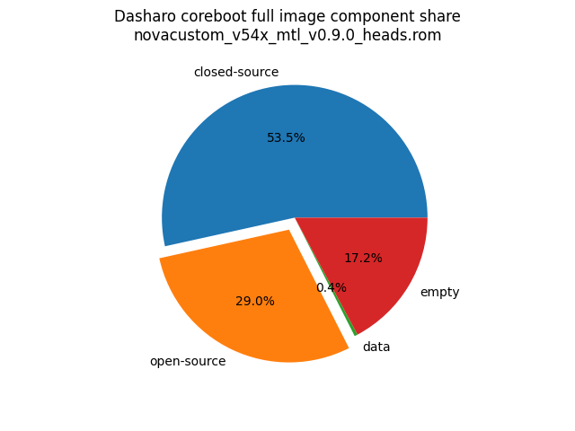

# Dasharo Openness Score

This page contains the [Dasharo Openness
Score](../../glossary.md#dasharo-openness-score) for NovaCustom V540TU Dasharo
releases. The content of the page is generated with [Dasharo Openness Score
utility](https://github.com/Dasharo/Openness-Score).

## v0.9.0 Heads

Openness Score for novacustom_v54x_mtl_v0.9.0_heads.rom

Open-source code percentage: **35.2%**
Closed-source code percentage: **64.8%**

* Image size: 33554432 (0x2000000)
* Number of regions: 7
* Number of CBFSes: 1
* Total open-source code size: 9731311 (0x947cef)
* Total closed-source code size: 17946033 (0x111d5b1)
* Total data size: 118808 (0x1d018)
* Total empty size: 5758280 (0x57dd48)

> Numbers given above already include the calculations from CBFS regions
> presented below

### FMAP regions

| FMAP region | Offset | Size | Category |
| ----------- | ------ | ---- | -------- |
| SI_ME | 0x6000 | 0x885000 | closed-source |
| SI_DESC | 0x0 | 0x4000 | data |
| RW_MRC_CACHE | 0x1000000 | 0x10000 | data |
| FMAP | 0x1010000 | 0x200 | data |

### CBFS COREBOOT

* CBFS size: 16711168
* Number of files: 19
* Open-source files size: 9731311 (0x947cef)
* Closed-source files size: 1185201 (0x1215b1)
* Data size: 36376 (0x8e18)
* Empty size: 5758280 (0x57dd48)

> Numbers given above are already normalized (i.e. they already include size
> of metadata and possible closed-source LAN drivers included in the payload
> which are not visible in the table below)

| CBFS filename | CBFS filetype | Size | Compression | Category |
| ------------- | ------------- | ---- | ----------- | -------- |
| fallback/payload | simple elf | 9387706 | none | open-source |
| fallback/romstage | stage | 90376 | none | open-source |
| fallback/ramstage | stage | 165976 | LZMA | open-source |
| fallback/dsdt.aml | raw | 21829 | none | open-source |
| fallback/postcar | stage | 34384 | none | open-source |
| bootblock | bootblock | 31040 | none | open-source |
| cpu_microcode_blob.bin | microcode | 136192 | none | closed-source |
| fspm.bin | fsp | 786432 | none | closed-source |
| fsps.bin | fsp | 262577 | LZ4 | closed-source |
| cbfs_master_header | cbfs header | 32 | none | data |
| intel_fit | intel_fit | 80 | none | data |
| config | raw | 4883 | LZMA | data |
| revision | raw | 867 | none | data |
| build_info | raw | 97 | none | data |
| bootsplash.jpg | bootsplash | 26784 | none | data |
| vbt.bin | raw | 1269 | LZMA | data |
| cmos_layout.bin | cmos_layout | 800 | none | data |
| (empty) | null | 804 | none | empty |
| (empty) | null | 5757476 | none | empty |

## v0.9.0

Openness Score for novacustom_v54x_mtl_v0.9.0.rom

Open-source code percentage: **31.9%**
Closed-source code percentage: **68.1%**

* Image size: 33554432 (0x2000000)
* Number of regions: 32
* Number of CBFSes: 4
* Total open-source code size: 6178929 (0x5e4871)
* Total closed-source code size: 13188259 (0xc93ca3)
* Total data size: 544952 (0x850b8)
* Total empty size: 13042292 (0xc70274)

> Numbers given above already include the calculations from CBFS regions
> presented below

### FMAP regions

| FMAP region | Offset | Size | Category |
| ----------- | ------ | ---- | -------- |
| SI_ME | 0x6000 | 0x8fa000 | closed-source |
| SI_DESC | 0x0 | 0x4000 | data |
| VBLOCK_A | 0x900000 | 0x2000 | data |
| RW_FWID_A | 0xffffc0 | 0x40 | data |
| RECOVERY_MRC_CACHE | 0x1000000 | 0x10000 | data |
| RW_MRC_CACHE | 0x1010000 | 0x10000 | data |
| SMMSTORE | 0x1020000 | 0x40000 | data |
| RW_ELOG | 0x1060000 | 0x4000 | data |
| SHARED_DATA | 0x1064000 | 0x2000 | data |
| VBLOCK_DEV | 0x1066000 | 0x2000 | data |
| RW_NVRAM | 0x1068000 | 0x6000 | data |
| VBLOCK_B | 0x1200000 | 0x2000 | data |
| RW_FWID_B | 0x18fffc0 | 0x40 | data |
| RO_VPD | 0x1900000 | 0x4000 | data |
| FMAP | 0x1906000 | 0x800 | data |
| RO_FRID | 0x1906800 | 0x40 | data |
| GBB | 0x1907000 | 0x3000 | data |

### CBFS FW_MAIN_A

* CBFS size: 7331776
* Number of files: 15
* Open-source files size: 2021099 (0x1ed6eb)
* Closed-source files size: 1253089 (0x131ee1)
* Data size: 9776 (0x2630)
* Empty size: 4047812 (0x3dc3c4)

> Numbers given above are already normalized (i.e. they already include size
> of metadata and possible closed-source LAN drivers included in the payload
 > which are not visible in the table below)

| CBFS filename | CBFS filetype | Size | Compression | Category |
| ------------- | ------------- | ---- | ----------- | -------- |
| fallback/payload | simple elf | 1757121 | none | open-source |
| fallback/romstage | stage | 96280 | none | open-source |
| fallback/ramstage | stage | 153503 | LZMA | open-source |
| fallback/dsdt.aml | raw | 21837 | none | open-source |
| fallback/postcar | stage | 44748 | none | open-source |
| cpu_microcode_blob.bin | microcode | 136192 | none | closed-source |
| fspm.bin | fsp | 786432 | none | closed-source |
| fsps.bin | fsp | 262577 | LZ4 | closed-source |
| config | raw | 5787 | LZMA | data |
| revision | raw | 879 | none | data |
| build_info | raw | 123 | none | data |
| vbt.bin | raw | 1287 | LZMA | data |
| (empty) | null | 1444 | none | empty |
| (empty) | null | 4046368 | none | empty |

### CBFS BOOTSPLASH

* CBFS size: 1048576
* Number of files: 1
* Open-source files size: 0 (0x0)
* Closed-source files size: 0 (0x0)
* Data size: 28 (0x1c)
* Empty size: 1048548 (0xfffe4)

> Numbers given above are already normalized (i.e. they already include size
> of metadata and possible closed-source LAN drivers included in the payload
 > which are not visible in the table below)

| CBFS filename | CBFS filetype | Size | Compression | Category |
| ------------- | ------------- | ---- | ----------- | -------- |
| (empty) | null | 1048548 | none | empty |

### CBFS FW_MAIN_B

* CBFS size: 7331776
* Number of files: 15
* Open-source files size: 2021099 (0x1ed6eb)
* Closed-source files size: 1253089 (0x131ee1)
* Data size: 9776 (0x2630)
* Empty size: 4047812 (0x3dc3c4)

> Numbers given above are already normalized (i.e. they already include size
> of metadata and possible closed-source LAN drivers included in the payload
 > which are not visible in the table below)

| CBFS filename | CBFS filetype | Size | Compression | Category |
| ------------- | ------------- | ---- | ----------- | -------- |
| fallback/payload | simple elf | 1757121 | none | open-source |
| fallback/romstage | stage | 96280 | none | open-source |
| fallback/ramstage | stage | 153503 | LZMA | open-source |
| fallback/dsdt.aml | raw | 21837 | none | open-source |
| fallback/postcar | stage | 44748 | none | open-source |
| cpu_microcode_blob.bin | microcode | 136192 | none | closed-source |
| fspm.bin | fsp | 786432 | none | closed-source |
| fsps.bin | fsp | 262577 | LZ4 | closed-source |
| config | raw | 5787 | LZMA | data |
| revision | raw | 879 | none | data |
| build_info | raw | 123 | none | data |
| vbt.bin | raw | 1287 | LZMA | data |
| (empty) | null | 1444 | none | empty |
| (empty) | null | 4046368 | none | empty |

### CBFS COREBOOT

* CBFS size: 7299072
* Number of files: 20
* Open-source files size: 2136731 (0x209a9b)
* Closed-source files size: 1253089 (0x131ee1)
* Data size: 11132 (0x2b7c)
* Empty size: 3898120 (0x3b7b08)

> Numbers given above are already normalized (i.e. they already include size
> of metadata and possible closed-source LAN drivers included in the payload
 > which are not visible in the table below)

| CBFS filename | CBFS filetype | Size | Compression | Category |
| ------------- | ------------- | ---- | ----------- | -------- |
| fallback/payload | simple elf | 1757121 | none | open-source |
| fallback/romstage | stage | 96280 | none | open-source |
| fallback/ramstage | stage | 153503 | LZMA | open-source |
| fallback/dsdt.aml | raw | 21837 | none | open-source |
| fallback/postcar | stage | 44748 | none | open-source |
| fallback/verstage | stage | 78320 | none | open-source |
| bootblock | bootblock | 37312 | none | open-source |
| cpu_microcode_blob.bin | microcode | 136192 | none | closed-source |
| fspm.bin | fsp | 786432 | none | closed-source |
| fsps.bin | fsp | 262577 | LZ4 | closed-source |
| cbfs_master_header | cbfs header | 32 | none | data |
| intel_fit | intel_fit | 80 | none | data |
| config | raw | 5787 | LZMA | data |
| revision | raw | 879 | none | data |
| build_info | raw | 123 | none | data |
| vbt.bin | raw | 1287 | LZMA | data |
| cmos_layout.bin | cmos_layout | 800 | none | data |
| (empty) | null | 292 | none | empty |
| (empty) | null | 3897828 | none | empty |
