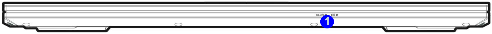
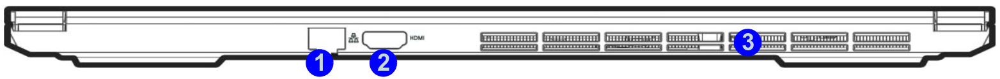
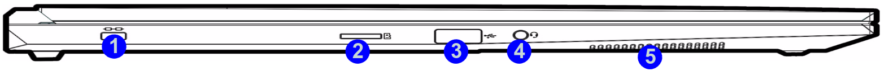
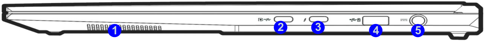

# Hardware configuration matrix

## Introduction

This document describes the hardware configurations used for validation of the
coreboot port on the NovaCustom V560TNx laptop.

## Ports specification

### Front View

| No.  | Description                                      |
|------|--------------------------------------------------|
| 1.   | LED Indicators                                   |

### Rear View

| No.  | Description                                      |
|------|--------------------------------------------------|
| 1.   | RJ-45 LAN Jack                                   |
| 2.   | HDMI-Out Port                                    |
| 3.   | Vent/Fan Intake/Outlet                           |

### Left side view

| No.  | Description                                      |
|------|--------------------------------------------------|
| 1.   | Security Lock Slot                               |
| 2.   | Vent                                             |
| 3.   | MicroSD Card Reader                              |
| 4.   | USB 3.2 Gen 1 Type A Port                        |
| 5.   | 2-In-1 Audio Jack (Headphone and Microphone)     |
| 6.   | Speaker                                          |

### Right side view

| No. |                                Description                                 |
| --- | -------------------------------------------------------------------------- |
| 1.  | Speaker                                                                    |
| 2.  | USB 3.2 Gen 2 Port (Type C) with DP 1.4, PD DC-in and [Always On USB][aou] |
| 3.  | Thunderbolt™ 4 (Type C) with PD DC-in and [Always On USB][aou]             |
| 4.  | USB 3.2 Gen 2 Port (Type A) with [Always On USB][aou]                      |
| 5.  | DC-In Jack                                                                 |

[aou]: ../../dasharo-menu-docs/dasharo-system-features.md#power-management-options

The graphics used are from pages 16-19 of the official end user manual for the
V540TNx platforms.

## V560TND

| Component                      | Description                                      |
|--------------------------------|--------------------------------------------------|
| **CPU**                        | Intel(R) Core(TM) Ultra 7 155H                   |
|                                | Internal Cooling                                 |
| **GPU**                        | 1. Intel ARC Graphics Integrated GPU             |
|                                | 2. NVIDIA GeForce RTX 4060 discrete GPU          |
| **RAM**                        | Slot 1: W-NM56S516G                              |
| **SSD**                        | Goodram PX700 1TB                                |
| **Flash memory**               | GigaDevice 25LB256FYIG                           |
| **USB pendrives**              | SanDisk Ultra USB 3.0 32 GB                      |
| **USB Keyboard**               | Logitech, Inc. Keyboard K120                     |
| **Wireless card 1**            | Intel Wi-Fi 6E AX211                             |
| **Wireless card 2**            | Intel Wi-Fi 7 BE200                              |
| **Display**                    | Display 1: HDMI 1920x1080p                       |
| **Network**                    | Local network wired connection                   |
| **Internal devices**           | 1. 1920x1200 16 inch screen                      |
|                                | 2. Internal ISO keyboard                         |
|                                | 3. Touchpad                                      |
|                                | 4. Camera                                        |
|                                | 5. Audio subsystem                               |
| **Attached devices**           | The platform is tested with every docking station/hub listed [in HCL][HCL] |
| **Power Supply**               | Chicony 20V, 9A, 180 W                           |

## V560TNE

| Component                      | Description                                      |
|--------------------------------|--------------------------------------------------|
| **CPU**                        | Intel(R) Core(TM) Ultra 7 155H                   |
|                                | Internal Cooling                                 |
| **GPU**                        | 1. Intel ARC Graphics Integrated GPU             |
|                                | 2. NVIDIA GeForce RTX 4070 discrete GPU          |
| **RAM**                        | Slot 1: W-NM56S516G                              |
| **SSD**                        | Goodram PX700 1TB                                |
| **Flash memory**               | GigaDevice 25LB256FYIG                           |
| **USB pendrives**              | SanDisk Ultra USB 3.0 32 GB                      |
| **USB Keyboard**               | Logitech, Inc. Keyboard K120                     |
| **Wireless card 1**            | Intel Wi-Fi 6E AX211                             |
| **Wireless card 2**            | Intel Wi-Fi 7 BE200                              |
| **Display**                    | Display 1: HDMI 1920x1080p                       |
| **Network**                    | Local network wired connection                   |
| **Internal devices**           | 1. 2560x1600 16 inch screen                      |
|                                | 2. Internal ISO keyboard                         |
|                                | 3. Touchpad                                      |
|                                | 4. Camera                                        |
|                                | 5. Audio subsystem                               |
| **Attached devices**           | The platform is tested with every docking station/hub listed [in HCL][HCL] |
| **Power Supply**               | Chicony 20V, 9A, 180 W                           |

[HCL]: https://docs.dasharo.com/unified/novacustom/hcl/#v56-series
