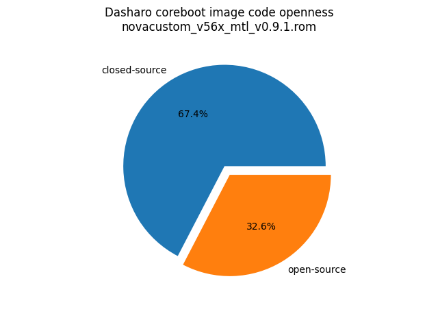
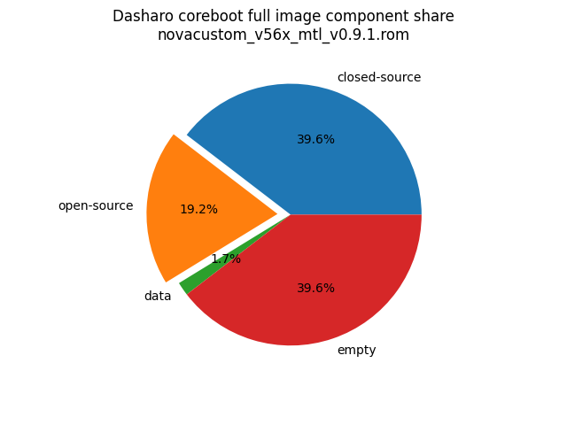

# Dasharo Openness Score v0.2.0

This page contains the [Dasharo Openness
Score](../../glossary.md#dasharo-openness-score) for NovaCustom V56xTNx Dasharo
releases. The content of the page is generated with [Dasharo Openness Score
utility](https://github.com/Dasharo/Openness-Score).

## v0.9.1

Report has been generated with Openness Score utility version v0.2

Openness Score for novacustom_v56x_mtl_v0.9.1.rom

Open-source code percentage: **32.6%**
Closed-source code percentage: **67.4%**

* Image size: 33554432 (0x2000000)
* Number of regions: 31
* Number of CBFSes: 4
* Total open-source code size: 6341706 (0x60c44a)
* Total closed-source code size: 13088979 (0xc7b8d3)
* Total data size: 553007 (0x8702f)
* Total empty size: 13083316 (0xc7a2b4)

> Numbers given above already include the calculations from CBFS regions
> presented below

### FMAP regions

| FMAP region | Offset | Size | Category |
| ----------- | ------ | ---- | -------- |
| VBLOCK_A | 0x900000 | 0x2000 | data |
| RW_FWID_A | 0xffffc0 | 0x40 | data |
| RECOVERY_MRC_CACHE | 0x1000000 | 0x10000 | data |
| RW_MRC_CACHE | 0x1010000 | 0x10000 | data |
| SMMSTORE | 0x1020000 | 0x40000 | data |
| RW_ELOG | 0x1060000 | 0x4000 | data |
| SHARED_DATA | 0x1064000 | 0x2000 | data |
| VBLOCK_DEV | 0x1066000 | 0x2000 | data |
| RW_NVRAM | 0x1068000 | 0x6000 | data |
| VBLOCK_B | 0x1200000 | 0x2000 | data |
| RW_FWID_B | 0x18fffc0 | 0x40 | data |
| RO_VPD | 0x1900000 | 0x4000 | data |
| RO_GSCVD | 0x1904000 | 0x2000 | data |
| FMAP | 0x1906000 | 0x800 | data |
| RO_FRID | 0x1906800 | 0x40 | data |
| GBB | 0x1907000 | 0x3000 | data |

### IFD regions

| IFD region | Start | End | Size | Category |
| -------------- | ----- | --- | ---- | -------- |
| Intel ME | 0x00004000 | 0x00888fff | 0x885000 | closed-source |
| Flash Descriptor | 0x00000000 | 0x00003fff | 0x4000 | data |

### CBFS FW_MAIN_A

* CBFS size: 7331776
* Number of files: 14
* Open-source files size: 2075734 (0x1fac56)
* Closed-source files size: 1185201 (0x1215b1)
* Data size: 9717 (0x25f5)
* Empty size: 4061124 (0x3df7c4)

> Numbers given above are already normalized (i.e. they already include size
> of metadata and possible closed-source LAN drivers included in the payload
> which are not visible in the table below)

| CBFS filename | CBFS filetype | Size | Compression | Category |
| ------------- | ------------- | ---- | ----------- | -------- |
| fallback/payload | simple elf | 1752592 | none | open-source |
| fallback/romstage | stage | 102472 | none | open-source |
| fallback/ramstage | stage | 152870 | LZMA | open-source |
| fallback/dsdt.aml | raw | 25200 | none | open-source |
| fallback/postcar | stage | 42600 | none | open-source |
| cpu_microcode_blob.bin | microcode | 136192 | none | closed-source |
| fspm.bin | fsp | 786432 | none | closed-source |
| fsps.bin | fsp | 262577 | LZ4 | closed-source |
| config | raw | 5823 | LZMA | data |
| revision | raw | 859 | none | data |
| build_info | raw | 103 | none | data |
| vbt.bin | raw | 1277 | LZMA | data |
| (empty) | null | 356 | none | empty |
| (empty) | null | 4060768 | none | empty |

### CBFS BOOTSPLASH

* CBFS size: 1048576
* Number of files: 1
* Open-source files size: 0 (0x0)
* Closed-source files size: 0 (0x0)
* Data size: 28 (0x1c)
* Empty size: 1048548 (0xfffe4)

> Numbers given above are already normalized (i.e. they already include size
> of metadata and possible closed-source LAN drivers included in the payload
> which are not visible in the table below)

| CBFS filename | CBFS filetype | Size | Compression | Category |
| ------------- | ------------- | ---- | ----------- | -------- |
| (empty) | null | 1048548 | none | empty |

### CBFS FW_MAIN_B

* CBFS size: 7331776
* Number of files: 14
* Open-source files size: 2075734 (0x1fac56)
* Closed-source files size: 1185201 (0x1215b1)
* Data size: 9717 (0x25f5)
* Empty size: 4061124 (0x3df7c4)

> Numbers given above are already normalized (i.e. they already include size
> of metadata and possible closed-source LAN drivers included in the payload
> which are not visible in the table below)

| CBFS filename | CBFS filetype | Size | Compression | Category |
| ------------- | ------------- | ---- | ----------- | -------- |
| fallback/payload | simple elf | 1752592 | none | open-source |
| fallback/romstage | stage | 102472 | none | open-source |
| fallback/ramstage | stage | 152870 | LZMA | open-source |
| fallback/dsdt.aml | raw | 25200 | none | open-source |
| fallback/postcar | stage | 42600 | none | open-source |
| cpu_microcode_blob.bin | microcode | 136192 | none | closed-source |
| fspm.bin | fsp | 786432 | none | closed-source |
| fsps.bin | fsp | 262577 | LZ4 | closed-source |
| config | raw | 5823 | LZMA | data |
| revision | raw | 859 | none | data |
| build_info | raw | 103 | none | data |
| vbt.bin | raw | 1277 | LZMA | data |
| (empty) | null | 356 | none | empty |
| (empty) | null | 4060768 | none | empty |

### CBFS COREBOOT

* CBFS size: 7299072
* Number of files: 19
* Open-source files size: 2190238 (0x216b9e)
* Closed-source files size: 1185201 (0x1215b1)
* Data size: 11113 (0x2b69)
* Empty size: 3912520 (0x3bb348)

> Numbers given above are already normalized (i.e. they already include size
> of metadata and possible closed-source LAN drivers included in the payload
> which are not visible in the table below)

| CBFS filename | CBFS filetype | Size | Compression | Category |
| ------------- | ------------- | ---- | ----------- | -------- |
| fallback/payload | simple elf | 1752592 | none | open-source |
| fallback/romstage | stage | 102472 | none | open-source |
| fallback/ramstage | stage | 152870 | LZMA | open-source |
| fallback/dsdt.aml | raw | 25200 | none | open-source |
| fallback/postcar | stage | 42600 | none | open-source |
| fallback/verstage | stage | 78728 | none | open-source |
| bootblock | bootblock | 35776 | none | open-source |
| cpu_microcode_blob.bin | microcode | 136192 | none | closed-source |
| fspm.bin | fsp | 786432 | none | closed-source |
| fsps.bin | fsp | 262577 | LZ4 | closed-source |
| cbfs_master_header | cbfs header | 32 | none | data |
| intel_fit | intel_fit | 80 | none | data |
| config | raw | 5823 | LZMA | data |
| revision | raw | 859 | none | data |
| build_info | raw | 103 | none | data |
| vbt.bin | raw | 1277 | LZMA | data |
| cmos_layout.bin | cmos_layout | 800 | none | data |
| (empty) | null | 100 | none | empty |
| (empty) | null | 3912420 | none | empty |
