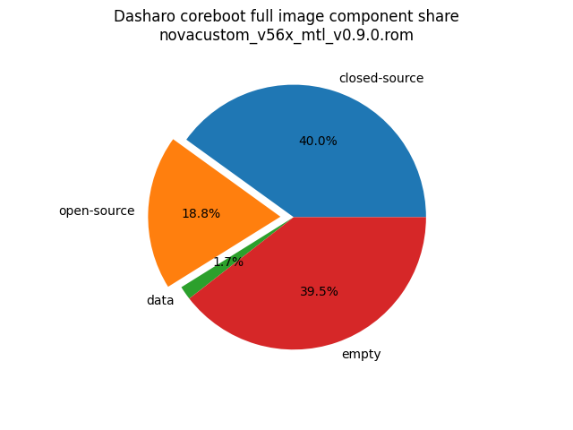

# Dasharo Openness Score v0.2.0

This page contains the [Dasharo Openness
Score](../../glossary.md#dasharo-openness-score) for NovaCustom V540TU Dasharo
releases. The content of the page is generated with [Dasharo Openness Score
utility](https://github.com/Dasharo/Openness-Score).

## v1.0.1

Openness Score for novacustom_v56x_mtl_igpu_v1.0.1_btg_prod.rom

Open-source code percentage: **22.2%**
Closed-source code percentage: **77.8%**

* Image size: 33554432 (0x2000000)
* Number of regions: 29
* Number of CBFSes: 3
* Total open-source code size: 3859614 (0x3ae49e)
* Total closed-source code size: 13532089 (0xce7bb9)
* Total data size: 794261 (0xc1e95)
* Total empty size: 15368468 (0xea8114)

> Numbers given above already include the calculations from CBFS regions
> presented below

### FMAP regions

| FMAP region | Offset | Size | Category |
| ----------- | ------ | ---- | -------- |
| SI_ME | 0x6000 | 0x9fa000 | closed-source |
| SI_DESC | 0x0 | 0x4000 | data |
| RECOVERY_MRC_CACHE | 0x1000000 | 0x10000 | data |
| RW_MRC_CACHE | 0x1010000 | 0x10000 | data |
| SMMSTORE | 0x1020000 | 0x80000 | data |
| RW_ELOG | 0x10a0000 | 0x4000 | data |
| SHARED_DATA | 0x10a4000 | 0x2000 | data |
| VBLOCK_DEV | 0x10a6000 | 0x2000 | data |
| RW_NVRAM | 0x10a8000 | 0x6000 | data |
| VBLOCK_A | 0x1200000 | 0x2000 | data |
| RW_FWID_A | 0x18fffc0 | 0x40 | data |
| RO_VPD | 0x1900000 | 0x4000 | data |
| FMAP | 0x1906000 | 0x800 | data |
| RO_FRID | 0x1906800 | 0x40 | data |
| GBB | 0x1907000 | 0x3000 | data |
| RW_UNUSED | 0xa00000 | 0x600000 | empty |

### CBFS BOOTSPLASH

* CBFS size: 1048576
* Number of files: 1
* Open-source files size: 0 (0x0)
* Closed-source files size: 0 (0x0)
* Data size: 28 (0x1c)
* Empty size: 1048548 (0xfffe4)

> Numbers given above are already normalized (i.e. they already include size
> of metadata and possible closed-source LAN drivers included in the payload
> which are not visible in the table below)

| CBFS filename | CBFS filetype | Size | Compression | Category |
| ------------- | ------------- | ---- | ----------- | -------- |
| (empty) | null | 1048548 | none | empty |

### CBFS FW_MAIN_A

* CBFS size: 7331776
* Number of files: 15
* Open-source files size: 1880655 (0x1cb24f)
* Closed-source files size: 1258061 (0x13324d)
* Data size: 10784 (0x2a20)
* Empty size: 4182276 (0x3fd104)

> Numbers given above are already normalized (i.e. they already include size
> of metadata and possible closed-source LAN drivers included in the payload
> which are not visible in the table below)

| CBFS filename | CBFS filetype | Size | Compression | Category |
| ------------- | ------------- | ---- | ----------- | -------- |
| fallback/payload | simple elf | 1564998 | none | open-source |
| fallback/romstage | stage | 105656 | none | open-source |
| fallback/ramstage | stage | 161664 | LZMA | open-source |
| fallback/dsdt.aml | raw | 23083 | none | open-source |
| fallback/postcar | stage | 77644 | none | open-source |
| cpu_microcode_blob.bin | microcode | 140288 | none | closed-source |
| fspm.bin | fsp | 786432 | none | closed-source |
| fsps.bin | fsp | 262577 | LZ4 | closed-source |
| config | raw | 6388 | LZMA | data |
| revision | raw | 864 | none | data |
| build_info | raw | 111 | none | data |
| vbt.bin | raw | 1745 | LZ4 | data |
| (empty) | null | 868 | none | empty |
| (empty) | null | 4181408 | none | empty |

### CBFS COREBOOT

* CBFS size: 7299072
* Number of files: 24
* Open-source files size: 1978959 (0x1e324f)
* Closed-source files size: 1458604 (0x1641ac)
* Data size: 15321 (0x3bd9)
* Empty size: 3846188 (0x3ab02c)

> Numbers given above are already normalized (i.e. they already include size
> of metadata and possible closed-source LAN drivers included in the payload
> which are not visible in the table below)

| CBFS filename | CBFS filetype | Size | Compression | Category |
| ------------- | ------------- | ---- | ----------- | -------- |
| fallback/payload | simple elf | 1564998 | none | open-source |
| fallback/romstage | stage | 105656 | none | open-source |
| fallback/ramstage | stage | 161664 | LZMA | open-source |
| fallback/dsdt.aml | raw | 23083 | none | open-source |
| fallback/postcar | stage | 77644 | none | open-source |
| bootblock | bootblock | 98304 | none | open-source |
| cpu_microcode_blob.bin | microcode | 140288 | none | closed-source |
| fspm.bin | fsp | 786432 | none | closed-source |
| fsps.bin | fsp | 262577 | LZ4 | closed-source |
| txt_sinit_acm.bin | raw | 68447 | LZMA | closed-source |
| txt_bios_acm.bin | raw | 132096 | none | closed-source |
| cbfs_master_header | cbfs header | 32 | none | data |
| intel_fit | intel_fit | 272 | none | data |
| boot_policy_manifest.bin | raw | 1536 | none | data |
| key_manifest.bin | raw | 1024 | none | data |
| config | raw | 6388 | LZMA | data |
| revision | raw | 864 | none | data |
| build_info | raw | 111 | none | data |
| vbt.bin | raw | 1745 | LZ4 | data |
| cmos_layout.bin | cmos_layout | 800 | none | data |
| (empty) | null | 804 | none | empty |
| (empty) | null | 143716 | none | empty |
| (empty) | null | 3701668 | none | empty |

## v1.0.0

Openness Score for novacustom_v56x_mtl_igpu_v1.0.0.rom

Open-source code percentage: **22.5%**
Closed-source code percentage: **77.5%**

* Image size: 33554432 (0x2000000)
* Number of regions: 29
* Number of CBFSes: 3
* Total open-source code size: 3946028 (0x3c362c)
* Total closed-source code size: 13593614 (0xcf6c0e)
* Total data size: 531862 (0x81d96)
* Total empty size: 15482928 (0xec4030)

> Numbers given above already include the calculations from CBFS regions
> presented below

### FMAP regions

| FMAP region | Offset | Size | Category |
| ----------- | ------ | ---- | -------- |
| SI_ME | 0x6000 | 0x9fa000 | closed-source |
| SI_DESC | 0x0 | 0x4000 | data |
| RECOVERY_MRC_CACHE | 0x1000000 | 0x10000 | data |
| RW_MRC_CACHE | 0x1010000 | 0x10000 | data |
| SMMSTORE | 0x1020000 | 0x40000 | data |
| RW_ELOG | 0x1060000 | 0x4000 | data |
| SHARED_DATA | 0x1064000 | 0x2000 | data |
| VBLOCK_DEV | 0x1066000 | 0x2000 | data |
| RW_NVRAM | 0x1068000 | 0x6000 | data |
| VBLOCK_A | 0x1200000 | 0x2000 | data |
| RW_FWID_A | 0x18fffc0 | 0x40 | data |
| RO_VPD | 0x1900000 | 0x4000 | data |
| FMAP | 0x1906000 | 0x800 | data |
| RO_FRID | 0x1906800 | 0x40 | data |
| GBB | 0x1907000 | 0x3000 | data |
| RW_UNUSED | 0xa00000 | 0x600000 | empty |

### CBFS BOOTSPLASH

* CBFS size: 1048576
* Number of files: 1
* Open-source files size: 0 (0x0)
* Closed-source files size: 0 (0x0)
* Data size: 28 (0x1c)
* Empty size: 1048548 (0xfffe4)

> Numbers given above are already normalized (i.e. they already include size
> of metadata and possible closed-source LAN drivers included in the payload
> which are not visible in the table below)

| CBFS filename | CBFS filetype | Size | Compression | Category |
| ------------- | ------------- | ---- | ----------- | -------- |
| (empty) | null | 1048548 | none | empty |

### CBFS FW_MAIN_A

* CBFS size: 7331776
* Number of files: 15
* Open-source files size: 1923862 (0x1d5b16)
* Closed-source files size: 1258023 (0x133227)
* Data size: 10815 (0x2a3f)
* Empty size: 4139076 (0x3f2844)

> Numbers given above are already normalized (i.e. they already include size
> of metadata and possible closed-source LAN drivers included in the payload
> which are not visible in the table below)

| CBFS filename | CBFS filetype | Size | Compression | Category |
| ------------- | ------------- | ---- | ----------- | -------- |
| fallback/payload | simple elf | 1595877 | none | open-source |
| fallback/romstage | stage | 114200 | none | open-source |
| fallback/ramstage | stage | 165588 | LZMA | open-source |
| fallback/dsdt.aml | raw | 23083 | none | open-source |
| fallback/postcar | stage | 77504 | none | open-source |
| cpu_microcode_blob.bin | microcode | 140288 | none | closed-source |
| fspm.bin | fsp | 786432 | none | closed-source |
| fsps.bin | fsp | 262577 | LZ4 | closed-source |
| config | raw | 6408 | LZMA | data |
| revision | raw | 864 | none | data |
| build_info | raw | 111 | none | data |
| vbt.bin | raw | 1745 | LZ4 | data |
| (empty) | null | 356 | none | empty |
| (empty) | null | 4138720 | none | empty |

### CBFS COREBOOT

* CBFS size: 7299072
* Number of files: 21
* Open-source files size: 2022166 (0x1edb16)
* Closed-source files size: 1258023 (0x133227)
* Data size: 15035 (0x3abb)
* Empty size: 4003848 (0x3d1808)

> Numbers given above are already normalized (i.e. they already include size
> of metadata and possible closed-source LAN drivers included in the payload
> which are not visible in the table below)

| CBFS filename | CBFS filetype | Size | Compression | Category |
| ------------- | ------------- | ---- | ----------- | -------- |
| fallback/payload | simple elf | 1595877 | none | open-source |
| fallback/romstage | stage | 114200 | none | open-source |
| fallback/ramstage | stage | 165588 | LZMA | open-source |
| fallback/dsdt.aml | raw | 23083 | none | open-source |
| fallback/postcar | stage | 77504 | none | open-source |
| bootblock | bootblock | 98304 | none | open-source |
| cpu_microcode_blob.bin | microcode | 140288 | none | closed-source |
| fspm.bin | fsp | 786432 | none | closed-source |
| fsps.bin | fsp | 262577 | LZ4 | closed-source |
| cbfs_master_header | cbfs header | 32 | none | data |
| intel_fit | intel_fit | 272 | none | data |
| boot_policy_manifest.bin | raw | 1536 | none | data |
| key_manifest.bin | raw | 1024 | none | data |
| config | raw | 6408 | LZMA | data |
| revision | raw | 864 | none | data |
| build_info | raw | 111 | none | data |
| cmos_layout.bin | cmos_layout | 800 | none | data |
| vbt.bin | raw | 1745 | LZ4 | data |
| (empty) | null | 292 | none | empty |
| (empty) | null | 4003556 | none | empty |

## v0.9.0 Heads

Report has been generated with Openness Score utility version v0.2

Openness Score for novacustom_v56x_mtl_v0.9.0_heads.rom

Open-source code percentage: **35.2%**
Closed-source code percentage: **64.8%**

* Image size: 33554432 (0x2000000)
* Number of regions: 7
* Number of CBFSes: 1
* Total open-source code size: 9730808 (0x947af8)
* Total closed-source code size: 17937841 (0x111b5b1)
* Total data size: 126927 (0x1efcf)
* Total empty size: 5758856 (0x57df88)

> Numbers given above already include the calculations from CBFS regions
> presented below

### FMAP regions

| FMAP region | Offset | Size | Category |
| ----------- | ------ | ---- | -------- |
| RW_MRC_CACHE | 0x1000000 | 0x10000 | data |
| FMAP | 0x1010000 | 0x200 | data |

### IFD regions

| IFD region | Start | End | Size | Category |
| -------------- | ----- | --- | ---- | -------- |
| Intel ME | 0x00006000 | 0x0088afff | 0x885000 | closed-source |
| Flash Descriptor | 0x00000000 | 0x00003fff | 0x4000 | data |
| GbE | 0x00004000 | 0x00005fff | 0x2000 | data |

### CBFS COREBOOT

* CBFS size: 16711168
* Number of files: 19
* Open-source files size: 9730808 (0x947af8)
* Closed-source files size: 1185201 (0x1215b1)
* Data size: 36303 (0x8dcf)
* Empty size: 5758856 (0x57df88)

> Numbers given above are already normalized (i.e. they already include size
> of metadata and possible closed-source LAN drivers included in the payload
> which are not visible in the table below)

| CBFS filename | CBFS filetype | Size | Compression | Category |
| ------------- | ------------- | ---- | ----------- | -------- |
| fallback/payload | simple elf | 9387194 | none | open-source |
| fallback/romstage | stage | 90376 | none | open-source |
| fallback/ramstage | stage | 165985 | LZMA | open-source |
| fallback/dsdt.aml | raw | 21829 | none | open-source |
| fallback/postcar | stage | 34384 | none | open-source |
| bootblock | bootblock | 31040 | none | open-source |
| cpu_microcode_blob.bin | microcode | 136192 | none | closed-source |
| fspm.bin | fsp | 786432 | none | closed-source |
| fsps.bin | fsp | 262577 | LZ4 | closed-source |
| cbfs_master_header | cbfs header | 32 | none | data |
| intel_fit | intel_fit | 80 | none | data |
| config | raw | 4879 | LZMA | data |
| revision | raw | 867 | none | data |
| build_info | raw | 97 | none | data |
| bootsplash.jpg | bootsplash | 26784 | none | data |
| vbt.bin | raw | 1269 | LZMA | data |
| cmos_layout.bin | cmos_layout | 800 | none | data |
| (empty) | null | 484 | none | empty |
| (empty) | null | 5758372 | none | empty |

## v0.9.0

Report has been generated with Openness Score utility version v0.2

Openness Score for novacustom_v56x_mtl_v0.9.0.rom

Open-source code percentage: **32.0%**
Closed-source code percentage: **68.0%**

* Image size: 33554432 (0x2000000)
* Number of regions: 32
* Number of CBFSes: 4
* Total open-source code size: 6225987 (0x5f0043)
* Total closed-source code size: 13246149 (0xca1ec5)
* Total data size: 553156 (0x870c4)
* Total empty size: 13049908 (0xc72034)

> Numbers given above already include the calculations from CBFS regions
> presented below

### FMAP regions

| FMAP region | Offset | Size | Category |
| ----------- | ------ | ---- | -------- |
| VBLOCK_A | 0x900000 | 0x2000 | data |
| RW_FWID_A | 0xffffc0 | 0x40 | data |
| RECOVERY_MRC_CACHE | 0x1000000 | 0x10000 | data |
| RW_MRC_CACHE | 0x1010000 | 0x10000 | data |
| SMMSTORE | 0x1020000 | 0x40000 | data |
| RW_ELOG | 0x1060000 | 0x4000 | data |
| SHARED_DATA | 0x1064000 | 0x2000 | data |
| VBLOCK_DEV | 0x1066000 | 0x2000 | data |
| RW_NVRAM | 0x1068000 | 0x6000 | data |
| VBLOCK_B | 0x1200000 | 0x2000 | data |
| RW_FWID_B | 0x18fffc0 | 0x40 | data |
| RO_VPD | 0x1900000 | 0x4000 | data |
| RO_GSCVD | 0x1904000 | 0x2000 | data |
| FMAP | 0x1906000 | 0x800 | data |
| RO_FRID | 0x1906800 | 0x40 | data |
| GBB | 0x1907000 | 0x3000 | data |

### IFD regions

| IFD region | Start | End | Size | Category |
| -------------- | ----- | --- | ---- | -------- |
| Intel ME | 0x00006000 | 0x0088afff | 0x885000 | closed-source |
| Flash Descriptor | 0x00000000 | 0x00003fff | 0x4000 | data |
| GbE | 0x00004000 | 0x00005fff | 0x2000 | empty |

### CBFS FW_MAIN_A

* CBFS size: 7331776
* Number of files: 15
* Open-source files size: 2036785 (0x1f1431)
* Closed-source files size: 1237591 (0x12e257)
* Data size: 9780 (0x2634)
* Empty size: 4047620 (0x3dc304)

> Numbers given above are already normalized (i.e. they already include size
> of metadata and possible closed-source LAN drivers included in the payload
> which are not visible in the table below)

| CBFS filename | CBFS filetype | Size | Compression | Category |
| ------------- | ------------- | ---- | ----------- | -------- |
| fallback/payload | simple elf | 1757121 | none | open-source |
| fallback/romstage | stage | 96280 | none | open-source |
| fallback/ramstage | stage | 153488 | LZMA | open-source |
| fallback/dsdt.aml | raw | 21837 | none | open-source |
| ec.rom | raw | 15701 | LZMA | open-source |
| fallback/postcar | stage | 44748 | none | open-source |
| cpu_microcode_blob.bin | microcode | 136192 | none | closed-source |
| fspm.bin | fsp | 786432 | none | closed-source |
| fsps.bin | fsp | 262577 | LZ4 | closed-source |
| config | raw | 5786 | LZMA | data |
| revision | raw | 879 | none | data |
| build_info | raw | 123 | none | data |
| vbt.bin | raw | 1287 | LZMA | data |
| (empty) | null | 1252 | none | empty |
| (empty) | null | 4046368 | none | empty |

### CBFS BOOTSPLASH

* CBFS size: 1048576
* Number of files: 1
* Open-source files size: 0 (0x0)
* Closed-source files size: 0 (0x0)
* Data size: 28 (0x1c)
* Empty size: 1048548 (0xfffe4)

> Numbers given above are already normalized (i.e. they already include size
> of metadata and possible closed-source LAN drivers included in the payload
> which are not visible in the table below)

| CBFS filename | CBFS filetype | Size | Compression | Category |
| ------------- | ------------- | ---- | ----------- | -------- |
| (empty) | null | 1048548 | none | empty |

### CBFS FW_MAIN_B

* CBFS size: 7331776
* Number of files: 15
* Open-source files size: 2036785 (0x1f1431)
* Closed-source files size: 1237591 (0x12e257)
* Data size: 9780 (0x2634)
* Empty size: 4047620 (0x3dc304)

> Numbers given above are already normalized (i.e. they already include size
> of metadata and possible closed-source LAN drivers included in the payload
> which are not visible in the table below)

| CBFS filename | CBFS filetype | Size | Compression | Category |
| ------------- | ------------- | ---- | ----------- | -------- |
| fallback/payload | simple elf | 1757121 | none | open-source |
| fallback/romstage | stage | 96280 | none | open-source |
| fallback/ramstage | stage | 153488 | LZMA | open-source |
| fallback/dsdt.aml | raw | 21837 | none | open-source |
| ec.rom | raw | 15701 | LZMA | open-source |
| fallback/postcar | stage | 44748 | none | open-source |
| cpu_microcode_blob.bin | microcode | 136192 | none | closed-source |
| fspm.bin | fsp | 786432 | none | closed-source |
| fsps.bin | fsp | 262577 | LZ4 | closed-source |
| config | raw | 5786 | LZMA | data |
| revision | raw | 879 | none | data |
| build_info | raw | 123 | none | data |
| vbt.bin | raw | 1287 | LZMA | data |
| (empty) | null | 1252 | none | empty |
| (empty) | null | 4046368 | none | empty |

### CBFS COREBOOT

* CBFS size: 7299072
* Number of files: 20
* Open-source files size: 2152417 (0x20d7e1)
* Closed-source files size: 1237591 (0x12e257)
* Data size: 11136 (0x2b80)
* Empty size: 3897928 (0x3b7a48)

> Numbers given above are already normalized (i.e. they already include size
> of metadata and possible closed-source LAN drivers included in the payload
> which are not visible in the table below)

| CBFS filename | CBFS filetype | Size | Compression | Category |
| ------------- | ------------- | ---- | ----------- | -------- |
| fallback/payload | simple elf | 1757121 | none | open-source |
| fallback/romstage | stage | 96280 | none | open-source |
| fallback/ramstage | stage | 153488 | LZMA | open-source |
| fallback/dsdt.aml | raw | 21837 | none | open-source |
| ec.rom | raw | 15701 | LZMA | open-source |
| fallback/postcar | stage | 44748 | none | open-source |
| fallback/verstage | stage | 78320 | none | open-source |
| bootblock | bootblock | 37312 | none | open-source |
| cpu_microcode_blob.bin | microcode | 136192 | none | closed-source |
| fspm.bin | fsp | 786432 | none | closed-source |
| fsps.bin | fsp | 262577 | LZ4 | closed-source |
| cbfs_master_header | cbfs header | 32 | none | data |
| intel_fit | intel_fit | 80 | none | data |
| config | raw | 5786 | LZMA | data |
| revision | raw | 879 | none | data |
| build_info | raw | 123 | none | data |
| vbt.bin | raw | 1287 | LZMA | data |
| cmos_layout.bin | cmos_layout | 800 | none | data |
| (empty) | null | 100 | none | empty |
| (empty) | null | 3897828 | none | empty |
