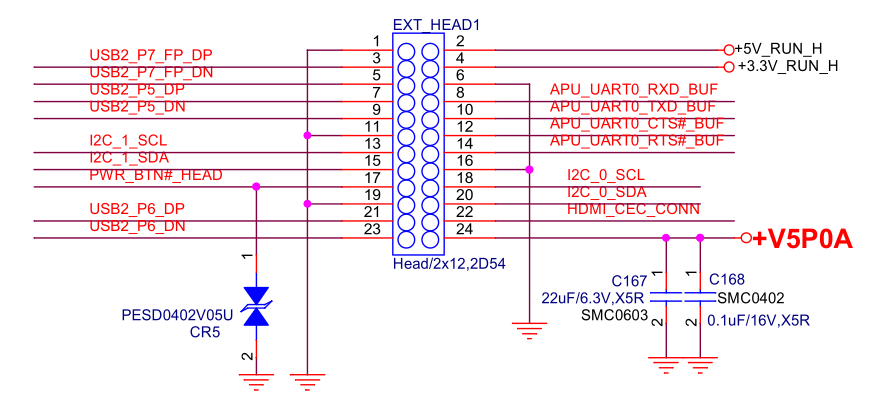

# Laboratory stand dedicated to Odroid-H4 platforms assembly guide

## Introduction

This document describes platform-specific details for assembling Odroid
H4 testing stands. Use this document as reference while going through
[Generic Testing Stand Setup](../../unified-test-documentation/generic-testing-stand-setup.md)

## Prerequisites

The below table contains platform-specific information about all elements which
are needed to create testing stands for Odroid H4.

* [RTE v1.1.0](https://shop.3mdeb.com/shop/open-source-hardware/open-source-hardware-3mdeb/rte/)
* RTE power supply 5V 2A Micro-USB
* 10x standard female-female connection wire 2.54 mm raster
* Pomona 8-pin SOIC clip
* 2x RJ45 cable: 1 for RTE and 1 for the platform

### External flashing enabling

Connect the RTE SPI header to the platform using the 2.54 mm female-female
wires and Pomona as shown in [Generic testing stand setup](../../unified-test-documentation/generic-testing-stand-setup.md)
to the flash chip on the bottom of your platform:


### Serial connection

The method of setting and using serial connection is described in the
[Serial connection guide](../rte/v1.1.0/serial-port-connection-guide.md).
In this case, you will need to enable UART port and connect it to the pins 6,
8 and 10 of Odroid's Peripheral Expansion Header using 2.54 mm female-female
wires.

| RTE J18             | Odroid H4 EXPANSION HEADER             |
|:--------------------|:---------------------------------------|
| J18 pin 1 (TX)      | <TBD marking> pin 6  APU_UART_RXD_BUF  |
| J18 pin 2 (RX)      | <TBD marking> pin 8  APU_UART_TXD_BUF  |
| J18 pin 3 (GND)     | <TBD marking> pin 10 GND               |



## Theory of operation

The following sections describe how to use all of the enabled features:

* serial connection to the platform,
* controlling power supply,
* enabling basic power actions with the platform (power off/power on),
* external flashing with the RTE.

### Power supply controlling

Power supply controlling is performed with the relay module on RTE
connected to one of RTE GPIOs. Power operation should be performed using
the `rte_ctrl` script implemented in `meta-rte` (OS image dedicated to the
RTE platform).

To toggle the power supply use the below command:

```bash
rte_ctrl rel
```

### Basic power operations

Basic power operations should be performed based on the `rte_ctrl` script
implemented in `meta-rte` (OS image dedicated to the RTE platform). To perform
basic power operations use the below-described commands:

1. Turn on the platform:

    ```bash
    rte_ctrl pon
    ```

1. Turn off the platform:

    ```bash
    rte_ctrl poff
    ```

> Note, that in order for the above commands to work properly, the platform
should be powered up: both RTE Relay and the power supply must be connected and
turned on.

### External flashing

The external flashing procedure should be performed based on the scripts
implemented on the RTE platform. To perform the flashing operation reproduce,
the below-described steps:

!!! Danger "Important"
    it is recommended to detect the chip with the DC jack power cable
    disconnected from the Odroid. If the chip is surequiresccessfully detected,
    you can reconnect the DC power jack and proceed with your task. If the
    chip fails to detect after reconnecting the power, you may need to attach
    an additional grounding cable to the RTE. This additional grounding is not
    always necessary, but it can resolve detection issues if they ARISE.

1. First run the flashrom command on RTE to check if the flash is detected by
    following the first three steps from [this guide](https://docs.dasharo.com/transparent-validation/rte/v1.1.0/specification/#how-to-set-gpio-states-to-flash-spi)
    , this chip requires 3.3V.

1. Next check if the pomona is connected properly.

    ```bash
    flashrom -p linux_spi:dev=/dev/spidev1.0,spispeed=16000
    ```

1. By using `scp` put the requested Dasharo file to the RTE:

    ```bash
    scp <path_to_firmware>/<firmware_file> root@<RTE_IP>:/tmp/coreboot.rom
    ```

    Where:

    - `path_to_firmware` - path to firmware, which should send to RTE,
    - `firmware_file` - the name of the firmware file, which should be sent
        to RTE,
    - `RTE_IP` - IP address of the connected RTE.

1. Login to RTE via `ssh` or `minicom`.
1. Read the flash chip by executing the following command on RTE:

    ```bash
    ./flash.sh read tmp/dump.rom
    ```

1. If the reading was successful, the output from the command above should
    contain the phrase `Verifying flash... VERIFIED`.
1. Write the flash chip by executing the following command on RTE:

    ```bash
    ./flash.sh write /tmp/coreboot.rom
    ```

    > Do not interrupt the flashing procedure in any way (especially by
    changing connections). It may cause hardware damage!

1. If the reading was successful, the output from the command above should
    contain the phrase `Verifying flash... VERIFIED`.

### USB devices

Since some issues with USB controllers may only happen on select USB ports,
it's important to plug in USB devices to all 4 USB ports of the board.
