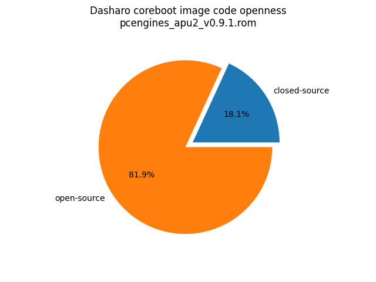
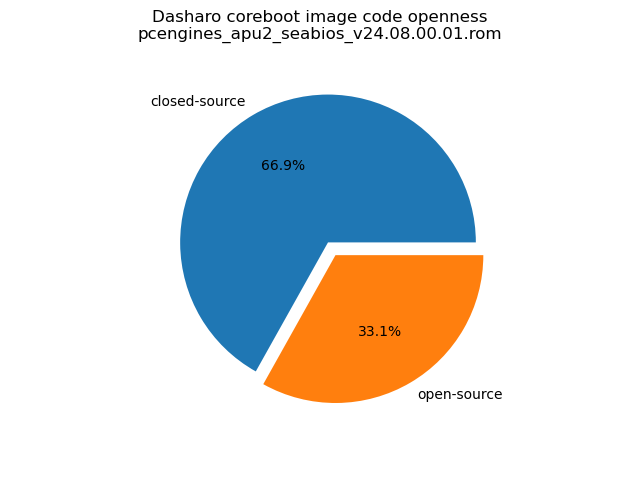
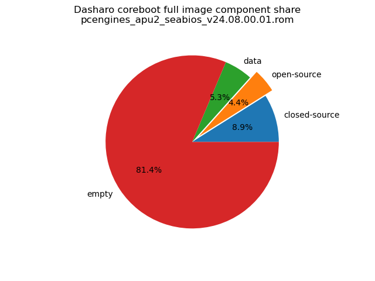
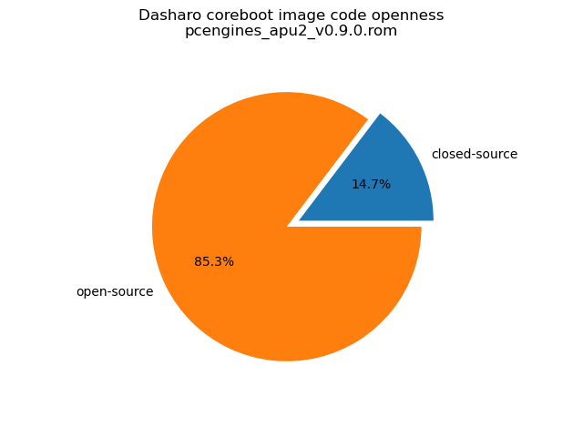
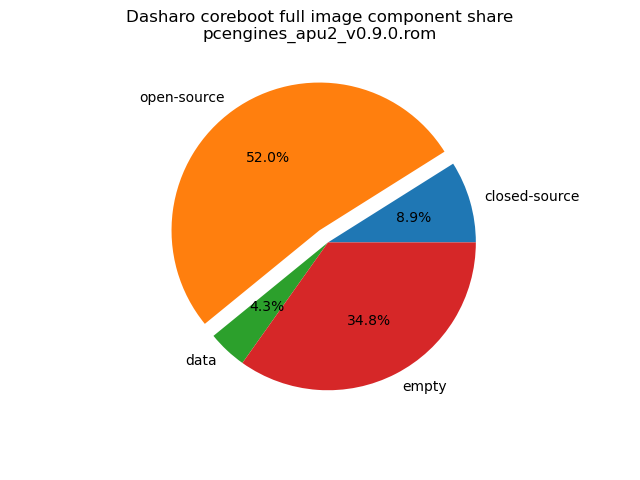

# Dasharo Openness Score

This page contains the [Dasharo Openness
Score](../../glossary.md#dasharo-openness-score) for PC Engines apu2 series
Dasharo releases. The content of the page is generated with [Dasharo Openness
Score utility](https://github.com/Dasharo/Openness-Score).

## v0.9.1

Openness Score for pcengines_apu2_v0.9.1.rom

Open-source code percentage: **81.9%**
Closed-source code percentage: **18.1%**

* Image size: 8388608 (0x800000)
* Number of regions: 12
* Number of CBFSes: 2
* Total open-source code size: 3382824 (0x339e28)
* Total closed-source code size: 749792 (0xb70e0)
* Total data size: 359852 (0x57dac)
* Total empty size: 3896140 (0x3b734c)

> Numbers given above already include the calculations from CBFS regions
> presented below

### FMAP regions

| FMAP region | Offset | Size | Category |
| ----------- | ------ | ---- | -------- |
| SMMSTORE | 0x0 | 0x40000 | data |
| RW_NVRAM | 0x40000 | 0x1000 | data |
| VBLOCK_A | 0x41000 | 0x2000 | data |
| RW_FWID_A | 0x3fff00 | 0x100 | data |
| FMAP | 0x400000 | 0x1000 | data |
| RO_FRID | 0x401000 | 0x100 | data |
| RO_FRID_PAD | 0x401100 | 0x700 | data |
| GBB | 0x401800 | 0x10000 | data |

### CBFS FW_MAIN_A

* CBFS size: 3919616
* Number of files: 10
* Open-source files size: 1662740 (0x195f14)
* Closed-source files size: 0 (0x0)
* Data size: 6476 (0x194c)
* Empty size: 2250400 (0x2256a0)

> Numbers given above are already normalized (i.e. they already include size
> of metadata and possible closed-source LAN drivers included in the payload
> which are not visible in the table below)

| CBFS filename | CBFS filetype | Size | Compression | Category |
| ------------- | ------------- | ---- | ----------- | -------- |
| fallback/payload | simple elf | 1475016 | none | open-source |
| fallback/romstage | stage | 46520 | none | open-source |
| fallback/ramstage | stage | 101109 | LZMA | open-source |
| fallback/dsdt.aml | raw | 5835 | none | open-source |
| fallback/postcar | stage | 34260 | none | open-source |
| config | raw | 4109 | LZMA | data |
| revision | raw | 854 | none | data |
| build_info | raw | 97 | none | data |
| spd.bin | spd | 256 | none | data |
| (empty) | null | 2250400 | none | empty |

### CBFS COREBOOT

* CBFS size: 4122624
* Number of files: 16
* Open-source files size: 1720084 (0x1a3f14)
* Closed-source files size: 749792 (0xb70e0)
* Data size: 7008 (0x1b60)
* Empty size: 1645740 (0x191cac)

> Numbers given above are already normalized (i.e. they already include size
> of metadata and possible closed-source LAN drivers included in the payload
> which are not visible in the table below)

| CBFS filename | CBFS filetype | Size | Compression | Category |
| ------------- | ------------- | ---- | ----------- | -------- |
| fallback/payload | simple elf | 1475016 | none | open-source |
| fallback/romstage | stage | 46520 | none | open-source |
| fallback/ramstage | stage | 101109 | LZMA | open-source |
| fallback/dsdt.aml | raw | 5835 | none | open-source |
| fallback/postcar | stage | 34260 | none | open-source |
| bootblock | bootblock | 57344 | none | open-source |
| AGESA | raw | 504032 | none | closed-source |
| apu/amdfw | raw | 245760 | none | closed-source |
| cbfs_master_header | cbfs header | 32 | none | data |
| config | raw | 4109 | LZMA | data |
| revision | raw | 854 | none | data |
| build_info | raw | 97 | none | data |
| spd.bin | spd | 256 | none | data |
| (empty) | null | 356004 | none | empty |
| (empty) | null | 1199716 | none | empty |
| (empty) | null | 90020 | none | empty |

## v24.08.00.01

Openness Score for pcengines_apu2_seabios_v24.08.00.01.rom

Open-source code percentage: **33.1%**
Closed-source code percentage: **66.9%**

* Image size: 8388608 (0x800000)
* Number of regions: 13
* Number of CBFSes: 1
* Total open-source code size: 371320 (0x5aa78)
* Total closed-source code size: 749792 (0xb70e0)
* Total data size: 443068 (0x6c2bc)
* Total empty size: 6824428 (0x6821ec)

> Numbers given above already include the calculations from CBFS regions
> presented below

### FMAP regions

| FMAP region | Offset | Size | Category |
| ----------- | ------ | ---- | -------- |
| BOOTORDER | 0x0 | 0x1000 | data |
| RW_VPD | 0x1000 | 0x4000 | data |
| SMMSTORE | 0x5000 | 0x20000 | data |
| RO_VPD | 0x200000 | 0x4000 | data |
| FMAP | 0x204000 | 0x800 | data |
| RO_FRID | 0x204800 | 0x40 | data |
| RO_FRID_PAD | 0x204840 | 0x7c0 | data |
| GBB | 0x205000 | 0x40000 | data |
| RW_UNUSED | 0x25000 | 0x1db000 | empty |

### CBFS COREBOOT

* CBFS size: 6008832
* Number of files: 27
* Open-source files size: 371320 (0x5aa78)
* Closed-source files size: 749792 (0xb70e0)
* Data size: 8892 (0x22bc)
* Empty size: 4878828 (0x4a71ec)

> Numbers given above are already normalized (i.e. they already include size
> of metadata and possible closed-source LAN drivers included in the payload
> which are not visible in the table below)

| CBFS filename | CBFS filetype | Size | Compression | Category |
| ------------- | ------------- | ---- | ----------- | -------- |
| fallback/romstage | stage | 24560 | none | open-source |
| fallback/ramstage | stage | 82119 | LZMA | open-source |
| fallback/dsdt.aml | raw | 6962 | none | open-source |
| fallback/postcar | stage | 22184 | none | open-source |
| fallback/payload | simple elf | 53703 | none | open-source |
| img/memtest | simple elf | 47526 | none | open-source |
| img/setup | simple elf | 27258 | none | open-source |
| genroms/pxe.rom | raw | 90624 | none | open-source |
| bootblock | bootblock | 16384 | none | open-source |
| AGESA | raw | 504032 | none | closed-source |
| apu/amdfw | raw | 245760 | none | closed-source |
| cbfs_master_header | cbfs header | 32 | none | data |
| config | raw | 3178 | LZMA | data |
| revision | raw | 702 | none | data |
| build_info | raw | 88 | none | data |
| spd.bin | spd | 256 | none | data |
| payload_config | raw | 1599 | none | data |
| payload_revision | raw | 217 | none | data |
| bootorder_map | raw | 153 | none | data |
| bootorder_def | raw | 624 | none | data |
| etc/boot-menu-key | raw | 8 | none | data |
| etc/boot-menu-wait | raw | 8 | none | data |
| etc/boot-menu-message | raw | 48 | none | data |
| etc/sercon-port | raw | 8 | none | data |
| (empty) | null | 3548068 | none | empty |
| (empty) | null | 675492 | none | empty |
| (empty) | null | 655268 | none | empty |

## v0.9.0

Openness Score for pcengines_apu2_v0.9.0.rom

Open-source code percentage: **85.3%**
Closed-source code percentage: **14.7%**

* Image size: 8388608 (0x800000)
* Number of regions: 12
* Number of CBFSes: 2
* Total open-source code size: 4358328 (0x4280b8)
* Total closed-source code size: 749792 (0xb70e0)
* Total data size: 359260 (0x57b5c)
* Total empty size: 2921228 (0x2c930c)

> Numbers given above already include the calculations from CBFS regions
> presented below

### FMAP regions

| FMAP region | Offset | Size | Category |
| ----------- | ------ | ---- | -------- |
| SMMSTORE | 0x0 | 0x40000 | data |
| RW_NVRAM | 0x40000 | 0x1000 | data |
| VBLOCK_A | 0x41000 | 0x2000 | data |
| RW_FWID_A | 0x3fff00 | 0x100 | data |
| FMAP | 0x400000 | 0x1000 | data |
| RO_FRID | 0x401000 | 0x100 | data |
| RO_FRID_PAD | 0x401100 | 0x700 | data |
| GBB | 0x401800 | 0x10000 | data |

### CBFS FW_MAIN_A

* CBFS size: 3919616
* Number of files: 10
* Open-source files size: 2150524 (0x20d07c)
* Closed-source files size: 0 (0x0)
* Data size: 6180 (0x1824)
* Empty size: 1762912 (0x1ae660)

> Numbers given above are already normalized (i.e. they already include size
> of metadata and possible closed-source LAN drivers included in the payload
 > which are not visible in the table below)

| CBFS filename | CBFS filetype | Size | Compression | Category |
| ------------- | ------------- | ---- | ----------- | -------- |
| fallback/payload | simple elf | 1960751 | none | open-source |
| fallback/romstage | stage | 49464 | none | open-source |
| fallback/ramstage | stage | 101300 | LZMA | open-source |
| fallback/dsdt.aml | raw | 5713 | none | open-source |
| fallback/postcar | stage | 33296 | none | open-source |
| config | raw | 3848 | LZMA | data |
| revision | raw | 854 | none | data |
| build_info | raw | 97 | none | data |
| spd.bin | spd | 256 | none | data |
| (empty) | null | 1762912 | none | empty |

### CBFS COREBOOT

* CBFS size: 4122624
* Number of files: 16
* Open-source files size: 2207804 (0x21b03c)
* Closed-source files size: 749792 (0xb70e0)
* Data size: 6712 (0x1a38)
* Empty size: 1158316 (0x11acac)

> Numbers given above are already normalized (i.e. they already include size
> of metadata and possible closed-source LAN drivers included in the payload
 > which are not visible in the table below)

| CBFS filename | CBFS filetype | Size | Compression | Category |
| ------------- | ------------- | ---- | ----------- | -------- |
| fallback/payload | simple elf | 1960751 | none | open-source |
| fallback/romstage | stage | 49464 | none | open-source |
| fallback/dsdt.aml | raw | 5713 | none | open-source |
| fallback/ramstage | stage | 101300 | LZMA | open-source |
| fallback/postcar | stage | 33296 | none | open-source |
| bootblock | bootblock | 57280 | none | open-source |
| AGESA | raw | 504032 | none | closed-source |
| cbfs_master_header | cbfs header | 28 | none | data |
| config | raw | 3848 | LZMA | data |
| revision | raw | 854 | none | data |
| build_info | raw | 97 | none | data |
| spd.bin | spd | 256 | none | data |
| (empty) | null | 3364 | none | empty |
| (empty) | null | 1064868 | none | empty |
| (empty) | null | 90084 | none | empty |
