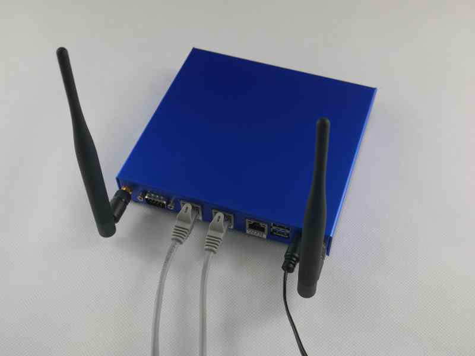

# Overview

{: style="height:400px"}

[PC Engines](https://www.pcengines.ch/) is a Swiss-based company that
specializes in the design and manufacture of small form factor computer
hardware, including single-board computers (SBCs), network appliances, and
embedded systems. Their products are often used in networking,
telecommunications, security applications, in-home automation, and other
industrial applications.

PC Engines is particularly well-known for its low-power, high-performance SBCs,
including the APU (Accelerated Processing Unit) series, which feature AMD G-series
embedded processors, and the ALIX series, based on the AMD Geode processor.
These SBCs are commonly used as firewalls, routers, and other network
appliances.

PC Engines is a well-recognized brand in the open-source community mostly
because of full [schematics availability (apu2d
example)](https://www.pcengines.ch/schema/apu2d.pdf) and use of [open-source
firmware](https://pcengines.github.io/). PC Engines products are top-rated
among pfSense and OPNsense users. What you can see based on the number of forum
topics regarding apu platforms.

## Status

In 2016 PC Engines contracted 3mdeb to take over the maintenance of open-source
firmware for PC Engines products. Development happened in [PC Engines Github
organization](https://github.com/pcengines) until September 2022, when PC
Engines decided to discontinue its sponsorship for open-source firmware.
Dasharo Team working on creating a sustainable path forward for PC Engines'
open-source firmware through a subscription and donation model. For more
details please check [Post EOL firmware
announcement](post-eol-fw-announcement.md), contact us
[directly](mailto:contact@dasharo.com) or through [community
chat](https://matrix.to/#/#dasharo:matrix.org).

## References

* [Post-EOL firmware announcement](post-eol-fw-announcement.md)
