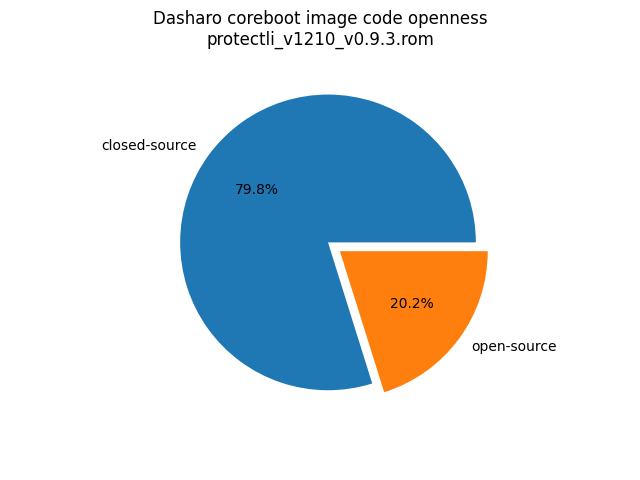

# Dasharo Openness Score v0.2.0

This page contains the [Dasharo Openness
Score](../../glossary.md#dasharo-openness-score) for Protectli V1000 series
Dasharo releases. The content of the page is generated with [Dasharo Openness
Score utility](https://github.com/Dasharo/Openness-Score).

## v0.9.4

> V1410, V1610 and V1211 are very similar to V1210, thus the Openness Scores
> for V1410 and V1610 are not generated, as they're considered to be either
> identical or to contain negligible differences compared to V1210.

Openness Score for protectli_v1210_v0.9.4.rom

Open-source code percentage: **15.4%**
Closed-source code percentage: **84.6%**

* Image size: 16777216 (0x1000000)
* Number of regions: 10
* Number of CBFSes: 2
* Total open-source code size: 1672149 (0x1983d5)
* Total closed-source code size: 9190838 (0x8c3db6)
* Total data size: 665037 (0xa25cd)
* Total empty size: 5249192 (0x5018a8)

> Numbers given above already include the calculations from CBFS regions
> presented below

### FMAP regions

| FMAP region | Offset | Size | Category |
| ----------- | ------ | ---- | -------- |
| SI_ME | 0x1000 | 0x7ff000 | closed-source |
| SI_DESC | 0x0 | 0x1000 | data |
| SMMSTORE | 0x800000 | 0x40000 | data |
| RW_MRC_CACHE | 0x840000 | 0x10000 | data |
| CONSOLE | 0x850000 | 0x20000 | data |
| FMAP | 0x970000 | 0x1000 | data |

### CBFS BOOTSPLASH

* CBFS size: 1048576
* Number of files: 2
* Open-source files size: 0 (0x0)
* Closed-source files size: 0 (0x0)
* Data size: 188768 (0x2e160)
* Empty size: 859808 (0xd1ea0)

> Numbers given above are already normalized (i.e. they already include size
> of metadata and possible closed-source LAN drivers included in the payload
> which are not visible in the table below)

| CBFS filename | CBFS filetype | Size | Compression | Category |
| ------------- | ------------- | ---- | ----------- | -------- |
| logo.bmp | raw | 188663 | LZMA | data |
| (empty) | null | 859808 | none | empty |

### CBFS COREBOOT

* CBFS size: 6877184
* Number of files: 18
* Open-source files size: 1672149 (0x1983d5)
* Closed-source files size: 806326 (0xc4db6)
* Data size: 9325 (0x246d)
* Empty size: 4389384 (0x42fa08)

> Numbers given above are already normalized (i.e. they already include size
> of metadata and possible closed-source LAN drivers included in the payload
> which are not visible in the table below)

| CBFS filename | CBFS filetype | Size | Compression | Category |
| ------------- | ------------- | ---- | ----------- | -------- |
| fallback/payload | simple elf | 1403712 | none | open-source |
| fallback/romstage | stage | 69424 | none | open-source |
| fallback/ramstage | stage | 125451 | LZMA | open-source |
| fallback/dsdt.aml | raw | 9694 | none | open-source |
| fallback/postcar | stage | 31100 | none | open-source |
| bootblock | bootblock | 32768 | none | open-source |
| cpu_microcode_blob.bin | microcode | 20480 | none | closed-source |
| fspm.bin | fsp | 557056 | none | closed-source |
| fsps.bin | fsp | 228790 | LZ4 | closed-source |
| cbfs_master_header | cbfs header | 32 | none | data |
| intel_fit | intel_fit | 80 | none | data |
| config | raw | 4746 | LZMA | data |
| revision | raw | 859 | none | data |
| build_info | raw | 102 | none | data |
| spd.bin | spd | 1024 | none | data |
| vbt.bin | raw | 1209 | LZMA | data |
| (empty) | null | 548 | none | empty |
| (empty) | null | 4388836 | none | empty |

## v0.9.3

> V1410 and V1610 is very similar to V1210, thus the Openness Score for V1410
> and V1610 is not generated, as is considered to be either identical or
> contain neglectable differences compared to V1210.

Report has been generated with Openness Score utility version v0.2

Openness Score for protectli_v1210_v0.9.3.rom

Open-source code percentage: **20.2%**
Closed-source code percentage: **79.8%**

* Image size: 16777216 (0x1000000)
* Number of regions: 10
* Number of CBFSes: 2
* Total open-source code size: 2321343 (0x236bbf)
* Total closed-source code size: 9190838 (0x8c3db6)
* Total data size: 475999 (0x7435f)
* Total empty size: 4789036 (0x49132c)

> Numbers given above already include the calculations from CBFS regions
> presented below

### FMAP regions

| FMAP region | Offset | Size | Category |
| ----------- | ------ | ---- | -------- |
| SMMSTORE | 0x800000 | 0x40000 | data |
| RW_MRC_CACHE | 0x840000 | 0x10000 | data |
| CONSOLE | 0x850000 | 0x20000 | data |
| FMAP | 0x970000 | 0x1000 | data |

### IFD regions

| IFD region | Start | End | Size | Category |
| -------------- | ----- | --- | ---- | -------- |
| Intel ME | 0x00001000 | 0x007fffff | 0x7ff000 | closed-source |
| Flash Descriptor | 0x00000000 | 0x00000fff | 0x1000 | data |

### CBFS BOOTSPLASH

* CBFS size: 1048576
* Number of files: 1
* Open-source files size: 0 (0x0)
* Closed-source files size: 0 (0x0)
* Data size: 28 (0x1c)
* Empty size: 1048548 (0xfffe4)

> Numbers given above are already normalized (i.e. they already include size
> of metadata and possible closed-source LAN drivers included in the payload
> which are not visible in the table below)

| CBFS filename | CBFS filetype | Size | Compression | Category |
| ------------- | ------------- | ---- | ----------- | -------- |
| (empty) | null | 1048548 | none | empty |

### CBFS COREBOOT

* CBFS size: 6877184
* Number of files: 18
* Open-source files size: 2321343 (0x236bbf)
* Closed-source files size: 806326 (0xc4db6)
* Data size: 9027 (0x2343)
* Empty size: 3740488 (0x391348)

> Numbers given above are already normalized (i.e. they already include size
> of metadata and possible closed-source LAN drivers included in the payload
> which are not visible in the table below)

| CBFS filename | CBFS filetype | Size | Compression | Category |
| ------------- | ------------- | ---- | ----------- | -------- |
| fallback/payload | simple elf | 2059016 | none | open-source |
| fallback/romstage | stage | 68056 | none | open-source |
| fallback/ramstage | stage | 124848 | LZMA | open-source |
| fallback/dsdt.aml | raw | 8619 | none | open-source |
| fallback/postcar | stage | 30852 | none | open-source |
| bootblock | bootblock | 29952 | none | open-source |
| cpu_microcode_blob.bin | microcode | 20480 | none | closed-source |
| fspm.bin | fsp | 557056 | none | closed-source |
| fsps.bin | fsp | 228790 | LZ4 | closed-source |
| cbfs_master_header | cbfs header | 28 | none | data |
| intel_fit | intel_fit | 80 | none | data |
| config | raw | 4368 | LZMA | data |
| revision | raw | 859 | none | data |
| build_info | raw | 102 | none | data |
| spd.bin | spd | 1024 | none | data |
| vbt.bin | raw | 1209 | LZMA | data |
| (empty) | null | 1188 | none | empty |
| (empty) | null | 3739300 | none | empty |
