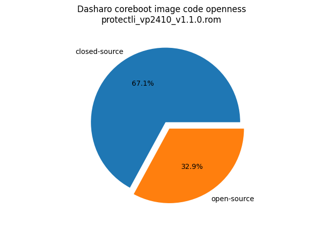

# Dasharo Openness Score

This page contains the [Dasharo Openness
Score](../../glossary.md#dasharo-openness-score) for Protectli VP2410 Dasharo
releases. The content of the page is generated with [Dasharo Openness Score
utility](https://github.com/Dasharo/Openness-Score).

## v1.1.1

Report has been generated with Openness Score utility version v0.2

Openness Score for protectli_vp2410_v1.1.1.rom

Open-source code percentage: **30.7%**
Closed-source code percentage: **69.3%**

* Image size: 8388608 (0x800000)
* Number of regions: 17
* Number of CBFSes: 2
* Total open-source code size: 2086013 (0x1fd47d)
* Total closed-source code size: 4714334 (0x47ef5e)
* Total data size: 413725 (0x6501d)
* Total empty size: 2227208 (0x21fc08)

> Numbers given above already include the calculations from CBFS regions
> presented below

### FMAP regions

| FMAP region | Offset | Size | Category |
| ----------- | ------ | ---- | -------- |
| IFWI | 0x1000 | 0x2ff000 | closed-source |
| RECOVERY_MRC_CACHE | 0x300000 | 0x10000 | data |
| RW_MRC_CACHE | 0x310000 | 0x10000 | data |
| RW_VAR_MRC_CACHE | 0x320000 | 0x1000 | data |
| FMAP | 0x3a1000 | 0x1000 | data |
| SMMSTORE | 0x67f000 | 0x40000 | data |
| BIOS_UNUSABLE | 0x6bf000 | 0x40000 | empty |
| UNUSED_HOLE | 0x7ff000 | 0x1000 | empty |

### IFD regions

| IFD region | Start | End | Size | Category |
| -------------- | ----- | --- | ---- | -------- |
| Flash Descriptor | 0x00000000 | 0x00000fff | 0x1000 | data |
| Device Exp1 | 0x006ff000 | 0x007fffff | 0x101000 | empty |

### CBFS BOOTSPLASH

* CBFS size: 524288
* Number of files: 1
* Open-source files size: 0 (0x0)
* Closed-source files size: 0 (0x0)
* Data size: 28 (0x1c)
* Empty size: 524260 (0x7ffe4)

> Numbers given above are already normalized (i.e. they already include size
> of metadata and possible closed-source LAN drivers included in the payload
> which are not visible in the table below)

| CBFS filename | CBFS filetype | Size | Compression | Category |
| ------------- | ------------- | ---- | ----------- | -------- |
| (empty) | null | 524260 | none | empty |

### CBFS COREBOOT

* CBFS size: 3002368
* Number of files: 17
* Open-source files size: 2086013 (0x1fd47d)
* Closed-source files size: 524126 (0x7ff5e)
* Data size: 8193 (0x2001)
* Empty size: 384036 (0x5dc24)

> Numbers given above are already normalized (i.e. they already include size
> of metadata and possible closed-source LAN drivers included in the payload
> which are not visible in the table below)

| CBFS filename | CBFS filetype | Size | Compression | Category |
| ------------- | ------------- | ---- | ----------- | -------- |
| fallback/payload | simple elf | 1848895 | none | open-source |
| fallback/romstage | stage | 48672 | LZ4 | open-source |
| fallback/ramstage | stage | 125050 | LZMA | open-source |
| fallback/dsdt.aml | raw | 7244 | none | open-source |
| pt | raw | 20480 | none | open-source |
| pdpt | raw | 32 | none | open-source |
| fallback/postcar | stage | 35640 | none | open-source |
| cpu_microcode_blob.bin | microcode | 153600 | none | closed-source |
| fspm.bin | fsp | 178014 | LZ4 | closed-source |
| fsps.bin | fsp | 192512 | none | closed-source |
| cbfs_master_header | cbfs header | 32 | none | data |
| config | raw | 4661 | LZMA | data |
| revision | raw | 859 | none | data |
| build_info | raw | 103 | none | data |
| vbt.bin | raw | 1271 | LZMA | data |
| header_pointer | cbfs header | 4 | none | data |
| (empty) | null | 384036 | none | empty |

## v1.1.0

Report has been generated with Openness Score utility version v0.2

Openness Score for protectli_vp2410_v1.1.0.rom

Open-source code percentage: **32.9%**
Closed-source code percentage: **67.1%**

* Image size: 8388608 (0x800000)
* Number of regions: 17
* Number of CBFSes: 2
* Total open-source code size: 2313343 (0x234c7f)
* Total closed-source code size: 4713310 (0x47eb5e)
* Total data size: 413723 (0x6501b)
* Total empty size: 2000904 (0x1e8808)

> Numbers given above already include the calculations from CBFS regions
> presented below

### FMAP regions

| FMAP region | Offset | Size | Category |
| ----------- | ------ | ---- | -------- |
| IFWI | 0x1000 | 0x2ff000 | closed-source |
| RECOVERY_MRC_CACHE | 0x300000 | 0x10000 | data |
| RW_MRC_CACHE | 0x310000 | 0x10000 | data |
| RW_VAR_MRC_CACHE | 0x320000 | 0x1000 | data |
| FMAP | 0x3a1000 | 0x1000 | data |
| SMMSTORE | 0x67f000 | 0x40000 | data |
| BIOS_UNUSABLE | 0x6bf000 | 0x40000 | empty |
| UNUSED_HOLE | 0x7ff000 | 0x1000 | empty |

### IFD regions

| IFD region | Start | End | Size | Category |
| -------------- | ----- | --- | ---- | -------- |
| Flash Descriptor | 0x00000000 | 0x00000fff | 0x1000 | data |
| Device Exp1 | 0x006ff000 | 0x007fffff | 0x101000 | empty |

### CBFS BOOTSPLASH

* CBFS size: 524288
* Number of files: 1
* Open-source files size: 0 (0x0)
* Closed-source files size: 0 (0x0)
* Data size: 28 (0x1c)
* Empty size: 524260 (0x7ffe4)

> Numbers given above are already normalized (i.e. they already include size
> of metadata and possible closed-source LAN drivers included in the payload
> which are not visible in the table below)

| CBFS filename | CBFS filetype | Size | Compression | Category |
| ------------- | ------------- | ---- | ----------- | -------- |
| (empty) | null | 524260 | none | empty |

### CBFS COREBOOT

* CBFS size: 3002368
* Number of files: 17
* Open-source files size: 2313343 (0x234c7f)
* Closed-source files size: 523102 (0x7fb5e)
* Data size: 8191 (0x1fff)
* Empty size: 157732 (0x26824)

> Numbers given above are already normalized (i.e. they already include size
> of metadata and possible closed-source LAN drivers included in the payload
> which are not visible in the table below)

| CBFS filename | CBFS filetype | Size | Compression | Category |
| ------------- | ------------- | ---- | ----------- | -------- |
| fallback/payload | simple elf | 2080815 | none | open-source |
| fallback/romstage | stage | 47192 | LZ4 | open-source |
| fallback/ramstage | stage | 125678 | LZMA | open-source |
| fallback/dsdt.aml | raw | 7126 | none | open-source |
| pt | raw | 20480 | none | open-source |
| pdpt | raw | 32 | none | open-source |
| fallback/postcar | stage | 32020 | none | open-source |
| cpu_microcode_blob.bin | microcode | 152576 | none | closed-source |
| fspm.bin | fsp | 178014 | LZ4 | closed-source |
| fsps.bin | fsp | 192512 | none | closed-source |
| cbfs_master_header | cbfs header | 28 | none | data |
| config | raw | 4505 | LZMA | data |
| revision | raw | 859 | none | data |
| build_info | raw | 103 | none | data |
| vbt.bin | raw | 1271 | LZMA | data |
| header_pointer | cbfs header | 4 | none | data |
| (empty) | null | 157732 | none | empty |
