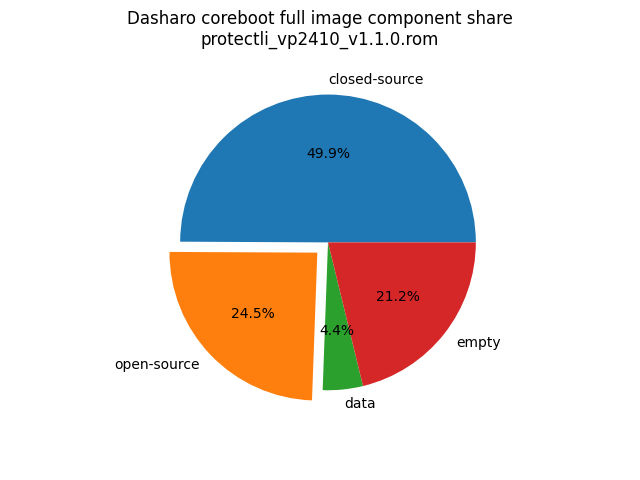

# Dasharo Openness Score

This page contains the [Dasharo Openness
Score](../../glossary.md#dasharo-openness-score) for Protectli VP2410 Dasharo
releases. The content of the page is generated with [Dasharo Openness Score
utility](https://github.com/Dasharo/Openness-Score).

## v1.1.0

Openness Score for protectli_vp2410_v1.1.0.rom

Open-source code percentage: **31.7%**
Closed-source code percentage: **68.3%**

* Image size: 8388608 (0x800000)
* Number of regions: 17
* Number of CBFSes: 2
* Total open-source code size: 2314517 (0x235115)
* Total closed-source code size: 4983646 (0x4c0b5e)
* Total data size: 409605 (0x64005)
* Total empty size: 680840 (0xa6388)

> Numbers given above already include the calculations from CBFS regions
> presented below

### FMAP regions

| FMAP region | Offset | Size | Category |
| ----------- | ------ | ---- | -------- |
| IFWI | 0x1000 | 0x2ff000 | closed-source |
| SI_DESC | 0x0 | 0x1000 | data |
| RECOVERY_MRC_CACHE | 0x300000 | 0x10000 | data |
| RW_MRC_CACHE | 0x310000 | 0x10000 | data |
| FMAP | 0x3a1000 | 0x1000 | data |
| SMMSTORE | 0x67f000 | 0x40000 | data |

### CBFS BOOTSPLASH

* CBFS size: 524288
* Number of files: 1
* Open-source files size: 0 (0x0)
* Closed-source files size: 0 (0x0)
* Data size: 28 (0x1c)
* Empty size: 524260 (0x7ffe4)

> Numbers given above are already normalized (i.e. they already include size
> of metadata and possible closed-source LAN drivers included in the payload
 > which are not visible in the table below)

| CBFS filename | CBFS filetype | Size | Compression | Category |
| ------------- | ------------- | ---- | ----------- | -------- |
| (empty) | null | 524260 | none | empty |

### CBFS COREBOOT

* CBFS size: 3002368
* Number of files: 17
* Open-source files size: 2314517 (0x235115)
* Closed-source files size: 523102 (0x7fb5e)
* Data size: 8169 (0x1fe9)
* Empty size: 156580 (0x263a4)

> Numbers given above are already normalized (i.e. they already include size
> of metadata and possible closed-source LAN drivers included in the payload
 > which are not visible in the table below)

| CBFS filename | CBFS filetype | Size | Compression | Category |
| ------------- | ------------- | ---- | ----------- | -------- |
| fallback/romstage | stage | 47218 | LZ4 | open-source |
| fallback/ramstage | stage | 126198 | LZMA | open-source |
| fallback/dsdt.aml | raw | 7126 | none | open-source |
| pt | raw | 20480 | none | open-source |
| pdpt | raw | 32 | none | open-source |
| fallback/postcar | stage | 32084 | none | open-source |
| fallback/payload | simple elf | 2081379 | none | open-source |
| cpu_microcode_blob.bin | microcode | 152576 | none | closed-source |
| fspm.bin | fsp | 178014 | LZ4 | closed-source |
| fsps.bin | fsp | 192512 | none | closed-source |
| cbfs_master_header | cbfs header | 28 | none | data |
| config | raw | 4490 | LZMA | data |
| revision | raw | 876 | none | data |
| build_info | raw | 120 | none | data |
| vbt.bin | raw | 1271 | LZMA | data |
| header_pointer | cbfs header | 4 | none | data |
| (empty) | null | 156580 | none | empty |
