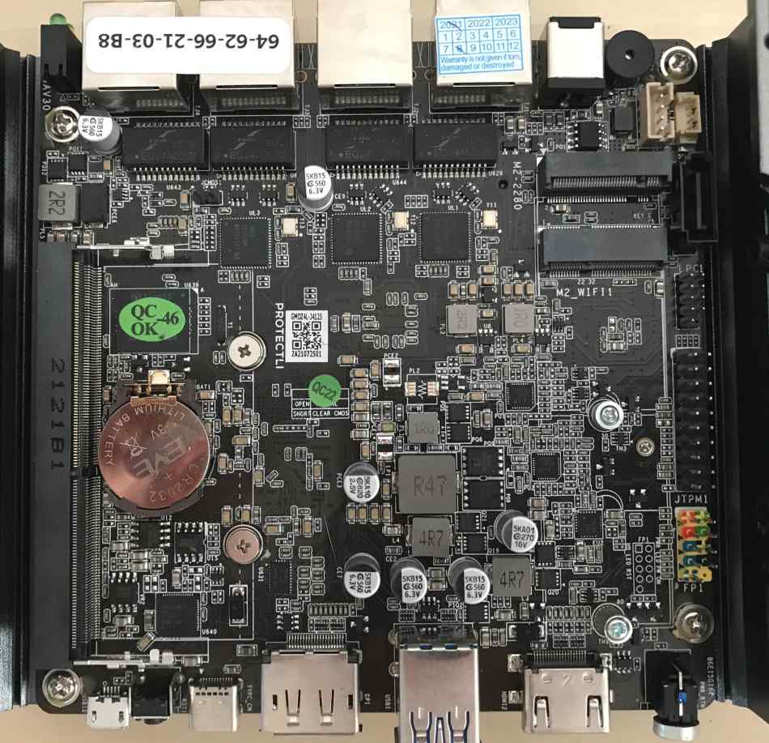
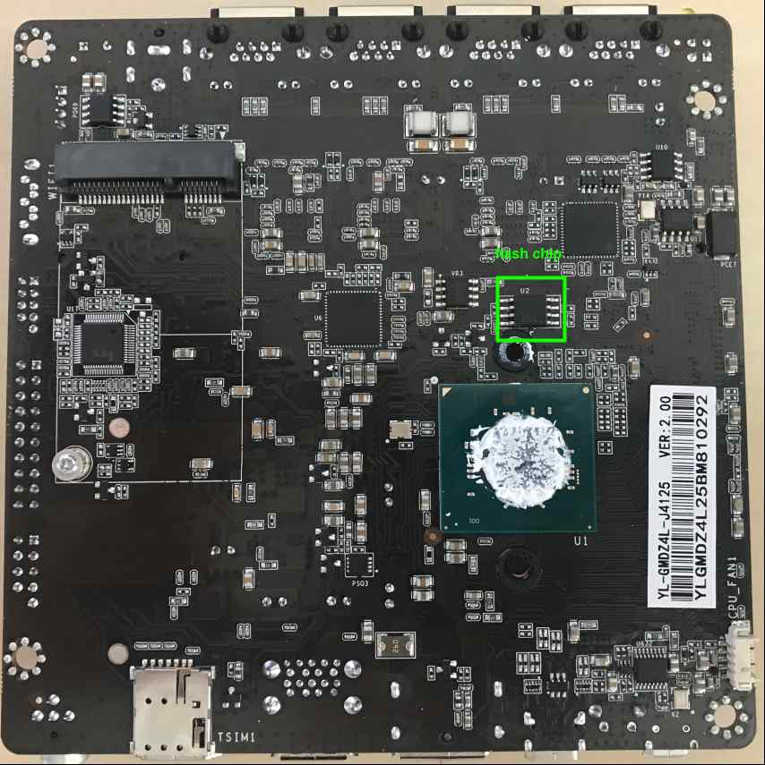

# Recovery

## Intro

The following documentation describes the process of recovering hardware from
the brick state with [RTE](../../transparent-validation/rte/introduction.md) and
Dasharo open-source firmware.

## Connections

Set up the connections required for external flashing as described in EX021.
Protectli VP2410 are flashed using the Pomona clip connection variant. Use
the pictures below to easily locate essential components on the mainboard.

### SPI flash chip location

Completely remove the motherboard from the platform cover.




> If there is little thermal paste on the CPU, apply it before reassembling
> the motherboard to the platform cover.

### CMOS header location


## Firmware flashing

To flash firmware, follow the steps described in EX021, noting that:
* The chip voltage for this platform is **1.8V**
* The proper flashrom parameters for this platform are:

    ```bash
    flashrom -p linux_spi:dev=/dev/spidev1.0,spispeed=16000 -c "MX25U6435E/F" -w [path_to_binary]
    ```
