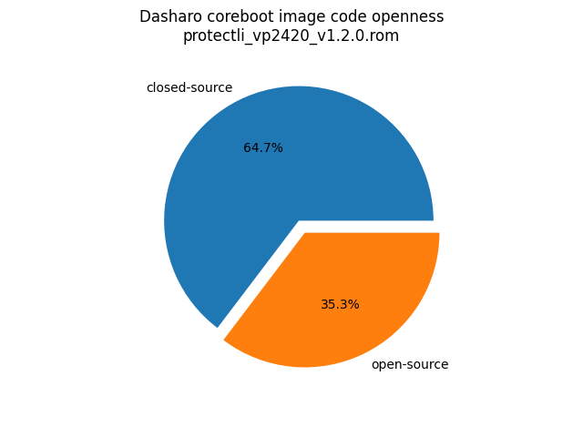

# Dasharo Openness Score

This page contains the [Dasharo Openness
Score](../../glossary.md#dasharo-openness-score) for Protectli VP2420 Dasharo
releases. The content of the page is generated with [Dasharo Openness Score
utility](https://github.com/Dasharo/Openness-Score).

## v1.2.1

Openness Score for protectli_vp2420_v1.2.1.rom

Open-source code percentage: **30.0%**
Closed-source code percentage: **70.0%**

* Image size: 16777216 (0x1000000)
* Number of regions: 26
* Number of CBFSes: 3
* Total open-source code size: 3768428 (0x39806c)
* Total closed-source code size: 8800938 (0x864aaa)
* Total data size: 628702 (0x997de)
* Total empty size: 3579148 (0x369d0c)

> Numbers given above already include the calculations from CBFS regions
> presented below

### FMAP regions

| FMAP region | Offset | Size | Category |
| ----------- | ------ | ---- | -------- |
| SI_ME | 0x1000 | 0x6ff000 | closed-source |
| SI_DESC | 0x0 | 0x1000 | data |
| RECOVERY_MRC_CACHE | 0x700000 | 0x10000 | data |
| RW_MRC_CACHE | 0x710000 | 0x10000 | data |
| SMMSTORE | 0x720000 | 0x40000 | data |
| SHARED_DATA | 0x760000 | 0x2000 | data |
| VBLOCK_DEV | 0x762000 | 0x2000 | data |
| RW_NVRAM | 0x764000 | 0x6000 | data |
| CONSOLE | 0x76a000 | 0x20000 | data |
| VBLOCK_A | 0x88a000 | 0x2000 | data |
| RW_FWID_A | 0xbfff00 | 0x100 | data |
| RO_VPD | 0xc00000 | 0x4000 | data |
| FMAP | 0xc04000 | 0x800 | data |
| RO_FRID | 0xc04800 | 0x100 | data |
| RO_FRID_PAD | 0xc04900 | 0x700 | data |
| GBB | 0xc05000 | 0x3000 | data |

### CBFS BOOTSPLASH

* CBFS size: 1048576
* Number of files: 1
* Open-source files size: 0 (0x0)
* Closed-source files size: 0 (0x0)
* Data size: 28 (0x1c)
* Empty size: 1048548 (0xfffe4)

> Numbers given above are already normalized (i.e. they already include size
> of metadata and possible closed-source LAN drivers included in the payload
> which are not visible in the table below)

| CBFS filename | CBFS filetype | Size | Compression | Category |
| ------------- | ------------- | ---- | ----------- | -------- |
| (empty) | null | 1048548 | none | empty |

### CBFS FW_MAIN_A

* CBFS size: 3620608
* Number of files: 14
* Open-source files size: 1845910 (0x1c2a96)
* Closed-source files size: 732501 (0xb2d55)
* Data size: 8913 (0x22d1)
* Empty size: 1033284 (0xfc444)

> Numbers given above are already normalized (i.e. they already include size
> of metadata and possible closed-source LAN drivers included in the payload
> which are not visible in the table below)

| CBFS filename | CBFS filetype | Size | Compression | Category |
| ------------- | ------------- | ---- | ----------- | -------- |
| fallback/payload | simple elf | 1553160 | none | open-source |
| fallback/romstage | stage | 88528 | none | open-source |
| fallback/ramstage | stage | 130886 | LZMA | open-source |
| fallback/dsdt.aml | raw | 9880 | none | open-source |
| fallback/postcar | stage | 63456 | none | open-source |
| cpu_microcode_blob.bin | microcode | 20480 | none | closed-source |
| fspm.bin | fsp | 495616 | none | closed-source |
| fsps.bin | fsp | 216405 | LZ4 | closed-source |
| config | raw | 5030 | LZMA | data |
| revision | raw | 879 | none | data |
| build_info | raw | 123 | none | data |
| vbt.bin | raw | 1200 | LZMA | data |
| (empty) | null | 228 | none | empty |
| (empty) | null | 1033056 | none | empty |

### CBFS COREBOOT

* CBFS size: 4161536
* Number of files: 16
* Open-source files size: 1922518 (0x1d55d6)
* Closed-source files size: 732501 (0xb2d55)
* Data size: 9201 (0x23f1)
* Empty size: 1497316 (0x16d8e4)

> Numbers given above are already normalized (i.e. they already include size
> of metadata and possible closed-source LAN drivers included in the payload
> which are not visible in the table below)

| CBFS filename | CBFS filetype | Size | Compression | Category |
| ------------- | ------------- | ---- | ----------- | -------- |
| fallback/payload | simple elf | 1553160 | none | open-source |
| fallback/romstage | stage | 88528 | none | open-source |
| fallback/ramstage | stage | 130886 | LZMA | open-source |
| fallback/dsdt.aml | raw | 9880 | none | open-source |
| fallback/postcar | stage | 63456 | none | open-source |
| bootblock | bootblock | 76608 | none | open-source |
| cpu_microcode_blob.bin | microcode | 20480 | none | closed-source |
| fspm.bin | fsp | 495616 | none | closed-source |
| fsps.bin | fsp | 216405 | LZ4 | closed-source |
| cbfs_master_header | cbfs header | 32 | none | data |
| intel_fit | intel_fit | 80 | none | data |
| config | raw | 5030 | LZMA | data |
| revision | raw | 879 | none | data |
| build_info | raw | 123 | none | data |
| vbt.bin | raw | 1200 | LZMA | data |
| (empty) | null | 1497316 | none | empty |

## v1.2.0

Openness Score for protectli_vp2420_v1.2.0.rom

Open-source code percentage: **35.3%**
Closed-source code percentage: **64.7%**

* Image size: 16777216 (0x1000000)
* Number of regions: 26
* Number of CBFSes: 3
* Total open-source code size: 4806882 (0x4958e2)
* Total closed-source code size: 8800924 (0x864a9c)
* Total data size: 627958 (0x994f6)
* Total empty size: 2541452 (0x26c78c)

> Numbers given above already include the calculations from CBFS regions
> presented below

### FMAP regions

| FMAP region | Offset | Size | Category |
| ----------- | ------ | ---- | -------- |
| SI_ME | 0x1000 | 0x6ff000 | closed-source |
| SI_DESC | 0x0 | 0x1000 | data |
| RECOVERY_MRC_CACHE | 0x700000 | 0x10000 | data |
| RW_MRC_CACHE | 0x710000 | 0x10000 | data |
| SMMSTORE | 0x720000 | 0x40000 | data |
| SHARED_DATA | 0x760000 | 0x2000 | data |
| VBLOCK_DEV | 0x762000 | 0x2000 | data |
| RW_NVRAM | 0x764000 | 0x6000 | data |
| CONSOLE | 0x76a000 | 0x20000 | data |
| VBLOCK_A | 0x88a000 | 0x2000 | data |
| RW_FWID_A | 0xbfff00 | 0x100 | data |
| RO_VPD | 0xc00000 | 0x4000 | data |
| FMAP | 0xc04000 | 0x800 | data |
| RO_FRID | 0xc04800 | 0x100 | data |
| RO_FRID_PAD | 0xc04900 | 0x700 | data |
| GBB | 0xc05000 | 0x3000 | data |

### CBFS BOOTSPLASH

* CBFS size: 1048576
* Number of files: 1
* Open-source files size: 0 (0x0)
* Closed-source files size: 0 (0x0)
* Data size: 28 (0x1c)
* Empty size: 1048548 (0xfffe4)

> Numbers given above are already normalized (i.e. they already include size
> of metadata and possible closed-source LAN drivers included in the payload
 > which are not visible in the table below)

| CBFS filename | CBFS filetype | Size | Compression | Category |
| ------------- | ------------- | ---- | ----------- | -------- |
| (empty) | null | 1048548 | none | empty |

### CBFS FW_MAIN_A

* CBFS size: 3620608
* Number of files: 13
* Open-source files size: 2365521 (0x241851)
* Closed-source files size: 732494 (0xb2d4e)
* Data size: 8513 (0x2141)
* Empty size: 514080 (0x7d820)

> Numbers given above are already normalized (i.e. they already include size
> of metadata and possible closed-source LAN drivers included in the payload
 > which are not visible in the table below)

| CBFS filename | CBFS filetype | Size | Compression | Category |
| ------------- | ------------- | ---- | ----------- | -------- |
| fallback/payload | simple elf | 2081638 | none | open-source |
| fallback/romstage | stage | 85520 | none | open-source |
| fallback/ramstage | stage | 129116 | LZMA | open-source |
| fallback/dsdt.aml | raw | 9759 | none | open-source |
| fallback/postcar | stage | 59488 | none | open-source |
| cpu_microcode_blob.bin | microcode | 20480 | none | closed-source |
| fspm.bin | fsp | 495616 | none | closed-source |
| fsps.bin | fsp | 216398 | LZ4 | closed-source |
| config | raw | 4815 | LZMA | data |
| revision | raw | 859 | none | data |
| build_info | raw | 103 | none | data |
| vbt.bin | raw | 1200 | LZMA | data |
| (empty) | null | 514080 | none | empty |

### CBFS COREBOOT

* CBFS size: 4161536
* Number of files: 17
* Open-source files size: 2441361 (0x254091)
* Closed-source files size: 732494 (0xb2d4e)
* Data size: 8857 (0x2299)
* Empty size: 978824 (0xeef88)

> Numbers given above are already normalized (i.e. they already include size
> of metadata and possible closed-source LAN drivers included in the payload
 > which are not visible in the table below)

| CBFS filename | CBFS filetype | Size | Compression | Category |
| ------------- | ------------- | ---- | ----------- | -------- |
| fallback/payload | simple elf | 2081638 | none | open-source |
| fallback/romstage | stage | 85520 | none | open-source |
| fallback/ramstage | stage | 129116 | LZMA | open-source |
| fallback/dsdt.aml | raw | 9759 | none | open-source |
| fallback/postcar | stage | 59488 | none | open-source |
| bootblock | bootblock | 75840 | none | open-source |
| cpu_microcode_blob.bin | microcode | 20480 | none | closed-source |
| fspm.bin | fsp | 495616 | none | closed-source |
| fsps.bin | fsp | 216398 | LZ4 | closed-source |
| cbfs_master_header | cbfs header | 28 | none | data |
| intel_fit | intel_fit | 80 | none | data |
| config | raw | 4815 | LZMA | data |
| revision | raw | 859 | none | data |
| build_info | raw | 103 | none | data |
| vbt.bin | raw | 1200 | LZMA | data |
| (empty) | null | 1060 | none | empty |
| (empty) | null | 977764 | none | empty |
