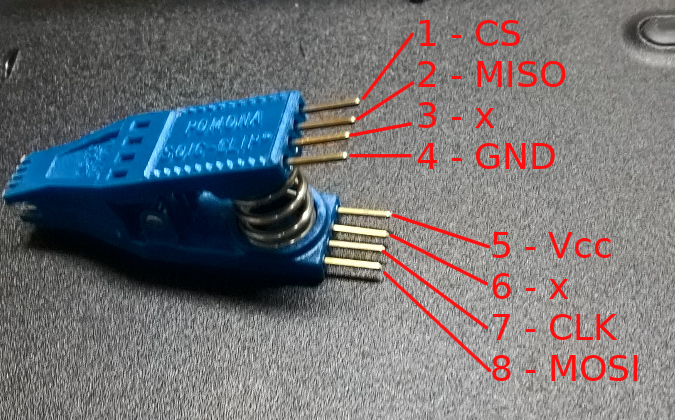
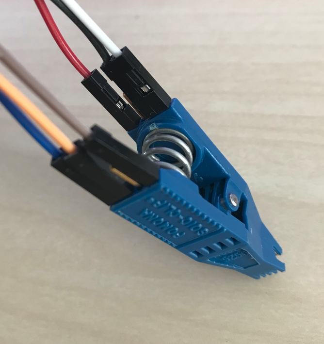
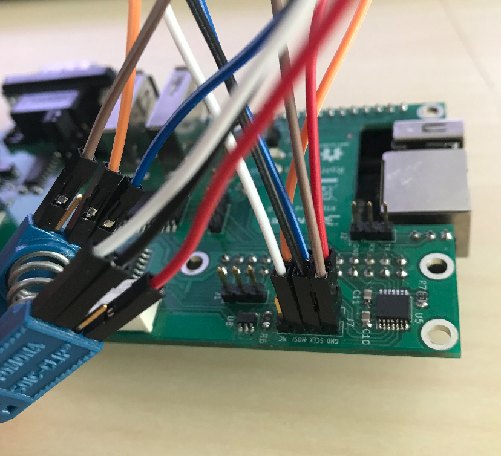
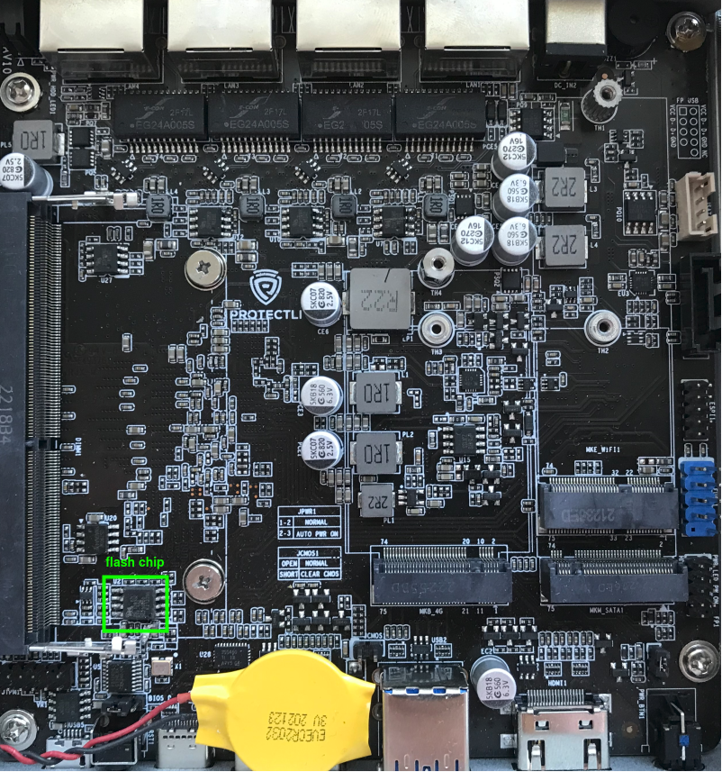
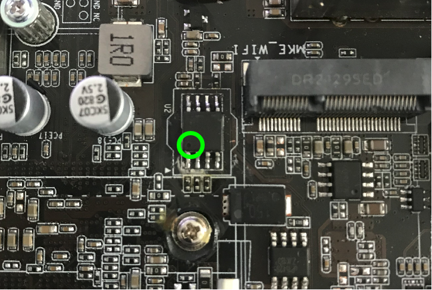
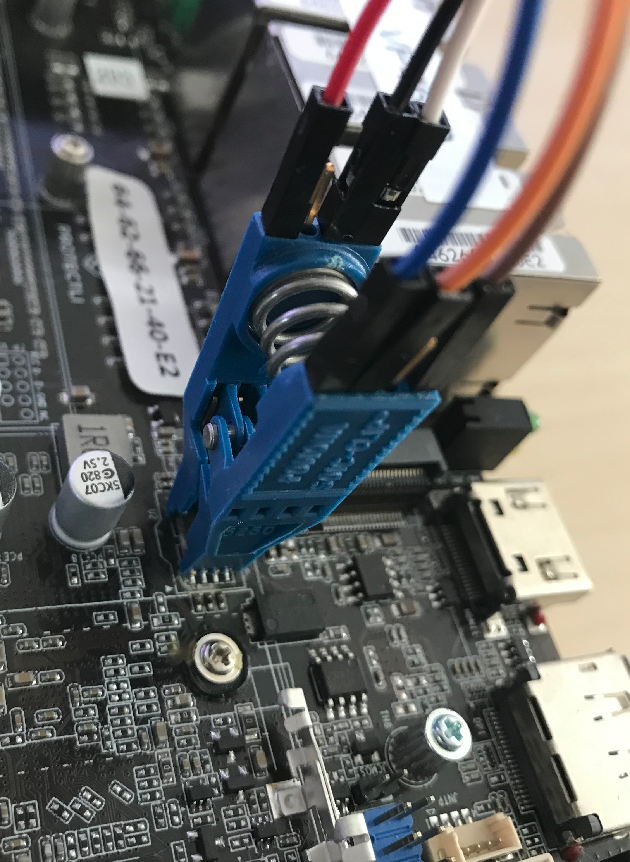
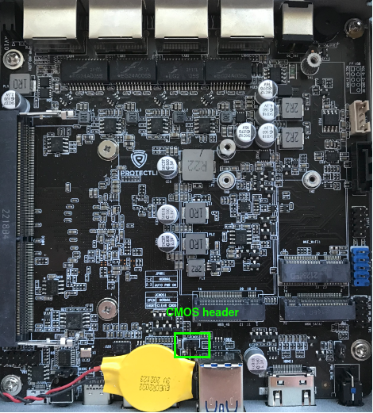

# Recovery

## Intro

The following documentation describes the process of recovering hardware from
the brick state with [RTE](../../transparent-validation/rte/introduction.md) and
Dasharo open-source firmware.

## Prerequisites

* [Prepared RTE](../../transparent-validation/rte/v1.1.0/quick-start-guide.md)
* SOIC-8 Pomona clip
* 6 wire cables

## Connections

To prepare the stand for flashing follow the steps shown below:

1. Connect the wire cables to the Pomona clip.

    
    

1. Connect the Pomona clip to the [SPI header](../../transparent-validation/rte/v1.1.0/specification.md)
   on RTE.

    | SPI header | Pomona clip  |
    |:----------:|:------------:|
    | Vcc        | pin 5 (Vcc)  |
    | GND        | pin 4 (GND)  |
    | CS         | pin 1 (CS)   |
    | SCLK       | pin 7 (CLK)  |
    | MISO       | pin 2 (MISO) |
    | MOSI       | pin 8 (MOSI) |

    

1. Open the platform cover.

    

1. Match pin 1(CS) on the Pomona clip with the first pin of the one of flash
   chip, marked with a small dot engraved on the chip.

    
    

## Firmware flashing

To flash firmware follow the steps shown below:

1. Login to RTE via `ssh` or `minicom`.
1. Turn on the platform by connecting the power supply.
1. Wait at least 5 seconds.
1. Turn off the platform by using the power button.
1. Wait at least 3 seconds.
1. Set the proper state of the SPI by using the following commands on RTE:

    ```bash
    # set SPI Vcc to 3.3V
    echo 1 > /sys/class/gpio/gpio405/value
    # SPI Vcc on
    echo 1 > /sys/class/gpio/gpio406/value
    # SPI lines ON
    echo 1 > /sys/class/gpio/gpio404/value
    ```

1. Wait at least 2 seconds.
1. Disconnect the power supply from the platform.
1. Wait at least 2 seconds.
1. Flash the platform by using the following command:

    ```bash
    flashrom -p linux_spi:dev=/dev/spidev1.0,spispeed=16000 -c "MX25L12835F/MX25L12845E/MX25L12865E" -w [path_to_binary]
    ```

    > Flashing with flashrom takes about 1 minute.

1. Change back the state of the SPI by using the following commands:

    ```bash
    echo 0 > /sys/class/gpio/gpio404/value
    echo 0 > /sys/class/gpio/gpio406/value
    ```

1. Reset CMOS, this can be done by two methods:
    1. Disconnect the CMOS battery, wait at least 10 seconds and connect again.
    1. Short the two pins from the CMOS header for at least 10 seconds.

        

1. Turn on the platform by connecting the power supply.

The first boot of the platform after proceeding with the above procedure can
take much longer than standard.
