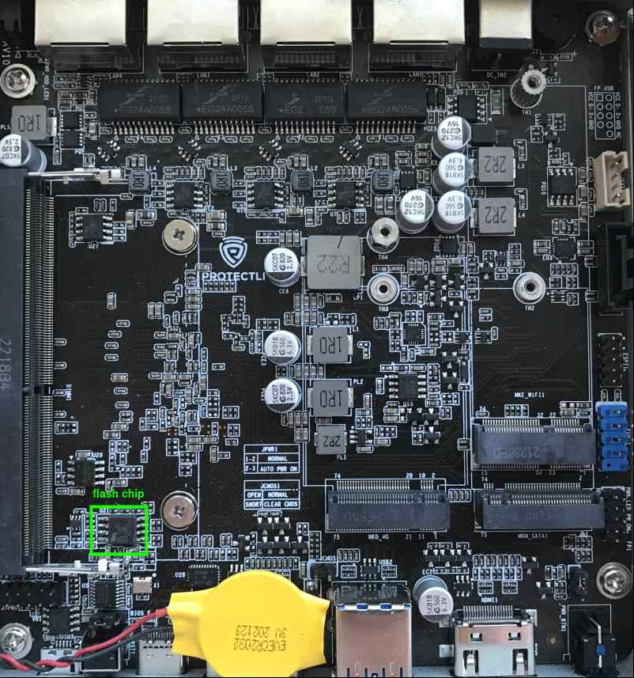
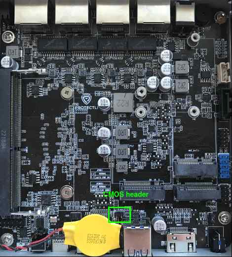

# Recovery

## Intro

The following documentation describes describes platform-specific details of
setting up Protectli VP2420 for recovery from brick state with
[RTE](../../transparent-validation/rte/introduction.md) and Dasharo open-source
firmware.

## Prerequisites

* [Prepared RTE](../../transparent-validation/rte/v1.1.0/quick-start-guide.md)
* SOIC-8 Pomona clip
* 6x female-female wire cables

## Connections

Set up the connections required for external flashing as described in EX021.
Protectli VP2420 are flashed using the Pomona clip connection variant. Use
the pictures below to easily locate essential components on the mainboard.

### SPI flash chip




### CMOS header



## Firmware flashing

To flash firmware, follow the steps described in EX021, noting that:
* The chip voltage for this platform is **3.3V**
* The proper flashrom parameters for this platform are:

    ```bash
    flashrom -p linux_spi:dev=/dev/spidev1.0,spispeed=16000 -c "MX25L12835F/MX25L12845E/MX25L12865E" -w [path_to_binary]
    ```
