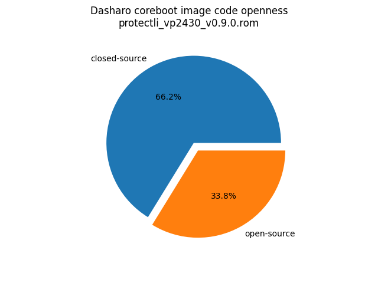
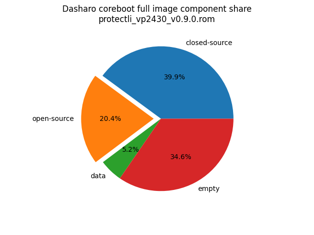

# Dasharo Openness Score

This page contains the [Dasharo Openness
Score](../../glossary.md#dasharo-openness-score) for Protectli VP2430 Dasharo
releases. The content of the page is generated with [Dasharo Openness Score
utility](https://github.com/Dasharo/Openness-Score).

## v0.9.0

Openness Score for protectli_vp2430_v0.9.0.rom

Open-source code percentage: **30.8%**
Closed-source code percentage: **69.2%**

* Image size: 16777216 (0x1000000)
* Number of regions: 24
* Number of CBFSes: 3
* Total open-source code size: 3414558 (0x341a1e)
* Total closed-source code size: 7660966 (0x74e5a6)
* Total data size: 677744 (0xa5770)
* Total empty size: 5023948 (0x4ca8cc)

> Numbers given above already include the calculations from CBFS regions
> presented below

### FMAP regions

| FMAP region | Offset | Size | Category |
| ----------- | ------ | ---- | -------- |
| SI_ME | 0x1000 | 0x4ff000 | closed-source |
| SI_DESC | 0x0 | 0x1000 | data |
| SMMSTORE | 0x500000 | 0x40000 | data |
| RECOVERY_MRC_CACHE | 0x540000 | 0x20000 | data |
| RW_MRC_CACHE | 0x560000 | 0x20000 | data |
| RW_VPD | 0x580000 | 0x2000 | data |
| RW_NVRAM | 0x582000 | 0x6000 | data |
| VBLOCK_A | 0x608000 | 0x10000 | data |
| RW_FWID_A | 0xafff00 | 0x100 | data |
| RO_VPD | 0xb00000 | 0x4000 | data |
| FMAP | 0xb04000 | 0x800 | data |
| RO_FRID | 0xb04800 | 0x100 | data |
| RO_FRID_PAD | 0xb04900 | 0x700 | data |
| GBB | 0xb05000 | 0x3000 | data |

### CBFS BOOTSPLASH

* CBFS size: 524288
* Number of files: 1
* Open-source files size: 0 (0x0)
* Closed-source files size: 0 (0x0)
* Data size: 28 (0x1c)
* Empty size: 524260 (0x7ffe4)

> Numbers given above are already normalized (i.e. they already include size
> of metadata and possible closed-source LAN drivers included in the payload
> which are not visible in the table below)

| CBFS filename | CBFS filetype | Size | Compression | Category |
| ------------- | ------------- | ---- | ----------- | -------- |
| (empty) | null | 524260 | none | empty |

### CBFS FW_MAIN_A

* CBFS size: 5144320
* Number of files: 13
* Open-source files size: 1663119 (0x19608f)
* Closed-source files size: 1211091 (0x127ad3)
* Data size: 8766 (0x223e)
* Empty size: 2261344 (0x228160)

> Numbers given above are already normalized (i.e. they already include size
> of metadata and possible closed-source LAN drivers included in the payload
> which are not visible in the table below)

| CBFS filename | CBFS filetype | Size | Compression | Category |
| ------------- | ------------- | ---- | ----------- | -------- |
| fallback/payload | simple elf | 1362458 | none | open-source |
| fallback/romstage | stage | 98000 | none | open-source |
| fallback/ramstage | stage | 145001 | LZMA | open-source |
| fallback/dsdt.aml | raw | 19448 | none | open-source |
| fallback/postcar | stage | 38212 | none | open-source |
| cpu_microcode_blob.bin | microcode | 138240 | none | closed-source |
| fspm.bin | fsp | 786432 | none | closed-source |
| fsps.bin | fsp | 286419 | LZ4 | closed-source |
| config | raw | 5566 | LZMA | data |
| revision | raw | 856 | none | data |
| build_info | raw | 100 | none | data |
| vbt.bin | raw | 1274 | LZMA | data |
| (empty) | null | 1764 | none | empty |

### CBFS COREBOOT

* CBFS size: 5210112
* Number of files: 17
* Open-source files size: 1751439 (0x1ab98f)
* Closed-source files size: 1211091 (0x127ad3)
* Data size: 9238 (0x2416)
* Empty size: 2238344 (0x222788)

> Numbers given above are already normalized (i.e. they already include size
> of metadata and possible closed-source LAN drivers included in the payload
> which are not visible in the table below)

| CBFS filename | CBFS filetype | Size | Compression | Category |
| ------------- | ------------- | ---- | ----------- | -------- |
| fallback/payload | simple elf | 1362458 | none | open-source |
| fallback/romstage | stage | 98000 | none | open-source |
| fallback/ramstage | stage | 145001 | LZMA | open-source |
| fallback/dsdt.aml | raw | 19448 | none | open-source |
| fallback/postcar | stage | 38212 | none | open-source |
| bootblock | bootblock | 88320 | none | open-source |
| cpu_microcode_blob.bin | microcode | 138240 | none | closed-source |
| fspm.bin | fsp | 786432 | none | closed-source |
| fsps.bin | fsp | 286419 | LZ4 | closed-source |
| cbfs_master_header | cbfs header | 32 | none | data |
| intel_fit | intel_fit | 80 | none | data |
| config | raw | 5566 | LZMA | data |
| revision | raw | 856 | none | data |
| build_info | raw | 100 | none | data |
| vbt.bin | raw | 1274 | LZMA | data |
| (empty) | null | 1508 | none | empty |
| (empty) | null | 2236836 | none | empty |
