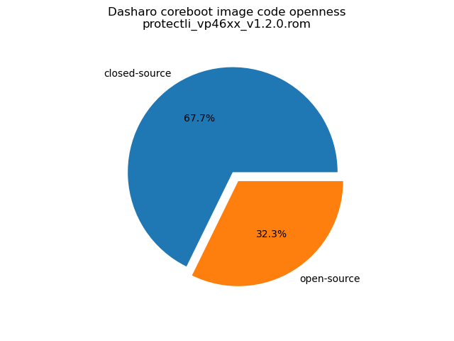
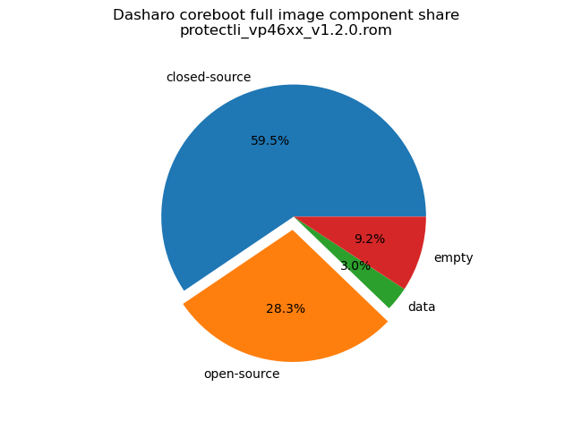

# Dasharo Openness Score

This page contains the [Dasharo Openness
Score](../../glossary.md#dasharo-openness-score) for Protectli VP46XX Dasharo
releases. The content of the page is generated with [Dasharo Openness Score
utility](https://github.com/Dasharo/Openness-Score).

## v1.2.0

Openness Score for protectli_vp46xx_v1.2.0.rom

Open-source code percentage: **32.3%**
Closed-source code percentage: **67.7%**

* Image size: 16777216 (0x1000000)
* Number of regions: 25
* Number of CBFSes: 3
* Total open-source code size: 4752356 (0x4883e4)
* Total closed-source code size: 9978470 (0x984266)
* Total data size: 497501 (0x7975d)
* Total empty size: 1548889 (0x17a259)

> Numbers given above already include the calculations from CBFS regions
> presented below

### FMAP regions

| FMAP region | Offset | Size | Category |
| ----------- | ------ | ---- | -------- |
| SI_ME | 0x1000 | 0x5ff000 | closed-source |
| SI_DESC | 0x0 | 0x1000 | data |
| RECOVERY_MRC_CACHE | 0x600000 | 0x10000 | data |
| RW_MRC_CACHE | 0x610000 | 0x10000 | data |
| SMMSTORE | 0x620000 | 0x40000 | data |
| SHARED_DATA | 0x660000 | 0x2000 | data |
| VBLOCK_DEV | 0x662000 | 0x2000 | data |
| RW_NVRAM | 0x664000 | 0x6000 | data |
| VBLOCK_A | 0x6ea000 | 0x2000 | data |
| RW_FWID_A | 0xb7ff00 | 0x100 | data |
| RO_VPD | 0xb80000 | 0x4000 | data |
| FMAP | 0xb84000 | 0x800 | data |
| RO_FRID | 0xb84800 | 0x100 | data |
| RO_FRID_PAD | 0xb84900 | 0x700 | data |
| GBB | 0xb85000 | 0x3000 | data |

### CBFS BOOTSPLASH

* CBFS size: 524288
* Number of files: 1
* Open-source files size: 0 (0x0)
* Closed-source files size: 0 (0x0)
* Data size: 28 (0x1c)
* Empty size: 524260 (0x7ffe4)

> Numbers given above are already normalized (i.e. they already include size
> of metadata and possible closed-source LAN drivers included in the payload
 > which are not visible in the table below)

| CBFS filename | CBFS filetype | Size | Compression | Category |
| ------------- | ------------- | ---- | ----------- | -------- |
| (empty) | null | 524260 | none | empty |

### CBFS FW_MAIN_A

* CBFS size: 4800256
* Number of files: 16
* Open-source files size: 2326070 (0x237e36)
* Closed-source files size: 1845555 (0x1c2933)
* Data size: 8334 (0x208e)
* Empty size: 620297 (0x97709)

> Numbers given above are already normalized (i.e. they already include size
> of metadata and possible closed-source LAN drivers included in the payload
 > which are not visible in the table below)

| CBFS filename | CBFS filetype | Size | Compression | Category |
| ------------- | ------------- | ---- | ----------- | -------- |
| fallback/romstage | stage | 71392 | none | open-source |
| fallback/ramstage | stage | 132724 | LZMA | open-source |
| fallback/dsdt.aml | raw | 8831 | none | open-source |
| fallback/postcar | stage | 31588 | none | open-source |
| fallback/payload | simple elf | 2081535 | none | open-source |
| cpu_microcode_blob.bin | microcode | 300032 | none | closed-source |
| fspm.bin | fsp | 581632 | none | closed-source |
| fspm_2.bin | fsp | 581632 | none | closed-source |
| fsps.bin | fsp | 191132 | LZMA | closed-source |
| fsps_2.bin | fsp | 191127 | LZMA | closed-source |
| config | raw | 4991 | LZMA | data |
| revision | raw | 859 | none | data |
| build_info | raw | 103 | none | data |
| vbt.bin | raw | 1183 | LZMA | data |
| (empty) | null | 548 | none | empty |
| (empty) | null | 2724 | none | empty |

### CBFS COREBOOT

* CBFS size: 4685824
* Number of files: 22
* Open-source files size: 2426286 (0x2505ae)
* Closed-source files size: 1845555 (0x1c2933)
* Data size: 9651 (0x25b3)
* Empty size: 404332 (0x62b6c)

> Numbers given above are already normalized (i.e. they already include size
> of metadata and possible closed-source LAN drivers included in the payload
 > which are not visible in the table below)

| CBFS filename | CBFS filetype | Size | Compression | Category |
| ------------- | ------------- | ---- | ----------- | -------- |
| fallback/romstage | stage | 71392 | none | open-source |
| fallback/ramstage | stage | 132724 | LZMA | open-source |
| fallback/dsdt.aml | raw | 8831 | none | open-source |
| fallback/postcar | stage | 31588 | none | open-source |
| fallback/payload | simple elf | 2081535 | none | open-source |
| fallback/verstage | stage | 61752 | none | open-source |
| bootblock | bootblock | 38464 | none | open-source |
| cpu_microcode_blob.bin | microcode | 300032 | none | closed-source |
| fspm.bin | fsp | 581632 | none | closed-source |
| fspm_2.bin | fsp | 581632 | none | closed-source |
| fsps.bin | fsp | 191132 | LZMA | closed-source |
| fsps_2.bin | fsp | 191127 | LZMA | closed-source |
| cbfs_master_header | cbfs header | 28 | none | data |
| intel_fit | intel_fit | 80 | none | data |
| config | raw | 4991 | LZMA | data |
| revision | raw | 859 | none | data |
| build_info | raw | 103 | none | data |
| vbt.bin | raw | 1183 | LZMA | data |
| cmos_layout.bin | cmos_layout | 708 | none | data |
| (empty) | null | 292 | none | empty |
| (empty) | null | 1956 | none | empty |
| (empty) | null | 402084 | none | empty |
