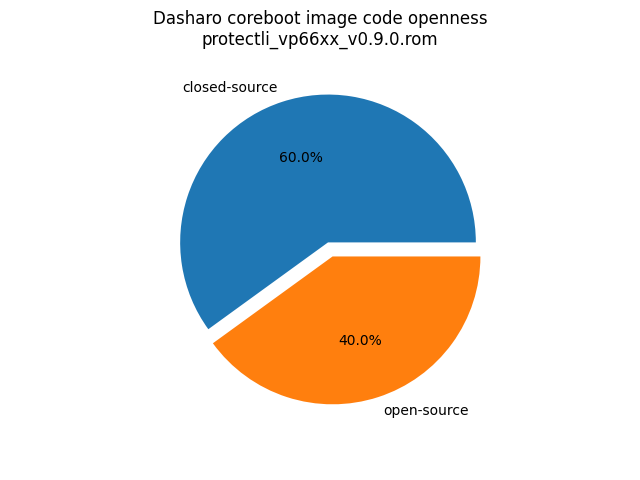
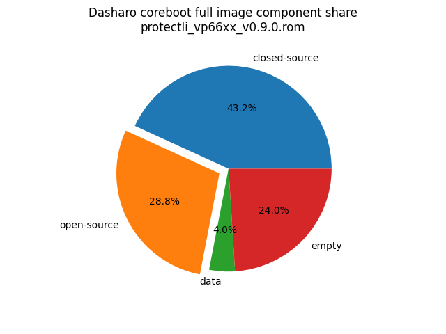

# Dasharo Openness Score

This page contains the [Dasharo Openness
Score](../../glossary.md#dasharo-openness-score) for Protectli
VP6630/VP6650/VP6670 Dasharo releases. The content of the page is generated
with [Dasharo Openness Score
utility](https://github.com/Dasharo/Openness-Score).

## v0.9.2

Report has been generated with Openness Score utility version v0.2

Openness Score for protectli_vp66xx_v0.9.2.rom

Open-source code percentage: **34.6%**
Closed-source code percentage: **65.4%**

* Image size: 16777216 (0x1000000)
* Number of regions: 25
* Number of CBFSes: 3
* Total open-source code size: 4408126 (0x43433e)
* Total closed-source code size: 8328230 (0x7f1426)
* Total data size: 678160 (0xa5910)
* Total empty size: 3362700 (0x334f8c)

> Numbers given above already include the calculations from CBFS regions
> presented below

### FMAP regions

| FMAP region | Offset | Size | Category |
| ----------- | ------ | ---- | -------- |
| SMMSTORE | 0x580000 | 0x40000 | data |
| RECOVERY_MRC_CACHE | 0x5c0000 | 0x20000 | data |
| RW_MRC_CACHE | 0x5e0000 | 0x20000 | data |
| RW_VPD | 0x608000 | 0x2000 | data |
| RW_NVRAM | 0x60a000 | 0x6000 | data |
| VBLOCK_A | 0x690000 | 0x10000 | data |
| RW_FWID_A | 0xafff00 | 0x100 | data |
| RO_VPD | 0xb00000 | 0x4000 | data |
| FMAP | 0xb04000 | 0x800 | data |
| RO_FRID | 0xb04800 | 0x100 | data |
| RO_FRID_PAD | 0xb04900 | 0x700 | data |
| GBB | 0xb05000 | 0x3000 | data |

### IFD regions

| IFD region | Start | End | Size | Category |
| -------------- | ----- | --- | ---- | -------- |
| Intel ME | 0x00001000 | 0x004b6fff | 0x4b6000 | closed-source |
| Flash Descriptor | 0x00000000 | 0x00000fff | 0x1000 | data |
| Device Exp2 | 0x004b7000 | 0x0057ffff | 0xc9000 | empty |

### CBFS BOOTSPLASH

* CBFS size: 524288
* Number of files: 1
* Open-source files size: 0 (0x0)
* Closed-source files size: 0 (0x0)
* Data size: 28 (0x1c)
* Empty size: 524260 (0x7ffe4)

> Numbers given above are already normalized (i.e. they already include size
> of metadata and possible closed-source LAN drivers included in the payload
> which are not visible in the table below)

| CBFS filename | CBFS filetype | Size | Compression | Category |
| ------------- | ------------- | ---- | ----------- | -------- |
| (empty) | null | 524260 | none | empty |

### CBFS FW_MAIN_A

* CBFS size: 4587264
* Number of files: 13
* Open-source files size: 2158783 (0x20f0bf)
* Closed-source files size: 1677843 (0x199a13)
* Data size: 8974 (0x230e)
* Empty size: 741664 (0xb5120)

> Numbers given above are already normalized (i.e. they already include size
> of metadata and possible closed-source LAN drivers included in the payload
> which are not visible in the table below)

| CBFS filename | CBFS filetype | Size | Compression | Category |
| ------------- | ------------- | ---- | ----------- | -------- |
| fallback/payload | simple elf | 1855319 | none | open-source |
| fallback/romstage | stage | 99600 | none | open-source |
| fallback/ramstage | stage | 146419 | LZMA | open-source |
| fallback/dsdt.aml | raw | 19169 | none | open-source |
| fallback/postcar | stage | 38276 | none | open-source |
| cpu_microcode_blob.bin | microcode | 562176 | none | closed-source |
| fspm.bin | fsp | 786432 | none | closed-source |
| fsps.bin | fsp | 329235 | LZ4 | closed-source |
| config | raw | 5610 | LZMA | data |
| revision | raw | 879 | none | data |
| build_info | raw | 123 | none | data |
| vbt.bin | raw | 1277 | LZMA | data |
| (empty) | null | 868 | none | empty |

### CBFS COREBOOT

* CBFS size: 5210112
* Number of files: 17
* Open-source files size: 2249343 (0x22527f)
* Closed-source files size: 1677843 (0x199a13)
* Data size: 9446 (0x24e6)
* Empty size: 1273480 (0x136e88)

> Numbers given above are already normalized (i.e. they already include size
> of metadata and possible closed-source LAN drivers included in the payload
> which are not visible in the table below)

| CBFS filename | CBFS filetype | Size | Compression | Category |
| ------------- | ------------- | ---- | ----------- | -------- |
| fallback/payload | simple elf | 1855319 | none | open-source |
| fallback/romstage | stage | 99600 | none | open-source |
| fallback/ramstage | stage | 146419 | LZMA | open-source |
| fallback/dsdt.aml | raw | 19169 | none | open-source |
| fallback/postcar | stage | 38276 | none | open-source |
| bootblock | bootblock | 90560 | none | open-source |
| cpu_microcode_blob.bin | microcode | 562176 | none | closed-source |
| fspm.bin | fsp | 786432 | none | closed-source |
| fsps.bin | fsp | 329235 | LZ4 | closed-source |
| cbfs_master_header | cbfs header | 32 | none | data |
| intel_fit | intel_fit | 80 | none | data |
| config | raw | 5610 | LZMA | data |
| revision | raw | 879 | none | data |
| build_info | raw | 123 | none | data |
| vbt.bin | raw | 1277 | LZMA | data |
| (empty) | null | 612 | none | empty |
| (empty) | null | 1272868 | none | empty |

## v0.9.1

Report has been generated with Openness Score utility version v0.2

Openness Score for protectli_vp66xx_v0.9.1.rom

Open-source code percentage: **34.6%**
Closed-source code percentage: **65.4%**

* Image size: 16777216 (0x1000000)
* Number of regions: 25
* Number of CBFSes: 3
* Total open-source code size: 4396772 (0x4316e4)
* Total closed-source code size: 8328230 (0x7f1426)
* Total data size: 677802 (0xa57aa)
* Total empty size: 3374412 (0x337d4c)

> Numbers given above already include the calculations from CBFS regions
> presented below

### FMAP regions

| FMAP region | Offset | Size | Category |
| ----------- | ------ | ---- | -------- |
| SMMSTORE | 0x580000 | 0x40000 | data |
| RECOVERY_MRC_CACHE | 0x5c0000 | 0x20000 | data |
| RW_MRC_CACHE | 0x5e0000 | 0x20000 | data |
| RW_VPD | 0x608000 | 0x2000 | data |
| RW_NVRAM | 0x60a000 | 0x6000 | data |
| VBLOCK_A | 0x690000 | 0x10000 | data |
| RW_FWID_A | 0xafff00 | 0x100 | data |
| RO_VPD | 0xb00000 | 0x4000 | data |
| FMAP | 0xb04000 | 0x800 | data |
| RO_FRID | 0xb04800 | 0x100 | data |
| RO_FRID_PAD | 0xb04900 | 0x700 | data |
| GBB | 0xb05000 | 0x3000 | data |

### IFD regions

| IFD region | Start | End | Size | Category |
| -------------- | ----- | --- | ---- | -------- |
| Intel ME | 0x00001000 | 0x004b6fff | 0x4b6000 | closed-source |
| Flash Descriptor | 0x00000000 | 0x00000fff | 0x1000 | data |
| Device Exp2 | 0x004b7000 | 0x0057ffff | 0xc9000 | empty |

### CBFS BOOTSPLASH

* CBFS size: 524288
* Number of files: 1
* Open-source files size: 0 (0x0)
* Closed-source files size: 0 (0x0)
* Data size: 28 (0x1c)
* Empty size: 524260 (0x7ffe4)

> Numbers given above are already normalized (i.e. they already include size
> of metadata and possible closed-source LAN drivers included in the payload
> which are not visible in the table below)

| CBFS filename | CBFS filetype | Size | Compression | Category |
| ------------- | ------------- | ---- | ----------- | -------- |
| (empty) | null | 524260 | none | empty |

### CBFS FW_MAIN_A

* CBFS size: 4587264
* Number of files: 13
* Open-source files size: 2153138 (0x20dab2)
* Closed-source files size: 1677843 (0x199a13)
* Data size: 8795 (0x225b)
* Empty size: 747488 (0xb67e0)

> Numbers given above are already normalized (i.e. they already include size
> of metadata and possible closed-source LAN drivers included in the payload
> which are not visible in the table below)

| CBFS filename | CBFS filetype | Size | Compression | Category |
| ------------- | ------------- | ---- | ----------- | -------- |
| fallback/payload | simple elf | 1849545 | none | open-source |
| fallback/romstage | stage | 99568 | none | open-source |
| fallback/ramstage | stage | 146644 | LZMA | open-source |
| fallback/dsdt.aml | raw | 19169 | none | open-source |
| fallback/postcar | stage | 38212 | none | open-source |
| cpu_microcode_blob.bin | microcode | 562176 | none | closed-source |
| fspm.bin | fsp | 786432 | none | closed-source |
| fsps.bin | fsp | 329235 | LZ4 | closed-source |
| config | raw | 5603 | LZMA | data |
| revision | raw | 859 | none | data |
| build_info | raw | 103 | none | data |
| vbt.bin | raw | 1277 | LZMA | data |
| (empty) | null | 1188 | none | empty |

### CBFS COREBOOT

* CBFS size: 5210112
* Number of files: 17
* Open-source files size: 2243634 (0x223c32)
* Closed-source files size: 1677843 (0x199a13)
* Data size: 9267 (0x2433)
* Empty size: 1279368 (0x138588)

> Numbers given above are already normalized (i.e. they already include size
> of metadata and possible closed-source LAN drivers included in the payload
> which are not visible in the table below)

| CBFS filename | CBFS filetype | Size | Compression | Category |
| ------------- | ------------- | ---- | ----------- | -------- |
| fallback/payload | simple elf | 1849545 | none | open-source |
| fallback/romstage | stage | 99568 | none | open-source |
| fallback/ramstage | stage | 146644 | LZMA | open-source |
| fallback/dsdt.aml | raw | 19169 | none | open-source |
| fallback/postcar | stage | 38212 | none | open-source |
| bootblock | bootblock | 90496 | none | open-source |
| cpu_microcode_blob.bin | microcode | 562176 | none | closed-source |
| fspm.bin | fsp | 786432 | none | closed-source |
| fsps.bin | fsp | 329235 | LZ4 | closed-source |
| cbfs_master_header | cbfs header | 32 | none | data |
| intel_fit | intel_fit | 80 | none | data |
| config | raw | 5603 | LZMA | data |
| revision | raw | 859 | none | data |
| build_info | raw | 103 | none | data |
| vbt.bin | raw | 1277 | LZMA | data |
| (empty) | null | 932 | none | empty |
| (empty) | null | 1278436 | none | empty |

## v0.9.0

Report has been generated with Openness Score utility version v0.2

Openness Score for protectli_vp66xx_v0.9.0.rom

Open-source code percentage: **40.0%**
Closed-source code percentage: **60.0%**

* Image size: 16777216 (0x1000000)
* Number of regions: 25
* Number of CBFSes: 3
* Total open-source code size: 4830854 (0x49b686)
* Total closed-source code size: 7242790 (0x6e8426)
* Total data size: 677420 (0xa562c)
* Total empty size: 4026152 (0x3d6f28)

> Numbers given above already include the calculations from CBFS regions
> presented below

### FMAP regions

| FMAP region | Offset | Size | Category |
| ----------- | ------ | ---- | -------- |
| SMMSTORE | 0x580000 | 0x40000 | data |
| RECOVERY_MRC_CACHE | 0x5c0000 | 0x20000 | data |
| RW_MRC_CACHE | 0x5e0000 | 0x20000 | data |
| RW_VPD | 0x608000 | 0x2000 | data |
| RW_NVRAM | 0x60a000 | 0x6000 | data |
| VBLOCK_A | 0x690000 | 0x10000 | data |
| RW_FWID_A | 0xafff00 | 0x100 | data |
| RO_VPD | 0xb00000 | 0x4000 | data |
| FMAP | 0xb04000 | 0x800 | data |
| RO_FRID | 0xb04800 | 0x100 | data |
| RO_FRID_PAD | 0xb04900 | 0x700 | data |
| GBB | 0xb05000 | 0x3000 | data |

### IFD regions

| IFD region | Start | End | Size | Category |
| -------------- | ----- | --- | ---- | -------- |
| Intel ME | 0x00001000 | 0x003aefff | 0x3ae000 | closed-source |
| Flash Descriptor | 0x00000000 | 0x00000fff | 0x1000 | data |
| Device Exp2 | 0x003af000 | 0x0057ffff | 0x1d1000 | empty |

### CBFS BOOTSPLASH

* CBFS size: 524288
* Number of files: 1
* Open-source files size: 0 (0x0)
* Closed-source files size: 0 (0x0)
* Data size: 28 (0x1c)
* Empty size: 524260 (0x7ffe4)

> Numbers given above are already normalized (i.e. they already include size
> of metadata and possible closed-source LAN drivers included in the payload
> which are not visible in the table below)

| CBFS filename | CBFS filetype | Size | Compression | Category |
| ------------- | ------------- | ---- | ----------- | -------- |
| (empty) | null | 524260 | none | empty |

### CBFS FW_MAIN_A

* CBFS size: 4587264
* Number of files: 13
* Open-source files size: 2370499 (0x242bc3)
* Closed-source files size: 1675795 (0x199213)
* Data size: 8622 (0x21ae)
* Empty size: 532348 (0x81f7c)

> Numbers given above are already normalized (i.e. they already include size
> of metadata and possible closed-source LAN drivers included in the payload
> which are not visible in the table below)

| CBFS filename | CBFS filetype | Size | Compression | Category |
| ------------- | ------------- | ---- | ----------- | -------- |
| fallback/payload | simple elf | 2074241 | none | open-source |
| fallback/romstage | stage | 96384 | none | open-source |
| fallback/ramstage | stage | 145746 | LZMA | open-source |
| fallback/dsdt.aml | raw | 19016 | none | open-source |
| fallback/postcar | stage | 35112 | none | open-source |
| cpu_microcode_blob.bin | microcode | 560128 | none | closed-source |
| fspm.bin | fsp | 786432 | none | closed-source |
| fsps.bin | fsp | 329235 | LZ4 | closed-source |
| config | raw | 5496 | LZMA | data |
| revision | raw | 859 | none | data |
| build_info | raw | 103 | none | data |
| vbt.bin | raw | 1277 | LZMA | data |
| (empty) | null | 36 | none | empty |

### CBFS COREBOOT

* CBFS size: 5210112
* Number of files: 17
* Open-source files size: 2460355 (0x258ac3)
* Closed-source files size: 1675795 (0x199213)
* Data size: 9058 (0x2362)
* Empty size: 1064904 (0x103fc8)

> Numbers given above are already normalized (i.e. they already include size
> of metadata and possible closed-source LAN drivers included in the payload
> which are not visible in the table below)

| CBFS filename | CBFS filetype | Size | Compression | Category |
| ------------- | ------------- | ---- | ----------- | -------- |
| fallback/payload | simple elf | 2074241 | none | open-source |
| fallback/romstage | stage | 96384 | none | open-source |
| fallback/ramstage | stage | 145746 | LZMA | open-source |
| fallback/dsdt.aml | raw | 19016 | none | open-source |
| fallback/postcar | stage | 35112 | none | open-source |
| bootblock | bootblock | 89856 | none | open-source |
| cpu_microcode_blob.bin | microcode | 560128 | none | closed-source |
| fspm.bin | fsp | 786432 | none | closed-source |
| fsps.bin | fsp | 329235 | LZ4 | closed-source |
| cbfs_master_header | cbfs header | 28 | none | data |
| intel_fit | intel_fit | 80 | none | data |
| config | raw | 5496 | LZMA | data |
| revision | raw | 859 | none | data |
| build_info | raw | 103 | none | data |
| vbt.bin | raw | 1277 | LZMA | data |
| (empty) | null | 1124 | none | empty |
| (empty) | null | 1063780 | none | empty |
