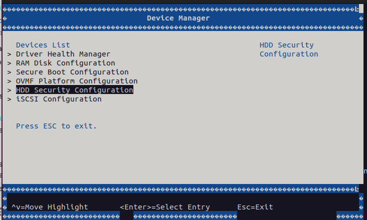
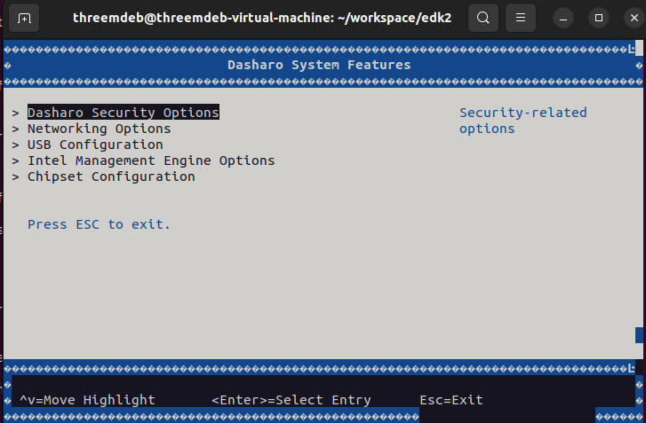

# Dasharo (UEFI) v0.1.0 for QEMU Q35

## Intro

1. Please check your qemu setup and launch qemu outside
docker instance (host machine) using built OVMF firmware image.

+ QEMU Installation:
    - [Install QEMU on your linux distro](https://www.qemu.org/download/#linux)

```bash
 qemu-system-x86_64 -machine q35,smm=on \

 -global driver=cfi.pflash01,property=secure,value=on \

 -drive if=pflash,format=raw,unit=0,file=Build/OvmfX64/DEBUG_GCC5
 /FV/OVMF_CODE.fd,readonly=on \

 -drive if=pflash,format=raw,unit=1,file=Build/OvmfX64/DEBUG_GCC5/FV/OVMF_VARS.fd \

 -debugcon file:debug.log -global isa-debugcon.iobase=0x402 \

 -global ICH9-LPC.disable_s3=1 -net none
```

+ `-drive` indicate device is pflash with firmware image of built OVMF.fd image.

+ `-debugcon file:debug.log -global isa-debugcon.iobase=0x402`
default OVMF build writes debug messages to IO port **0x402**.
The following qemu command line options save them in the file called debug.log.

+ `-global ICH9-LPC.disable_s3=1` SMM is put to use in the S3 suspend
and resume infrastructure, and in the UEFI variable driver stack.
Similarly, a pflash-backed variable store is a requirement.

+ `-net none` disables the OptionROM execution which
will interfere with the firmware image, if not disabled.

+ `-machine q35,smm=on` For SMM to work,
only Q35 machines are supported hence the machine type.

1. After executing the above qemu command,
   qemu boots into UEFI built-in shell and to BIOS selection area.

1. The features which are enabled in `OvmfPkgX64.dsc` can be verified at `Setup menu`.
   At `Device Manager section` Dasharo features can
   be verified in `Dasharo System Features` section.

## Useful Tips for modifying the changes in .DSC & .FDF

### Follow the steps below to rebuild firmware image & experiment with the features

+ If any code is added to C file or any library functions are invoked in other files,
rebuild the OVMF image with the following command.

```bash
build -a IA32 -a X64 -t GCC5 -b RELEASE -p OvmfPkg/OvmfPkgX64.dsc
```

1. By making some changes in the `OvmfPkgX64.dsc` file, one can add features like
OPAL, SATA security support for QEMU Q35 machine and also for specific platforms.

1. An example of where the changes
can be made in the `OvmfPkgX64.dsc` file is given below.

> The following changes describe about defining in the **Defines Section** of `OvmfPkgX64.dsc`

```bash
# Defines for default states.  These can be changed on the command line.
# -D FLAG=VALUE
#
(...)
DEFINE SATA_PASSWORD_ENABLE    = TRUE
DEFINE OPAL_PASSWORD_ENABLE    = TRUE
```

> Include the appropriate libraries in the **Libraries Section** of `OvmfPkgX64.dsc`.

```bash
#
# OPAL_PASSWORD
#

!if $(OPAL_PASSWORD_ENABLE) == TRUE
TcgStorageCoreLib|SecurityPkg/Library/TcgStorageCoreLib/TcgStorageCoreLib.inf
TcgStorageOpalLib|SecurityPkg/Library/TcgStorageOpalLib/TcgStorageOpalLib.inf
!endif
#
#
```

> According to feature, proper PCD's must be defined in `OvmfPkgX64.dsc` file.
>
> Addition of the components in **Components Section** of `OvmfPkgX64.dsc` file.

```bash
### SATA_PASSWORD

!if $(SATA_PASSWORD_ENABLE) == TRUE
SecurityPkg/HddPassword/HddPasswordPei.inf
!endif
#
#
```

## Dasharo System Features

1. The `.fdf` describes the source files' location and variables used during the
build process.

2. Below code snippet shows about the location of `SATA disk password` `.inf` file.

```bash
!if $(SATA_PASSWORD_ENABLE) == TRUE
INF SecurityPkg/HddPassword/HddPasswordDxe.inf
!endif
```

+ Include all necessary source file locations to point at source libraries
in .FDF file.

+ Below is the snippet of the SATA_PASSWORD support in `Device Manager`.



+ By default the `Dasharo System Features` are enabled in the **DasharoSystemFeatures.dec**.
It describes the configuration of the platform.

+ The flags can be toggled in order to enable `Dasharo System Features`.

    ```bash
	[PcdsFixedAtBuild]
	gDasharoSystemFeaturesTokenSpaceGuid.PcdShowMenu|TRUE|BOOLEAN|0x00000001
	gDasharoSystemFeaturesTokenSpaceGuid.PcdShowSecurityMenu|TRUE|BOOLEAN|0x00000002
	gDasharoSystemFeaturesTokenSpaceGuid.PcdShowIntelMeMenu|TRUE|BOOLEAN|0x00000003
	gDasharoSystemFeaturesTokenSpaceGuid.PcdShowUsbMenu|TRUE|BOOLEAN|0x00000004
	gDasharoSystemFeaturesTokenSpaceGuid.PcdShowNetworkMenu|TRUE|BOOLEAN|0x00000005
	gDasharoSystemFeaturesTokenSpaceGuid.PcdShowChipsetMenu|TRUE|BOOLEAN|0x00000006
	gDasharoSystemFeaturesTokenSpaceGuid.PcdDefaultNetworkBootEnable|FALSE|BOOLEAN|0x00000007
    ```

> In the above PCD definitions,
please check column after PCD definition to find **TRUE/FALSE**.
>
> By toggling these flags, one can view the Dasharo System Features.

+ The below image shows the Dasharo System Features enabled for the QEMU Q35 machine.


