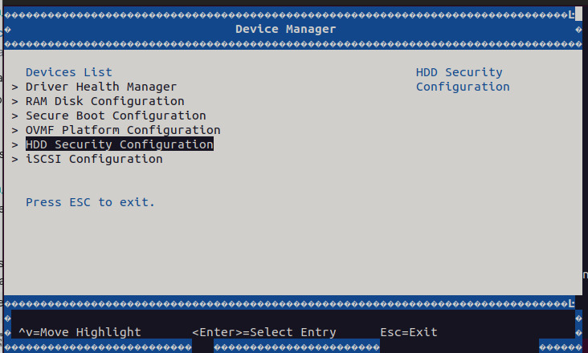
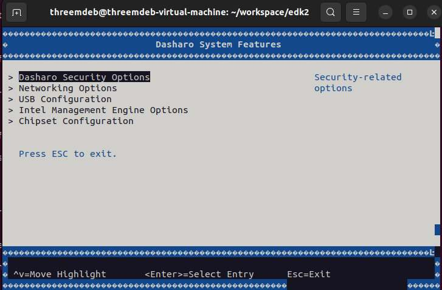

# Dasharo (UEFI) v0.1.0 for QEMU Q35

## Intro

1. Please check your qemu setup and launch qemu outside docker instance (host
   machine) using built OVMF firmware image.

    - [Install QEMU on your linux distro](https://www.qemu.org/download/#linux)
    - Run the OVMF in QEMU:

    ```bash
    qemu-system-x86_64 -machine q35,smm=on \
    	-global driver=cfi.pflash01,property=secure,value=on \
    	-drive if=pflash,format=raw,unit=0,file=Build/OvmfX64/DEBUG_GCC5/FV/OVMF_CODE.fd,readonly=on \
    	-drive if=pflash,format=raw,unit=1,file=Build/OvmfX64/DEBUG_GCC5/FV/OVMF_VARS.fd \
    	-debugcon file:debug.log -global isa-debugcon.iobase=0x402 \
    	-global ICH9-LPC.disable_s3=1
    ```

      - `-drive` indicate device is pflash with firmware image of built
        `OVMF*.fd` image.
      - `-debugcon file:debug.log -global isa-debugcon.iobase=0x402` default
        OVMF build writes debug messages to IO port **0x402**. The following
        qemu command line options save them in the file called debug.log.
      - `-global ICH9-LPC.disable_s3=1` SMM is put to use in the S3 suspend
        and resume infrastructure, and in the UEFI variable driver stack.
        Similarly, a pflash-backed variable store is a requirement.
      - `-machine q35,smm=on` For SMM to work, only Q35 machines are supported
        hence the machine type.

2. After executing the above qemu command, qemu boots into UEFI built-in shell
   and to BIOS selection area.
3. The features which are enabled in `OvmfPkgX64.dsc` can be verified at
   `Setup menu`. At `Device Manager section` Dasharo features can be verified
   in `Dasharo System Features` section.

## Useful Tips for modifying the DSC & FDF

### Follow the steps below to rebuild firmware image & experiment with the features

If any code is added to C file or any library functions are invoked in other
files, rebuild the OVMF image with the following command.

```bash
build -a IA32 -a X64 -t GCC5 -b DEBUG -p OvmfPkg/OvmfPkgX64.dsc
```

By making some changes in the `OvmfPkgX64.dsc` file, one can add features like
OPAL, SATA security support for QEMU Q35 machine and also for specific
platforms. An example of where the changes can be made in the `OvmfPkgX64.dsc`
file is given below.

The following changes describe defining in the **Defines Section** of
`OvmfPkgX64.dsc`

```bash
# Defines for default states.  These can be changed on the command line.
# -D FLAG=VALUE
#
(...)
DEFINE SATA_PASSWORD_ENABLE    = TRUE
DEFINE OPAL_PASSWORD_ENABLE    = TRUE
```

Include the appropriate libraries in the **Libraries Section** of
`OvmfPkgX64.dsc`.

```bash
!if $(OPAL_PASSWORD_ENABLE) == TRUE
TcgStorageCoreLib|SecurityPkg/Library/TcgStorageCoreLib/TcgStorageCoreLib.inf
TcgStorageOpalLib|SecurityPkg/Library/TcgStorageOpalLib/TcgStorageOpalLib.inf
!endif
```

According to the feature, proper PCD's must be defined in `OvmfPkgX64.dsc`
file.

Adding components in **Components Section** of `OvmfPkgX64.dsc` file:

```bash
!if $(SATA_PASSWORD_ENABLE) == TRUE
SecurityPkg/HddPassword/HddPasswordPei.inf
!endif
```

## Dasharo System Features

The `.fdf` describes the source files' location and variables used during the
build process.

Below code snippet shows the location of SATA disk password INF file.

```bash
!if $(SATA_PASSWORD_ENABLE) == TRUE
INF SecurityPkg/HddPassword/HddPasswordDxe.inf
!endif
```

Include all necessary source file locations to point at source libraries in
FDF file.

Below is the screenshot of the SATA_PASSWORD support in `Device Manager`.



By default the `Dasharo System Features` are enabled in the
**DasharoSystemFeatures.dec**. It describes the configuration of the platform.
The flags can be toggled inside platform DSC file  in order to enable
`Dasharo System Features`.

```bash
[PcdsFixedAtBuild]
  gDasharoSystemFeaturesTokenSpaceGuid.PcdShowMenu|TRUE
  gDasharoSystemFeaturesTokenSpaceGuid.PcdShowSecurityMenu|TRUE
  gDasharoSystemFeaturesTokenSpaceGuid.PcdShowIntelMeMenu|TRUE
  gDasharoSystemFeaturesTokenSpaceGuid.PcdShowUsbMenu|TRUE
  gDasharoSystemFeaturesTokenSpaceGuid.PcdShowNetworkMenu|TRUE
  gDasharoSystemFeaturesTokenSpaceGuid.PcdShowChipsetMenu|TRUE
  gDasharoSystemFeaturesTokenSpaceGuid.PcdDefaultNetworkBootEnable|FALSE
```

In the above PCD definitions, please check column after PCD definition to find
**TRUE/FALSE**. By toggling these flags, one can enable or disable the Dasharo
System Features. The below image shows the Dasharo System Features enabled for
the QEMU Q35 machine.



## Network support

### Compile iPXE for QEMU

To enable iPXE please follow this guide:

```bash
git clone https://git.ipxe.org/ipxe.git
```

Change directory:

```bash
cd ipxe
```

Checkout stable commit (2023.8 used by coreboot)

```bash
git checkout 4bffe0f0d9d0e1496ae5cfb7579e813277c29b0f
```

#### Enabled Dasharo script

```bash
sed -i 's|//#define\s*IMAGE_SCRIPT.*|#define IMAGE_SCRIPT|' "src/config/general.h"
```

Get the script:

```bash
wget https://raw.githubusercontent.com/Dasharo/dasharo-blobs/main/dasharo/dasharo.ipxe
```

#### Enabled HTTPS

```bash
sed -i 's|.*DOWNLOAD_PROTO_HTTPS|#define DOWNLOAD_PROTO_HTTPS|g'  "src/config/general.h"
```

#### Build

Start the instance of the docker image under the Dasharo/edk2 repository:

```bash
docker run --rm -it -v $PWD/../edk2:/home/coreboot/edk2 \
    -v $PWD/../edk2-platforms:/home/coreboot/edk2-platforms \
    -v $PWD:/home/coreboot/ipxe \
    -w /home/coreboot/ipxe coreboot/coreboot-sdk:2021-09-23_b0d87f753c \
    /bin/bash
```

Export cross compiler prefix:

```bash
export CROSS_COMPILE="x86_64-elf-"
```

Compile:

```bash
make -C src bin-x86_64-efi-sb/ipxe.efi EMBED=$PWD/dasharo.ipxe BUILD_ID_CMD="echo 0x1234567890" \
    EXTRA_CFLAGS="-Wno-address-of-packed-member  -m64  -fuse-ld=bfd \
    -Wl,--build-id=none -fno-delete-null-pointer-checks -Wlogical-op -march=nocona \
    -malign-data=abi -mcmodel=large -mno-red-zone -fno-pic"
```

#### Build EDK II

Change directory:

```bash
cd ../edk2
```

Setup the environment variables with the following command

```bash
source edksetup.sh
```

Compile EDK II base tools:

```bash
make -C BaseTools
```

Update the PACKAGES_PATH variable

```bash
export EDK2_PLATFORMS_PATH="$HOME/edk2-platforms"
export PACKAGES_PATH="$WORKSPACE:\
$HOME/ipxe/src/bin-x86_64-efi-sb/:\
$EDK2_PLATFORMS_PATH/Platform/Intel:\
$EDK2_PLATFORMS_PATH/Silicon/Intel:\
$EDK2_PLATFORMS_PATH/Features/Intel:\
$EDK2_PLATFORMS_PATH/Features/Intel/Debugging:\
$EDK2_PLATFORMS_PATH/Features/Intel/Network:\
$EDK2_PLATFORMS_PATH/Features/Intel/OutOfBandManagement:\
$EDK2_PLATFORMS_PATH/Features/Intel/PowerManagement:\
$EDK2_PLATFORMS_PATH/Features/Intel/SystemInformation:\
$EDK2_PLATFORMS_PATH/Features/Intel/UserInterface"
```

To build the image simply invoke the following command

```bash
build -a IA32 -a X64 -t GCC5 -b RELEASE -p OvmfPkg/OvmfPkgX64.dsc
```
