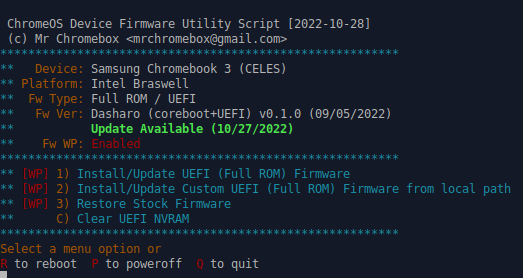

# Firmware update

## Introduction

This document describes the firmware update for Samsung Chromebook 3 running
Dasharo firmware to the latest version available. The proceess is slightly
different depending on model and installed firmware version.

## Requirements

* [Disable UEFI Secure Boot](../../../dasharo-tools-suite/documentation/#disabling-secure-boot)
* Debian-based distro (tested on Xubuntu 22.04)
* Install required packages
  ```bash
  sudo apt install -y git curl
  ```
* Install Dasharo version of MrChromebox/scripts
  ```bash
  git clone https://github.com/Dasharo/scripts.git -b add-support-for-custom-image
  ```
* [Write Protect Disabled](#disable-write-protect)

## Disable Write Protect

### Check status of your firmware

* Go to `scripts` directory
  ```bash
  cd scripts
  ```

* Add execution privileges
  ```bash
  chmod +x firmware-util.sh
  ```

* Run firmware utility:
  ```bash
  sudo DEV_MODE=true ./firmware-util.sh
  ```

* If Write Protect is Disabled you can continue with [firmware
  update](#update-using-firmware-utils):
  <center>
  
  </center>

* If Write Protect Enabled please follow instruction to disable WP.
  <center>
  
  </center>

* Unscrew first 9 screws on the bottom.
  <center>
  
  </center>

* Unscrew first 6 screws inside and disconnect wires.
  <center>
  
  </center>

* After removing metal from USB area, remove one more screw.
  <center>
  
  </center>

* Finally, remove WP screw to disable WP.
  <center>
  
  </center>

## Update using firmware util

* Copy `coreboot.rom` to Samsung Chromebook 3.
* Run `firmware-util.sh` and follow and choose option 2.
  <center>
  
  </center>
* Confirm you understand the risk:
  ```bash
  Install/Update Custom UEFI Full ROM Firmware from local path
  
  IMPORTANT: flashing the firmware has the potential to brick your device, 
  requiring relatively inexpensive hardware and some technical knowledge to 
  recover.Not all boards can be tested prior to release, and even then slight 
  differences in hardware can lead to unforseen failures.
  If you don't have the ability to recover from a bad flash, you're taking a risk.
  
  You have been warned.
  
  Do you wish to continue? [y/N] y
  ```

* Provide `coreboot.rom` path and press ++enter++
  ```bash
  Please provide local path for Full ROM Firmware: /path/to/coreboot.rom
  VPD extracted from current firmware
  
  Disabling software write-protect and clearing the WP range
  
  Installing Full ROM firmware (may take up to 90s)
  
  Full ROM firmware successfully installed/updated.
  
  IMPORTANT:
  The first boot after flashing may take substantially
  longer than subsequent boots -- up to 30s or more.
  Be patient and eventually your device will boot :)
  
  IMPORTANT:
  
  This update uses a new format to store UEFI NVRAM data, and
  will reset your BootOrder and boot entries. You may need to 
  manually Boot From File and reinstall your bootloader if 
  booting from the internal storage device fails.
  
  Press [Enter] to return to the main menu.
  ```

* Reboot


