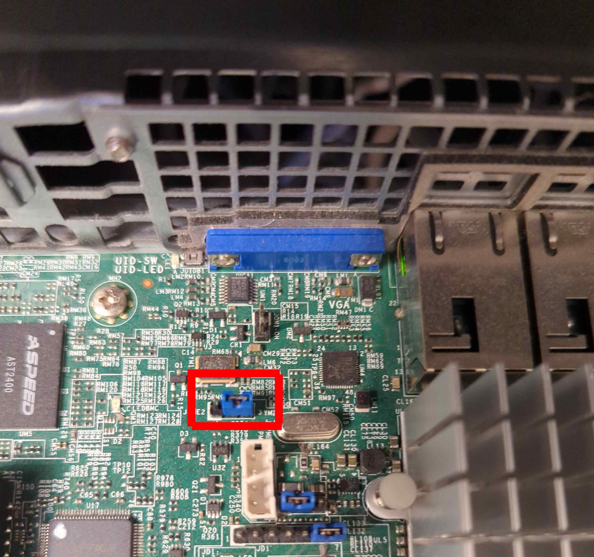
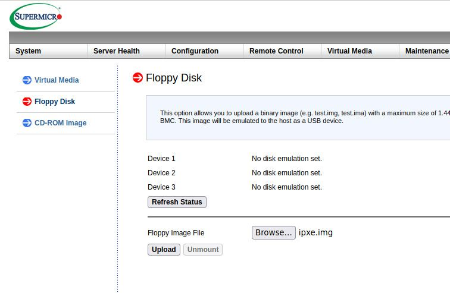
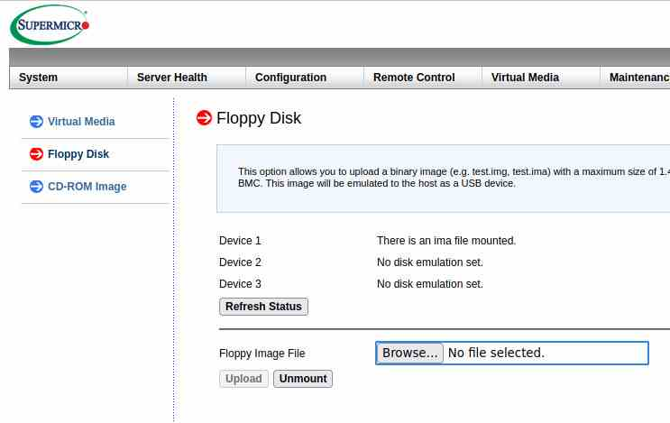

# Initial deployment

<!---
Initial deployment for Supermicro X11SSH is supported in DTS since version
[vTBD](#tbd). Please check [Dasharo zero-touch initial deployment
section](../../dasharo-tools-suite/documentation.md#dasharo-zero-touch-initial-deployment).
--->
We strongly recommend following these official instructions. The official guide
has a lot of collaborative effort put into covering all of the edge cases and
is regularly tested. Following these instructions to the letter without
skipping, reordering or adding any steps will give you a proper Dasharo
installation unless there's a hardware issue.  We strongly recommend against
following unofficial guides deviating in any way from the official
instructions.

If you have trouble with the installation process, ask for help on the official
[Dasharo chat channel](https://docs.dasharo.com/#community). There are almost
always people around willing to help with it. Before asking for help, make an
attempt to follow the guide on your own and then ask for help with anything you
get stuck on.

## Hardware preparation

Please use Supermicro Quick Reference Guide for you mainboard e.g.
[X11SSH-TF](https://www.supermicro.com/QuickRefs/motherboard/C236/QRG-1783.pdf).
Find JPME2 and change its state to position 2-3, which means ME Manufacturing
Mode enabled.

<center>

</center>

## Booting DTS over network

For seamless and storageless deployment one can use BMC virtual floppy
functionality to mount a floppy image containing iPXE.

iPXE will allow to boot DTS over network without much effort. The image file
can be downloaded from [3mdeb FTP
server](https://3mdeb.com/open-source-firmware/boot/ipxe.img). If you wish to
build the image, please follow instructions in [Building iPXE floppy
image](#building-ipxe-floppy-image) section.

To boot from the iPXE image, please do the following:

1. [Download](https://3mdeb.com/open-source-firmware/boot/ipxe.img) or
   [build](#building-ipxe-floppy-image) the iPXE image on your host machine.
1. Log in to the BMC dashboard.
1. Select the floppy image through Browse button:

    <center>
    
    </center>

1. Upload image to the BMC in the Virtual Media panel, by clicking `Upload`:

    <center>
    
    </center>

1. Go to `Remote Control -> iKVM/HTML5` and start `iKVM/HTML5` remote control
   window.
1. Use `Power Control -> Set Power On`
1. Enter Boot Menu with F11.
1. Select `UEFI: ATEN Virtual Floppy 3000, Partition 1`.
1. Wait for the embedded menu to show up (it may take up to 30 seconds for the
   UEFI protocols to execute during iPXE initialization - proprietary UEFI
   banzai...).
1. Choose `Dasharo Tools Suite` from the menu:

```txt
------------------------ Dasharo Network Boot Menu ------------------------
Autoboot (DHCP)
Dasharo Tools Suite
OS installation (netboot.xyz official server)
iPXE Shell
```

## Vendor BIOS backup

Please follow [DTS backup
guide](https://docs.dasharo.com/dasharo-tools-suite/documentation/#bios-backup).

## Installing Dasharo with DTS

TBD

### Building iPXE floppy image

To create a floppy disk image for Supermicro BMC Virtual Media, you
will need a Linux OS with docker installed. Then follow steps below:

1. Compile iPXE (a sample revision has been taken from top of master branch on
   25.01.2023, iPXE unfortunately stopped tagging the code in December 2020).
   Following set of commands will embed Dasharo iPXE menu script, enable HTTPS
   and EFI image support and provide custom build ID command to ensure build
   reproducibility:

    * Clone iPXE repository:

      ```bash
      git clone https://github.com/ipxe/ipxe.git
      ```

      ```bash
      cd ipxe
      ```

      ```bash
      git checkout 4bffe0f0d9d0e1496ae5cfb7579e813277c29b0f
      ```

      **NOTE**: As mentioned above this is sample revision since iPXE code is
      not tagged.

    * Get Dasharo menu for network booting.

      ```bash
      wget https://raw.githubusercontent.com/Dasharo/dasharo-blobs/46cc16f6d8f0ed9d057fdd20f15bb89ce5b8d212/dasharo/dasharo.ipxe
      ```

    * Modify iPXE build configuration through `general.h`

      ```bash
      sed "s|//#define\s*IMAGE_SCRIPT.*|#define IMAGE_SCRIPT|" src/config/general.h > src/config/general.h.tmp
      mv src/config/general.h.tmp src/config/general.h
      sed "s|.*DOWNLOAD_PROTO_HTTPS|#define DOWNLOAD_PROTO_HTTPS|g" src/config/general.h > src/config/general.h.tmp
      mv src/config/general.h.tmp src/config/general.h
      sed "s|.*IMAGE_EFI|#define IMAGE_EFI|g" src/config/general.h > src/config/general.h.tmp
      mv src/config/general.h.tmp src/config/general.h
      ```

    * Use coreboot-sdk container to build iPXE binry:

      ```bash
      docker run --rm -it -v $PWD:/home/coreboot/ipxe -w /home/coreboot/ipxe \
               coreboot/coreboot-sdk:2022-12-18_3b32af950d /bin/bash
      ```

    * Inside container: make sure you use correct cross-toolchain:

      ```bash
      export CROSS_COMPILE="x86_64-elf-"
      ```

    * Inside container: start compailation:

      ```bash
      make -C src bin-x86_64-efi-sb/ipxe.efi EMBED=$PWD/dasharo.ipxe BUILD_ID_CMD="echo 0x1234567890" \
          EXTRA_CFLAGS="-Wno-address-of-packed-member  -m64  -fuse-ld=bfd \
          -Wl,--build-id=none -fno-delete-null-pointer-checks -Wlogical-op -march=nocona \
          -malign-data=abi -mcmodel=large -mno-red-zone -fno-pic"
      ```

1. Exit docker container with `exit` command.
1. Create image file:

    ```bash
    dd if=/dev/zero of=ipxe.img count=1 bs=1440K
    ```

1. Make FAT filesystem on the image file:

    ```bash
    sudo mkfs.fat --mbr=y ipxe.img
    ```

1. Mount the image file:

    ```bash
    sudo mount ipxe.img /mnt
    ```

1. Copy the iPXE to the mounted image file:

    ```bash
    sudo mkdir -p /mnt/EFI/BOOT/ && \
        sudo cp src/bin-x86_64-efi-sb/ipxe.efi /mnt/EFI/BOOT/BOOTX64.EFI
    ```

1. Unmount the image file:

    ```bash
    sudo umount /mnt
    ```

The resulting `ipxe.img` file is now ready to be attached as Virtual Media on
Supermicro BMC.
