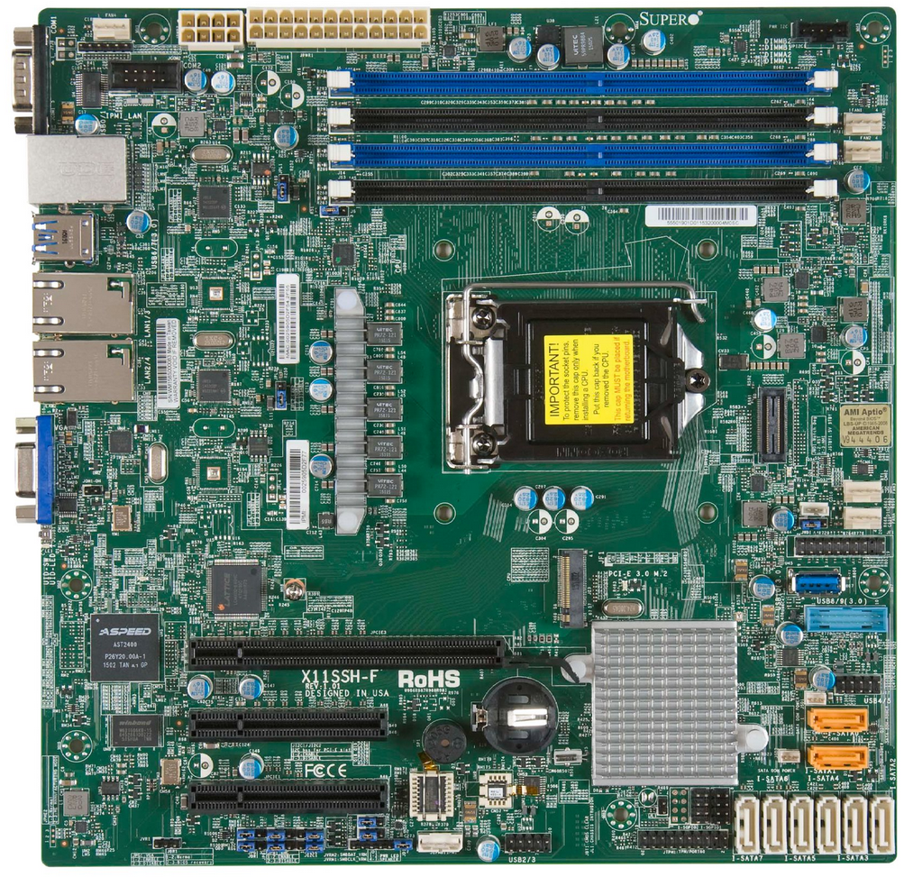

# Overview

{: style="height:400px"}

Supermicro X11 LGA1151 Series are mainboards dedicated for servers and
workstations. Most notable examples of this are hardware are
[X11SSH-TF](https://www.supermicro.com/en/products/motherboard/x11ssh-tf) and
[X11SSH-F](https://www.supermicro.com/en/products/motherboard/X11SSH-F). Ideal
motherboard for NAS servers, with a PCIE x16 slot to potentially accommodate a
graphics card.

To learn more about our motivation for the coreboot port and Dasharo compatible
with Supermicro X11 LGA1151 Series please check [references](#references) section.
If you want to build, initially deploy, update or recover your setup please
check documentation sections on the left.

## Status

Dasharo compatible with Supermicro X11 LGA1151 Series is a community-driven
effort.  We work on this in our free time, since we have no sponsor for this
project. To address the issue we organize virtual hackathon on Dasharo Matrix
whenever we can. At this point two communinty members are engaged
([collector-ynh](https://matrix.to/#/@collector-ynh:matrix.org) with X11SSH-F and
[pietrushnic](https://matrix.to/#/@pietrushnic:matrix.org) with X11SSH-TF). Feel free to reach them
if you wan to talk about project status. If you are interested in this project,
you can consider joining the community-dirven effort or [supporting us in other
way](../../ways-you-can-help-us.md).

The most advanced code is on [development branch](). This code supports only
`Dasharo (coreboot+UEFI)`. Work in progress documentation can be found
[here]().

## References

* [Mullvad: Open-source firmware is the future](https://mullvad.net/en/blog/2019/8/7/open-source-firmware-future/)
* [Green TekSolutions: The first motherboard for servers to use CoreBoot - X11SSH-TF](https://www.greenteksolutionsllc.com/blog/The_first_motherboard_for_servers_to_use_CoreBoot_-_X11SSH-TF)
* [coreboot: X11 LGA1151 Series documentation](https://doc.coreboot.org/mainboard/supermicro/x11-lga1151-series/x11-lga1151-series.html)
* [coreboot: Supermicro X11SSH-F/X11SSH-LN4F documentation](https://doc.coreboot.org/mainboard/supermicro/x11-lga1151-series/x11ssh-f/x11ssh-f.html)

