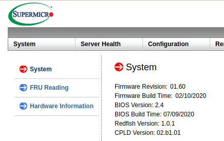
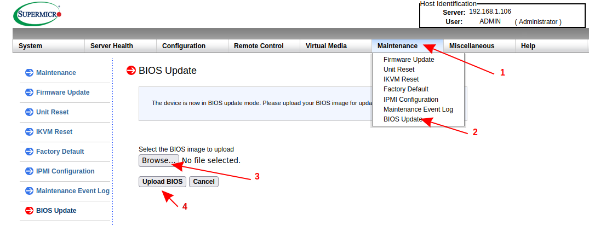
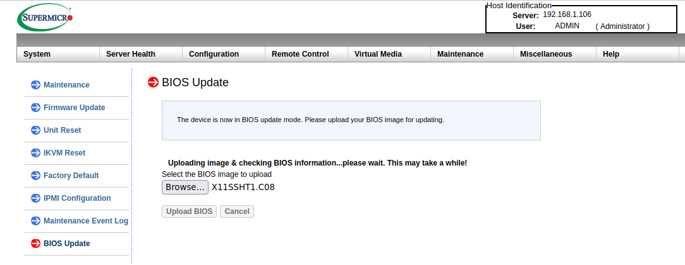
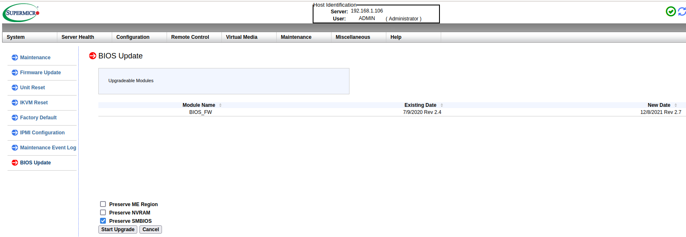
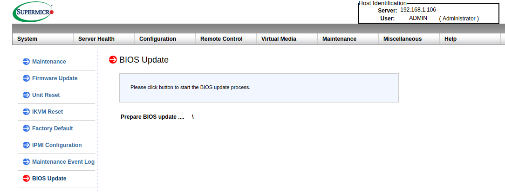
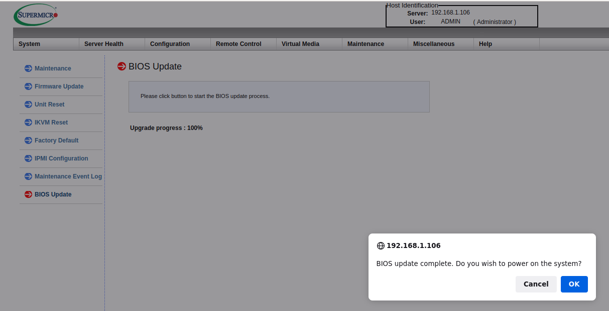
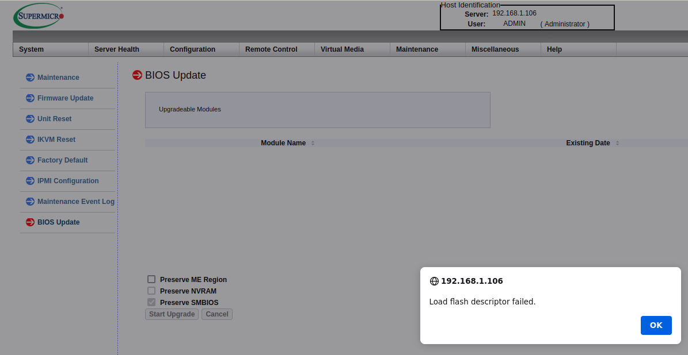
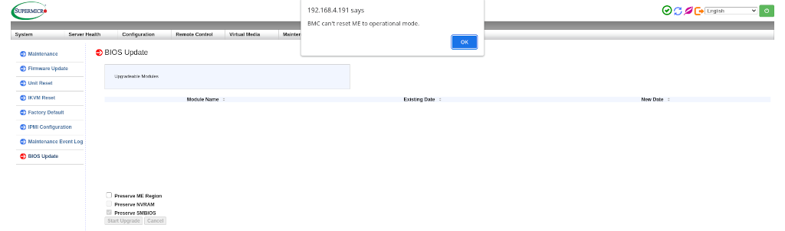

# Recovery

**Please read the [overview page](../overview) first!**

---

## BIOS Update (aka recovery) through BMC

Following instruction was tested on:

* X11SSH-TF v1.01 with following BMC firmware:
    - Firmware Revision: 01.60
    - Firmware Build Time: 02/10/2020
    - Redfish Version: 1.0.1
    - CPLD Version: 02.b1.01
* X11SSH-TF v1.01 with following BMC firmware:
    - Firmware Revision: 01.64
    - Firmware Build Time: 10/26/2022
    - Redfish Version: 1.0.1
    - CPLD Version: 02.b1.01

For information how to identify your mainboard model pelase check
[faq](../faq/#how-to-identify-my-mainboard-model). BMC firmware can be easily
verifed on System tab of BMC web interface.

Following documentation describes the process of recovering hardware from brick
state with through BMC BIOS Update feature. This feature can be used also for
[initial deployment](../initial-deployment) and [Firmware
Update](../firmware-update).

### Requirements

#### License activation

Without active license you can't use BIOS Update feature. License key can be
generated using [kasuganosoras
scripts](https://github.com/kasuganosoras/SuperMicro-IPMI-LicenseGenerator) and
entered through BMC web interface (`Miscellaneous->Activate License`).

#### Up to date firmware

Please make sure you using firmware revision 01.60

If not please follow `IPMI Firmware Update_NEW.pdf` instruction from package
that you can download
[here](https://www.supermicro.com/en/support/resources/downloadcenter/firmware/MBD-X11SSH-TF/BMC).

Unfortunately most efficient way to interact with proprietary BMC is to use
Supermicro proprietary closed source tools:

* ME in Normal Mode (JPME2 in position 1-2). For details please check [hardware
  preparation](../initial-deployment#hardware-preparation).
* If you don't have access to hardware and ME is in Manufacturing Mode there is
  a way to workaround recovery problem, but requires BMC firmware downgrade to
  specific version. Please reach [community for support](/#community) in such
  case.

### Recover/update BIOS

Please note that for recovery you can use:

* `rom.bin` from [vendor BIOS backup](../initial-deployment#vendor-bios-backup)
* [Supermicro BIOS
  update](https://www.supermicro.com/en/support/resources/downloadcenter/firmware/MBD-X11SSH-TF/BIOS)
  please make sure binary is correct for your mainboard model. Download and
  unpack archive.

1. Please use following steps to point BMC to BIOS binary:

    

    
    

1. BMC will try to load binary:

    

    
    

1. Eventually should display following page which show content of loaded image.
   Typically we don't want to preserve ME and/or NVRAM when system was bricked.
   Depending on your situation you may also want to recover SMBIOS data from
   backup or vendor binary.

    

    
    

1. Next BMC will perform update.

    

    
    

1. And ask for reboot.

    

    
    

#### Invalid flash descriptor

If your Dasharo firmware binary is broken or you forgot to include flash
descriptor BMC will throw following error:

#### BMC can't reset ME to operational state

Sometimes BMC soft locks up and can't reset ME operation state when using BMC
GUI to update BIOS. An pop-up windows will appear with a message:

The BIOS update process will be aborted. Software methods to unlock from this
state are not known. Recovering from this state requires power cord and CMOS
battery removal to reset the entire server. Keep the CMOS battery removed for
30 seconds, then plug it back and connect power cord afterwards. After that,
retry the BIOS Update process from BMC GUI using BIOS binary (whether coreboot,
Dasharo or official Supermicro firmware).
