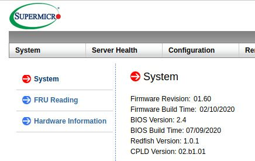

# Recovery

**Please read the [overview page](overview.md) first!**

---

## BIOS Update through BMC

Following instruction was tested on:

* X11SSH-TF v1.01

For information how to identify your mainboard model pelase check
[faq](faq.md#how-to-identify-my-mainboard-model).

Following documentation describes the process of recovering hardware from brick
state with through BMC BIOS Update feature. This feature can be used also for
[initial deployment](initial-deployment.md) and [Firmware
Update](firmware-update.md).

### Requirements

#### License activation

Without active license you can't use BIOS Update feature. License key can be
generated using [kasuganosoras
scripts](https://github.com/kasuganosoras/SuperMicro-IPMI-LicenseGenerator) and
entered through BMC web interface (`Miscellaneous->Activate License`).

#### Up to date firmware

Please make sure you using firmware revision 01.60

If not please follow `IPMI Firmware Update_NEW.pdf` instruction from package
that you can download
[here](https://www.supermicro.com/en/support/resources/downloadcenter/firmware/MBD-X11SSH-TF/BMC).

Unfortunately most efficient way to interact with proprietary BMC is to use
Supermicro proprietary closed source tools:

* [Supermicro Update
  Manager](https://www.supermicro.com/en/solutions/management-software/supermicro-update-manager)
   please download and unpack archive.
* [Backup](../../dasharo-tools-suite/documentation.md#bios-backup) or
  [Supermicro BIOS
  update](https://www.supermicro.com/en/support/resources/downloadcenter/firmware/MBD-X11SSH-TF/BIOS)
   please download and unpack archive.
