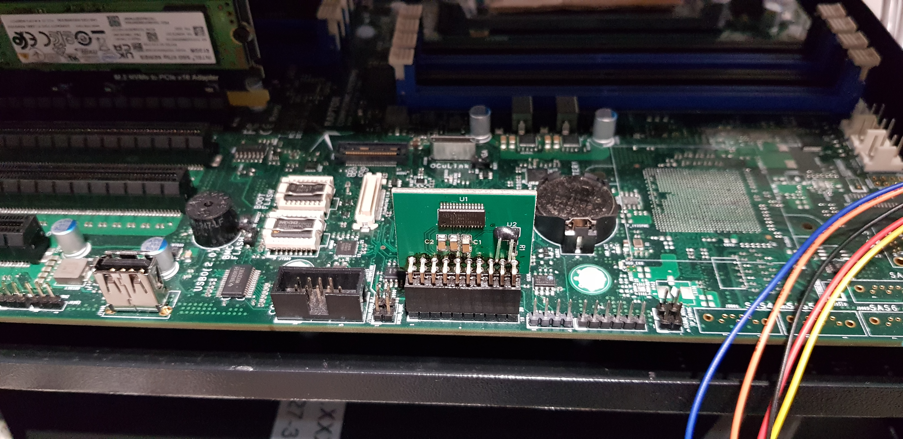
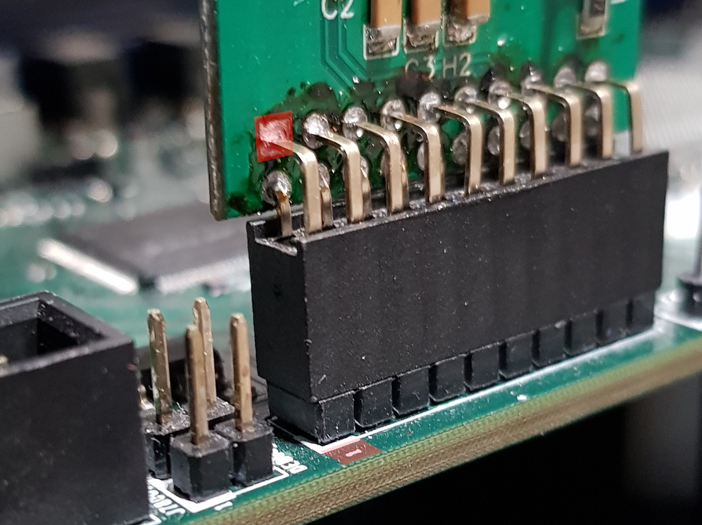
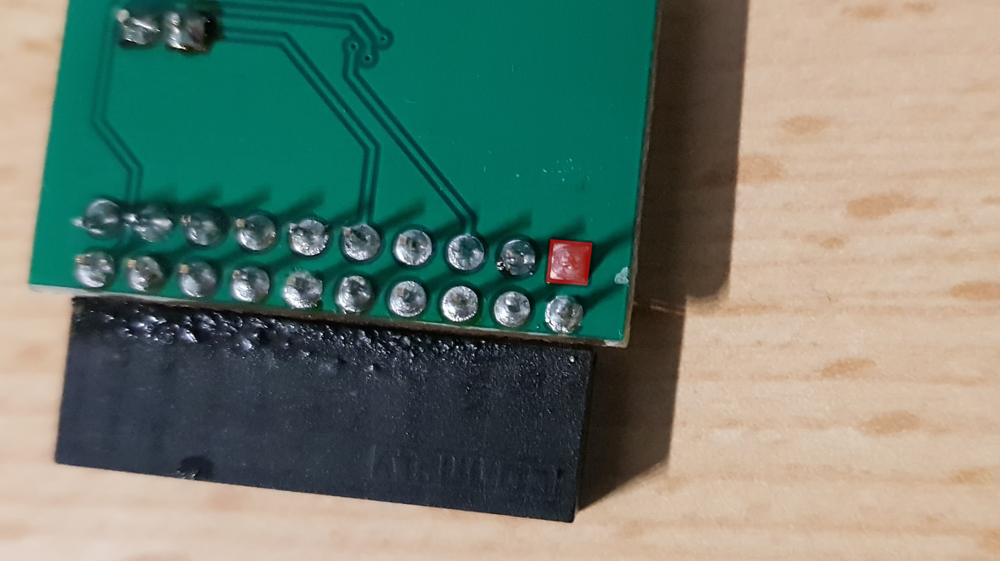

# TPM support

Module compatible with Raptor Computing Systems Talos II mainboard can be bought
here:
[Shop](https://3mdeb.com/shop/modules/tpm-1-2-compatible-with-raptor-computing-systems-talos-ii-mainboard/)

## Connecting TPM module to platform

1. Turn off and disconnect from power Talos II board.
1. Connect TPM module to board:

    + Exact location shown in this docs:
    [Link](https://github.com/3mdeb/openpower-coreboot-docs/blob/main/devnotes/tpm_over_lpc.md#talos-ii-tpm-connector)
    + Picture of connected module:
    
    + Best indicator when connecting TPM module to board is a grounding pin
    (square solder):
    
    

## Testing TPM module

1. Make all steps from
    [Connecting TPM module](#connecting-tpm-module-to-platform).
1. Connect powet to the Talos II plarform and power it on.
1. Boot to HEADS.
1. Enter the Shell.
1. Execute below command:

    ```shell
    cbmem -L
    ```

1. Output should look similar to below:

    ```shell
    TPM2 log:
	Specification: 2.00
	Platform class: PC Client
	No vendor information provided
    TPM2 log entry 1:
    	PCR: 2
    	Event type: Action
    	Digests:
    		 SHA1: f78a530fb5a70afcffdc86a98529abd24a90bac9
    	Event data: FMAP: FMAP
    TPM2 log entry 2:
    	PCR: 2
    	Event type: Action
    	Digests:
    		 SHA1: 369155e6eab3b0a874140e591a4c0e992268b4b9
    	Event data: FMAP: BOOTBLOCK
    TPM2 log entry 3:
    	PCR: 2
    	Event type: Action
    	Digests:
    		 SHA1: 5e785c080264aa6e169f70c80ac40b556066292b
    	Event data: FMAP: COREBOOT CBFS: fallback/romstage
    TPM2 log entry 4:
    	PCR: 2
    	Event type: Action
    	Digests:
    		 SHA1: ba2a5af955811fbac58a5198545539596eb38c3e
    	Event data: FMAP: COREBOOT CBFS: fallback/ramstage
    TPM2 log entry 5:
    	PCR: 2
    	Event type: Action
    	Digests:
    		 SHA1: ba35d4ce29d7b633b5644e2a3206c6069cf7f24d
    	Event data: FMAP: COREBOOT CBFS: fallback/payload
    TPM2 log entry 6:
    	PCR: 2
    	Event type: Action
    	Digests:
    		 SHA1: 47b49026133377e05193f8440c9a7cad239e883c
    	Event data: FMAP: COREBOOT CBFS: 1-cpu.dtb
    TPM2 log entry 7:
    	PCR: 3
    	Event type: Action
    	Digests:
    		 SHA256: 6e7b06693452d997ac534e823b1ea79e5bb8ed19ba8a7af878abf10199c3d515
    		 SHA1: 6e7b06693452d997ac534e823b1ea79e5bb8ed19
    	Event data: VERSION
    TPM2 log entry 8:
    	PCR: 2
    	Event type: Action
    	Digests:
    		 SHA256: de73053377e1ae5ba5d2b637a4f5bfaeb410137722f11ef135e7a1be524e3092
    		 SHA1: de73053377e1ae5ba5d2b637a4f5bfaeb4101377
    	Event data: IMA_CATALOG
    TPM2 log entry 9:
    	PCR: 4
    	Event type: Action
    	Digests:
    		 SHA256: cd32830f83a4f74b75d7feac6c03bd3ad8d553f54a8cac4b4b5a4b175ccbce3e
    		 SHA1: cd32830f83a4f74b75d7feac6c03bd3ad8d553f5
    	Event data: BOOTKERNEL
    TPM2 log entry 10:
    	PCR: 0
    	Event type: Separator
    	Digests:
    		 SHA256: ad95131bc0b799c0b1af477fb14fcf26a6a9f76079e48bf090acb7e8367bfd0e
    		 SHA1: d9be6524a5f5047db5866813acf3277892a7a30a
    	Event data: ����
    TPM2 log entry 11:
    	PCR: 1
    	Event type: Separator
    	Digests:
    		 SHA256: ad95131bc0b799c0b1af477fb14fcf26a6a9f76079e48bf090acb7e8367bfd0e
    		 SHA1: d9be6524a5f5047db5866813acf3277892a7a30a
    	Event data: ����
    TPM2 log entry 12:
    	PCR: 2
    	Event type: Separator
    	Digests:
    		 SHA256: ad95131bc0b799c0b1af477fb14fcf26a6a9f76079e48bf090acb7e8367bfd0e
    		 SHA1: d9be6524a5f5047db5866813acf3277892a7a30a
    	Event data: ����
    TPM2 log entry 13:
    	PCR: 3
    	Event type: Separator
    	Digests:
    		 SHA256: ad95131bc0b799c0b1af477fb14fcf26a6a9f76079e48bf090acb7e8367bfd0e
    		 SHA1: d9be6524a5f5047db5866813acf3277892a7a30a
    	Event data: ����
    TPM2 log entry 14:
    	PCR: 4
    	Event type: Separator
    	Digests:
    		 SHA256: ad95131bc0b799c0b1af477fb14fcf26a6a9f76079e48bf090acb7e8367bfd0e
    		 SHA1: d9be6524a5f5047db5866813acf3277892a7a30a
    	Event data: ����
    TPM2 log entry 15:
    	PCR: 5
    	Event type: Separator
    	Digests:
    		 SHA256: ad95131bc0b799c0b1af477fb14fcf26a6a9f76079e48bf090acb7e8367bfd0e
    		 SHA1: d9be6524a5f5047db5866813acf3277892a7a30a
    	Event data: ����
    TPM2 log entry 16:
    	PCR: 6
    	Event type: Separator
    	Digests:
    		 SHA256: ad95131bc0b799c0b1af477fb14fcf26a6a9f76079e48bf090acb7e8367bfd0e
    		 SHA1: d9be6524a5f5047db5866813acf3277892a7a30a
    	Event data: ����
    TPM2 log entry 17:
    	PCR: 7
    	Event type: Separator
    	Digests:
    		 SHA256: ad95131bc0b799c0b1af477fb14fcf26a6a9f76079e48bf090acb7e8367bfd0e
    		 SHA1: d9be6524a5f5047db5866813acf3277892a7a30a
    	Event data: ����
    ```
