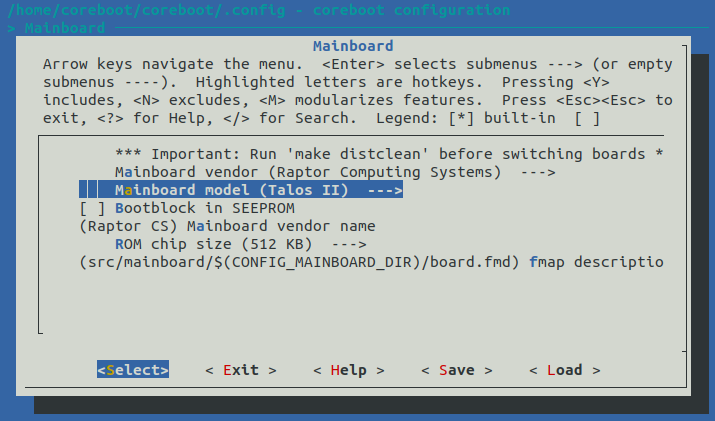

# Buidling coreboot image

In order to build coreboot image, follow the steps below:

1. Clone the coreboot repository:

   ```
   git clone git@github.com:3mdeb/coreboot.git -b talos_2_support_ramstage
   # or HTTPS alternatively
   git clone https://github.com/3mdeb/coreboot.git -b talos_2_support_ramstage
   ```
   `talos_2_support_ramstage` - ramstage devlopment branch - merge requests should go here.\
   `squashed_talos_2_support` - upstream branch, can be regularly pushed with force.\
   `talos_2_support` - legacy branch for bootblock and romstage release - as of today nothing should be pushed here.

2. Get the submodules:

   ```
   cd coreboot
   git submodule update --init --checkout
   ```

3. Start docker container (assuming you are already in coreboot root
   directory):

   ```
   docker run --rm -it -v $PWD:/home/coreboot/coreboot -w /home/coreboot/coreboot 3mdeb/coreboot-sdk:mkimage /bin/bash
   ```

4. When inside of the container, configure the build for Talos II:

   ```
   make menuconfig
   ```

   * Navigate to the **Mainboard** submenu.
   * As a **Mainboard vendor** select `Raptor Computing Systems`
   * If it wasn't selected autmatically, as **Mainboard model** select `Talos II`
   * In the **ROM chip size** option select `512 KB`
   * Save the configuration and exit.

   

5. Start the build process of coreboot inside the container:

   ```
   make
   ```
