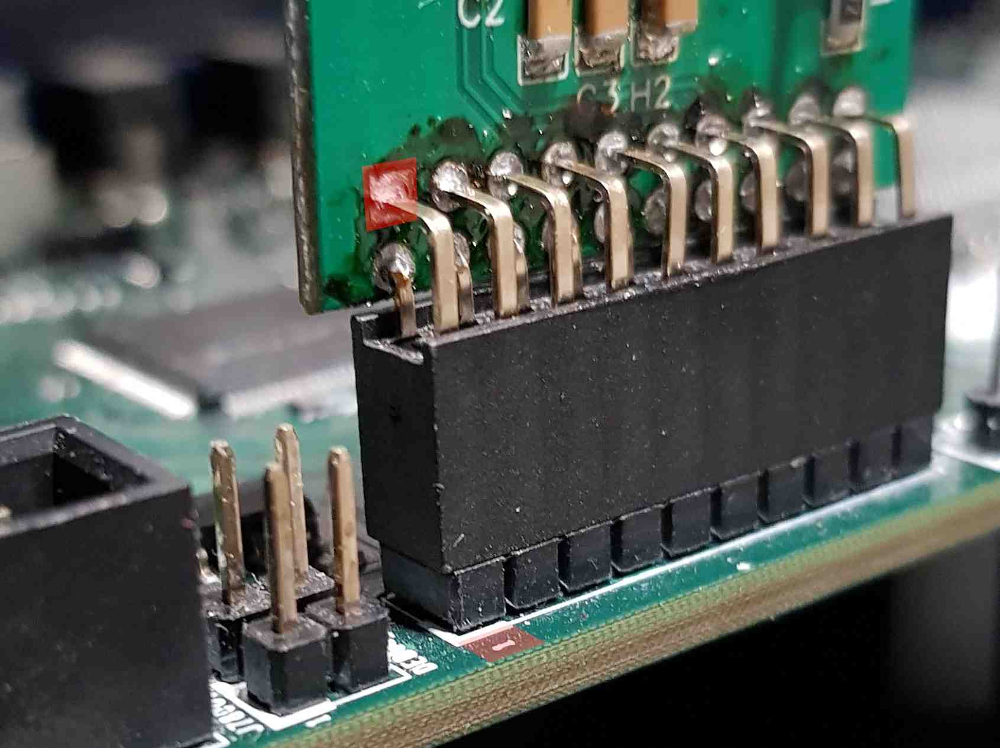
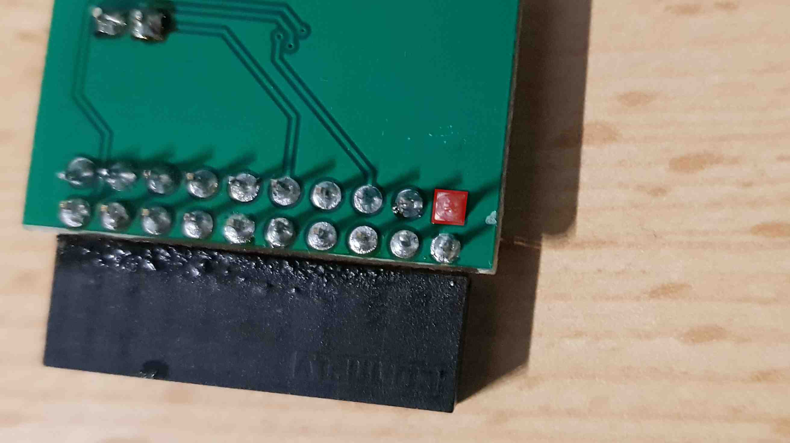
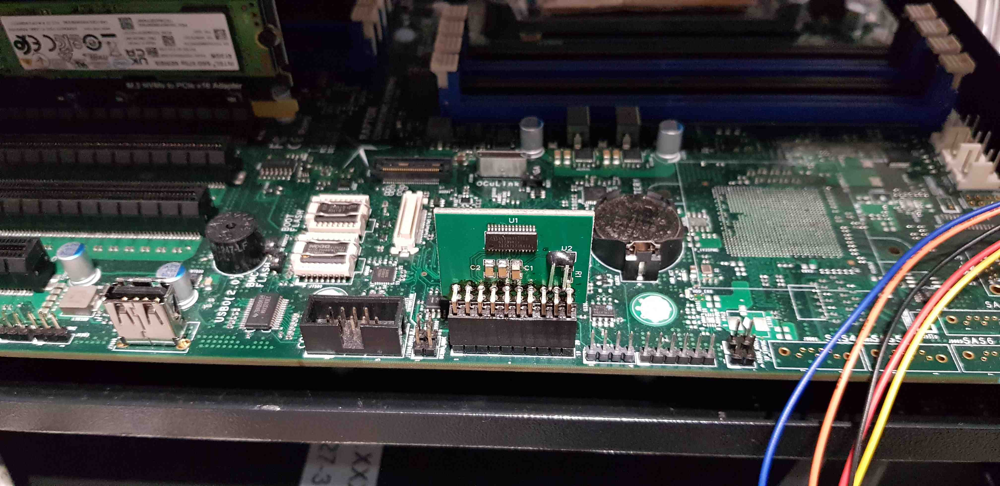

# TPM connections and support

The following documentation contains most important information about TPM 1.2
module dedicated to the Talos II mainboard.

## Connecting TPM to the Talos mainboard

To properly connect TPM to the Talos II mainboard reproduce the following steps:

1. Turn off the platform by using `OpenBMC`.
1. Disconnect mainboard from the mains.
1. Based on the
    [documentation](https://github.com/3mdeb/openpower-coreboot-docs/blob/main/devnotes/tpm_over_lpc.md#talos-ii-tpm-connector)
    find TPM connector on the mainboard.
1. Mount TPM module as shown in the graphics below:

    
    
    

1. Connect mainboard to the mains.

Additional information, i. e. TPM header pinout, might be found in the
[mainboard documentation](https://wiki.raptorcs.com/w/images/e/e3/T2P9D01_users_guide_version_1_0.pdf).

## TPM module testing

1. Turn on the platform and log into it by using `obmc-console-client` or `KVM`.
1. Boot into Heads.
1. Select the `Exit to recovery shell` option using the arrow keys and Enter.
1. Execute the following command:

    ```shell
    cbmem -L
    ```

Output of the above-described command should contains information about TPM
logs.

Example output:

```shell
TPM2 log:
Specification: 2.00
Platform class: PC Client
No vendor information provided
TPM2 log entry 1:
    PCR: 2
    Event type: Action
    Digests:
    	 SHA1: f78a530fb5a70afcffdc86a98529abd24a90bac9
    Event data: FMAP: FMAP
TPM2 log entry 2:
    PCR: 2
    Event type: Action
    Digests:
    	 SHA1: 369155e6eab3b0a874140e591a4c0e992268b4b9
    Event data: FMAP: BOOTBLOCK
TPM2 log entry 3:
    PCR: 2
    Event type: Action
    Digests:
    	 SHA1: 5e785c080264aa6e169f70c80ac40b556066292b
    Event data: FMAP: COREBOOT CBFS: fallback/romstage
TPM2 log entry 4:
    PCR: 2
    Event type: Action
    Digests:
    	 SHA1: ba2a5af955811fbac58a5198545539596eb38c3e
    Event data: FMAP: COREBOOT CBFS: fallback/ramstage
TPM2 log entry 5:
    PCR: 2
    Event type: Action
    Digests:
    	 SHA1: ba35d4ce29d7b633b5644e2a3206c6069cf7f24d
    Event data: FMAP: COREBOOT CBFS: fallback/payload
TPM2 log entry 6:
    PCR: 2
    Event type: Action
    Digests:
    	 SHA1: 47b49026133377e05193f8440c9a7cad239e883c
    Event data: FMAP: COREBOOT CBFS: 1-cpu.dtb
TPM2 log entry 7:
    PCR: 3
    Event type: Action
    Digests:
    	 SHA256: 6e7b06693452d997ac534e823b1ea79e5bb8ed19ba8a7af878abf10199c3d515
    	 SHA1: 6e7b06693452d997ac534e823b1ea79e5bb8ed19
    Event data: VERSION
TPM2 log entry 8:
    PCR: 2
    Event type: Action
    Digests:
    	 SHA256: de73053377e1ae5ba5d2b637a4f5bfaeb410137722f11ef135e7a1be524e3092
    	 SHA1: de73053377e1ae5ba5d2b637a4f5bfaeb4101377
    Event data: IMA_CATALOG
TPM2 log entry 9:
    PCR: 4
    Event type: Action
    Digests:
    	 SHA256: cd32830f83a4f74b75d7feac6c03bd3ad8d553f54a8cac4b4b5a4b175ccbce3e
    	 SHA1: cd32830f83a4f74b75d7feac6c03bd3ad8d553f5
    Event data: BOOTKERNEL
```

## Additional information

The Module is available at the official
[3mdeb store](https://3mdeb.com/shop/modules/tpm-1-2-compatible-with-raptor-computing-systems-talos-ii-mainboard/).

You can also buy the product by mailing us at:
[shopping@3mdeb.com](mailto:shopping@3mdeb.com).
