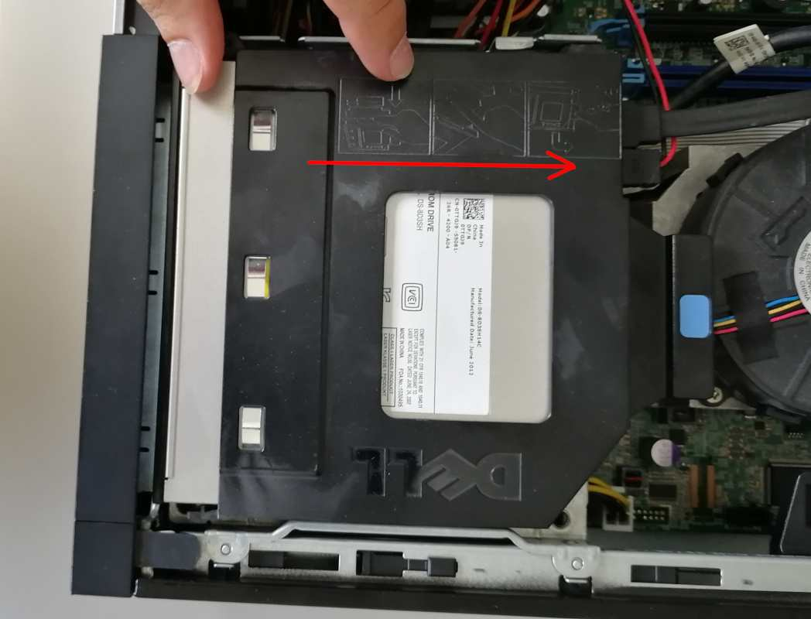

# Dasharo Workstation installation manual

## Introduction

__*Dasharo Workstation is a firmware product designed for Dell OptiPlex
7010 and 9010*__

In order to install the Dasharo Workstation you will need the Dell OptiPlex
7010 or 9010 machine and a Linux installed on it (**in UEFI mode**
since Dasharo Workstation v0.2 supports UEFI mode booting only).

TBD: picture of whole workstation hardware

## Preparation

In order to install Dasharo Workstation one has to conduct a few preparation
steps. Follow the below instructions:

1. Open the case by lifting the handle on the case up.

    

2. Lift whole top cover and take it off.

    

3. Now it is time to release the disk dock. Lift up the handle of CD/DVD drive
   bay.

    

4. Pull the CD/DVD drive bay to the CPU fan side.

    

### Move the blue disk dock handle to the CPU fan side.


### The screw should be at the bigger whole now. Lift up the whole dock to remove it.


### When the dock is removed the service mode jumper should be visible.

]

&#56;. Place the jumper in the place marked by red rectangle.

]

&#57;. It should look like this.

]

&#49;&#48;. Power on the machine. You should see a warning that service jumper is
active. Press F1 to proceed  and boot to your Linux system.

]

# Installation

You will need root privileges from now on to proceed. So switch to root user or
use __*sudo*__ in each command.

1. Install flashrom v1.1 with your distribution's package manager, if you don't
   have it installed yet.
2. Back your firmware image up with: `sudo flashrom -p internal -r bios_backup.bin`
   (be sure flashrom doesn't report any errors like below).
3. Download the [Dasharo Workstation firmware image](https://cloud.3mdeb.com/index.php/s/8WNEHEFcBGFRK23)
4. Flash it on you Dell OptiPlex machine:

   ```
   sudo flashrom -p internal --ifd -i bios -i me \
      -w <path_to_the_binary_file>
   ```
   
   for example: 

   ```
    sudo flashrom -p internal --ifd -i bios -i me \
      -w /tmp/dasharo_workstation_v0.2_rc3.rom 
      
   flashrom v1.1-rc1-127-g370a9f3 on Linux 4.19.0-9-amd64 (x86_64)
   flashrom is free software, get the source code at https://flashrom.org

   Using clock_gettime for delay loops (clk_id: 1, resolution: 1ns).
   Found chipset "Intel Q77".
   This chipset is marked as untested. If you are using an up-to-date version
   of flashrom *and* were (not) able to successfully update your firmware with
   it, then please email a report to flashrom@flashrom.org including a verbose
   (-V) log.
   Thank you!
   Enabling flash write... SPI Configuration is locked down.
   The Flash Descriptor Override Strap-Pin is set. Restrictions implied by
   the Master Section of the flash descriptor are NOT in effect. Please note
   that Protected Range (PR) restrictions still apply.
   Enabling hardware sequencing due to multiple flash chips detected.
   OK.
   Found Programmer flash chip "Opaque flash chip" (12288 kB,
      Programmer-specific) mapped at physical address 0x0000000000000000.
   Reading old flash chip contents... done.
   Erasing and writing flash chip... Erase/write done.
   Verifying flash... VERIFIED.
   ```

---

   If you get a warning:

   ```
   WARNING! You may be running flashrom on an unsupported laptop.
   ```

   And programmer initialization failed, run command:

   ```
   $ flashrom -p internal:laptop=this_is_not_a_laptop -w
   /tmp/dasharo_workstation_v0.2_rc3.rom --ifd -i bios -i me

   ```

   If you have placed the jumper correctly you should see the following message
   in flashrom's output:

   ```
   The Flash Descriptor Override Strap-Pin is set. Restrictions implied by
   the Master Section of the flash descriptor are NOT in effect. Please note
   that Protected Range (PR) restrictions still apply.
   ```

   Newer version of flashrom may not display the warning about unsupported
   chipset as it already may be marked as tested. Our team has verified that the
   flashrom updates firmware reliably on this chipset.

---

# Verification

1. If everything went well (flashrom has verified the flash content),
2. Shut down machine, move jumper to the original place
3. Power on the machine.
4. After rebooting you should see the Dasharo Workstation logo when booting.
   When logo appears you may press ESC to select the boot device if you want to
   reboot from other source.

   

---

# Troubleshooting

If you do not see the logo after few seconds, something probably went wrong or
a bug was hit. If the LED on the power button shines white, that means the
platform booted correctly.

]

If the power button LED shines constantly in orange color, that means you have
hit an error. The LED will soon to start blinking.

]

---

# Troubleshooting

If you see the logo and after that system do not starts (black screen), please
take the following steps:

1. Put bootable USB stick to USB port.
2. Restart computer using power button.
3. Press ESC key to enter a boot menu.
4. Choose USB drive from the list.
5. Re-install operating system.

If you see an flashrom error like this:

```
ERROR: Could not get I/O privileges (Operation not permitted).
You need to be root.
Error: Programmer initialization failed.
```

Use `sudo` with the flashrom command. If the problem persists, probably the
kernel restricts access to IOMEM. In order to workaround it, append
`iomem=relaxed` to kernel commandline. You may do it in two ways:

1. Edit `grub.cfg` in `/boot/grub/`:

  `linux	/boot/vmlinuz-4.15.0-115-generic ro quiet iomem=relaxed`

  And reboot. Then try flashing again.

2. Edit `/etc/default/grub`:

  `GRUB_CMDLINE_LINUX="iomem=relaxed"`

  And regenerate grub config file with `sudo update-grub2` or
  `sudo grub-mkconfig -o /boot/grub/grub.cfg`. Reboot and then try flashing
  again.

If above does not resolve the problem the kernel may be compiled with strict
devmem which prohibits accessing the IOMEM. You should then take different
Linux system.

---

# Troubleshooting

#### Ubuntu installation

Ubuntu legacy installers have problems to setup graphical mode. When you see an
error:

```
graphics initialization failled
Error setting up gfxboot
boot:_
```

you need a workaround to proceed with installation. To boo the installer simply
type `live-install` and press `ENTER`. It will boot to Ubuntu live and the
installator will be automatically launched.

Version affected: Dasharo Workstation v0.1

# Troubleshooting

If you see blinking yellow LED and black screen after reboot:
1. Unplug power supply cable
2. Wait 30s
3. Plug power supply again (machine should start automatically)

#### If you encountered an error or bug, please drop us an email [contact@dasharo.com](mailto:contact@dasharo.com).
