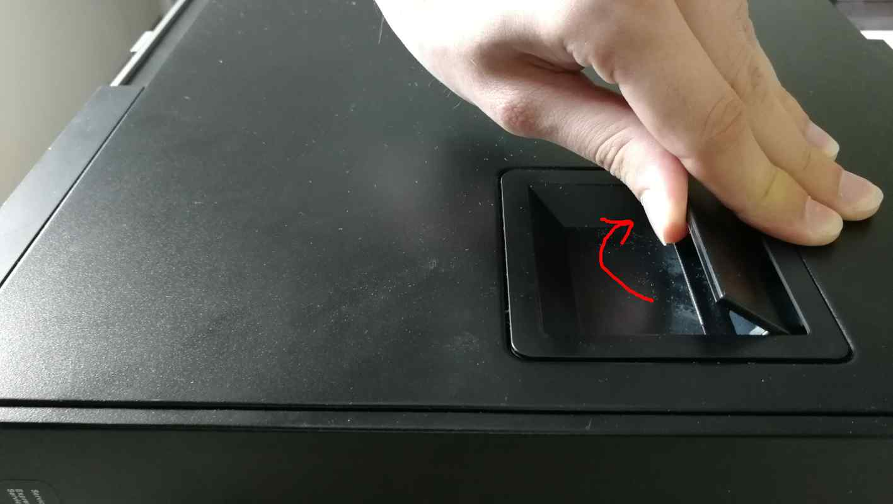
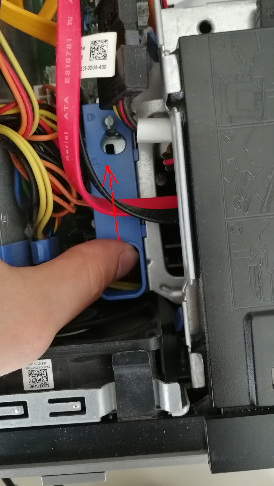
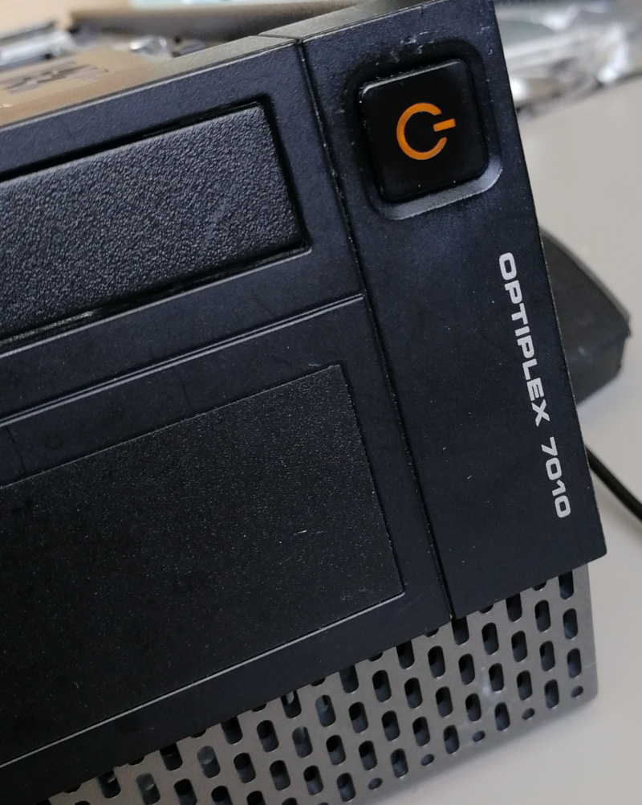

# Dasharo Workstation installation manual

## Introduction

__*Dasharo Workstation is a firmware product designed for Dell OptiPlex
7010 and 9010*__

To install the Dasharo Workstation, you will need the Dell OptiPlex
7010 or 9010 machines and a Linux installed on it (**in UEFI mode**
since Dasharo Workstation v0.2 supports UEFI mode booting only).

TBD: picture of whole workstation hardware, as it would be shown in shop

## Preparation

To install Dasharo Workstation, one has to conduct a few preparation
steps. Follow the below instructions:

1. Open the case by lifting the handle on the case up.

    

2. Lift the whole top cover and take it off.

    

3. Now, it is time to release the disk dock. Lift up the handle of the CD/DVD drive
   bay.

    

4. Pull the CD/DVD drive bay to the CPU fan side.

    

5. Move the blue disk dock handle to the CPU fan side.

    

6. The screw should be at the more giant hole now. Lift up the whole dock to
   remove it.

    

7. When the dock is removed, the service mode jumper should be visible.

    

8. Place the jumper in the place marked by the red rectangle.

    

9. It should look like this.

    

10. Power on the machine. You should see a warning that the service jumper is
active. Press F1 to proceed and boot to your Linux system.

    

## Installation

You will need root privileges from now on to proceed. So switch to the root user or
use __*sudo*__ in each command.

1. Install flashrom v1.1 or newer with your distribution's package manager if
   you don't have it installed yet. If your distro doesn't provide flashrom,
   you can build it yourself using [this instruction](https://www.flashrom.org/Downloads).
2. Back your firmware image up with: `sudo flashrom -p internal -r bios_backup.bin`
   (be sure flashrom doesn't report any errors like below).
3. Download the [Dasharo Workstation firmware image](https://cloud.3mdeb.com/index.php/s/8WNEHEFcBGFRK23)
4. Flash it on you Dell OptiPlex machine:

   ``` console
   sudo flashrom -p internal --ifd -i bios -i me -w <path_to_the_binary_file>
   ```

   for example:

   ``` console
   $ sudo flashrom -p internal --ifd -i bios -i me -w /tmp/dasharo_workstation_v0.2_rc3.rom 

   flashrom v1.1-rc1-127-g370a9f3 on Linux 4.19.0-9-amd64 (x86_64)
   flashrom is free software, get the source code at https://flashrom.org

   Using clock_gettime for delay loops (clk_id: 1, resolution: 1ns).
   Found chipset "Intel Q77".
   This chipset is marked as untested. If you are using an up-to-date version
   of flashrom *and* were (not) able to successfully update your firmware with
   it, then please email a report to flashrom@flashrom.org including a verbose
   (-V) log.
   Thank you!
   Enabling flash write... SPI Configuration is locked down.
   The Flash Descriptor Override Strap-Pin is set. Restrictions implied by
   the Master Section of the flash descriptor are NOT in effect. Please note
   that Protected Range (PR) restrictions still apply.
   Enabling hardware sequencing due to multiple flash chips detected.
   OK.
   Found Programmer flash chip "Opaque flash chip" (12288 kB,
      Programmer-specific) mapped at physical address 0x0000000000000000.
   Reading old flash chip contents... done.
   Erasing and writing flash chip... Erase/write done.
   Verifying flash... VERIFIED.
   ```

   If you get a warning:

   ``` console
   WARNING! You may be running flashrom on an unsupported laptop.
   ```

   And programmer initialization failed, run command:

   ``` console
   flashrom -p internal:laptop=this_is_not_a_laptop -w /tmp/dasharo_workstation_v0.2_rc3.rom --ifd -i bios -i me
   ```

   If you have placed the jumper correctly, you should see the following message
   in flashrom's output:

   ``` console
   The Flash Descriptor Override Strap-Pin is set. Restrictions implied by the Master Section of the flash descriptor are NOT in effect. Please note
   that Protected Range (PR) restrictions still apply.
   ```

   A newer version of flashrom may not display the warning about unsupported
   chipset as it already may be marked as tested. Our team has verified that
   the flashrom updates firmware reliably on this chipset.

## Verification

1. If everything went well (flashrom has verified the flash content),
2. Shut down machine, move the jumper to the original place
3. Power on the machine.
4. After rebooting, you should see the Dasharo Workstation logo when booting.
   When the logo appears, you may press ESC to select the boot device if you want to
   reboot from another source.

   

## Troubleshooting

If you do not see the logo after few seconds, something probably went wrong, or
a bug was hit. If the LED on the power button shines white, that means the
platform booted correctly.


If the power button LED constantly shines in orange color, that means you have
hit an error. The LED will start blinking soon.



If you see the logo and after that system does not starts (black screen), please
take the following steps:

1. Put a bootable USB stick to the USB port.
2. Restart the computer using the power button.
3. Press the ESC key to enter a boot menu.
4. Choose a USB drive from the list.
5. Re-install the operating system.

If you see a flashrom error like this:

``` console
ERROR: Could not get I/O privileges (Operation not permitted).
You need to be root.
Error: Programmer initialization failed.
```

Use `sudo` with the flashrom command. If the problem persists, probably the
kernel restricts access to IOMEM. To work around it, append
`iomem=relaxed` to the kernel command line. You may do it in two ways:

1. Edit `grub.cfg` in `/boot/grub/`:
  ``` bash
  Linux /boot/vmlinuz-4.15.0-115-generic ro quiet iomem=relaxed`
  ```
  And reboot. Then try flashing again.

2. Edit `/etc/default/grub`:
  ``` bash
  GRUB_CMDLINE_LINUX="iomem=relaxed"`
  ```
  And regenerate grub config file with `sudo update-grub2` or
  `sudo grub-mkconfig -o /boot/grub/grub.cfg`. Reboot and then try flashing
  again.

If the above does not resolve the problem, the kernel may be compiled with strict
devmem, which prohibits accessing the IOMEM. You should then take different
Linux system.

### Ubuntu installation

Ubuntu legacy installers have problems with graphical setup mode. When you see an
error:

``` console
graphics initialization failed
Error setting up gfxboot
boot:_
```

You need a workaround to proceed with the installation. To boot the installer, simply
type `live-install` and press `ENTER`. It will boot to Ubuntu Live, and the
installer will be automatically launched.

Version affected: Dasharo Workstation v0.1.

If you see blinking yellow LED and black screen after reboot:
1. Unplug the power supply cable
2. Wait for 30s
3. Plug power supply again (machine should start automatically)

### Bug reporting

If you encountered an error or bug, please fill report in [Dasharo Issues repo](https://github.com/Dasharo/dasharo-issues/issues).
